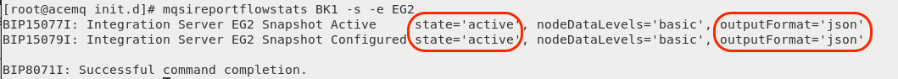

---

##  Configure Quote of the Day Application to use MQ & ACE

The **"Quote of the Day"** application has been installed for you . For more information about the **Quote of the
Day** application, you can go to this GitLab location:
https://gitlab.com/quote-of-the-day/quote-of-the-day (It is not necessary to go
there, but you might be interested in learning more about the application.)

For the containerized portion of the application, some technologies are
automatically instrumented for monitoring. In addition, the load generation tool
is continuously running transactions against the application.

Let's verify that things are running. Issue the **kubectl get pods** command against
the **qotd** namespace/project.

```sh
kubectl get pods -n qotd
```

You should see results similar to this:


The next step is to start the MQ and the ACE servers on the **ipot-mqace** node. 
The Quote of the Day application uses external ACE and MQ servers that are used by the **engraving** service which makes a REST API call to ACE and
ACE subsequently calls MQ and puts a message on a queue. All the necessary configurations have been made except except starting the ACE server

You can do this by opening a secured shell session from the bastion to the ipot-mqace host and then executing the startscript as the *root* user.

:::note

You will need to enter the cocuser password

:::

```
ssh -p 2022 cocuser@169.62.62.188

sudo /etc/init.d/middleware.sh start

```

Now you can navigate to the QotD application web page and try executing an engraving order

:::note

QotD runs at: http://169.62.62.174:32000

:::


The order details are filled in automatically. Click on the **Order Engraving** button. You should see a confirmation
telling you the order was placed successfully


---

## Configure ACE and MQ for Resource Monitoring

:::caution

This section is here for informational purposes. There are no steps to execute.

:::

This section of the lab will help you understand how IBM MQ and IBM App Connect
Enterprise (ACE) need to be configured for monitoring. There are certain
configuration settings within MQ and ACE that are required in order to get the
monitoring KPIs. The key KPI's that need to be enabled are Resource Stats and
Flow Stats. The requirements are documented in the
[sensor configuration guide](https://www.ibm.com/docs/en/obi/223?topic=technologies-monitoring-app-connect-enterprise#monitoring-ibm-app-connect-enterprise)
that is online. You'll see links to those guides further down in this document.

:::note

Typically, these steps are performed by the MQ and ACE admins, so you don't need
to know the step by step procedure. But, you do need to tell the MQ/ACE admins
what the monitoring requirements are.

:::

---

### Verify the ACE configuration

The "Resource Monitoring" KPIs are already enabled in most customer
environments. But it is worth validating the configuration. For example, you can
use the ACE `mqsireportresourcestats` and `mqsireportflowstats` commands to view
the configuration for ACE.

Become root user on mqace node:

```sh
sudo -i
```

To run the following commands you have to source the `mqsiprofile`:

```sh
. /opt/ace-11.0.0.11/server/bin/mqsiprofile
```

:::info

In the commands listed, BK1 is the Integration Node name and would be different
if the Integration Node had a different name

:::

Here are example commands that you can issue to see the ACE configuration:

```sh
mqsireportresourcestats BK1 -e EG2
```

You will see results similar to those shown below. Notice that the "state" is
set to "true" indicating that **"Resource Stats"** are enabled.


To see the configuration of the "flow" stats, issue the following command:

```sh
mqsireportflowstats BK1 -s -e EG2
```

You will see results similar to those shown below. Notice that the "state" is
"active", and the outputFormat is "json". This indicates that the **"Flow
Stats"** are enabled. The product requires that the output format be set to json
vs. XML.



---

### Verify the MQ configuration

There are fewer requirements for MQ. The sensor will work with the default
settings. However, you can have the sensor automatically use thresholds/Events
that are setup within the MQ server. If you want to use the built in MQ Events,
then you need to set **CHLEV** (Channel Events) and **PERFMEV** (Performance
Events) to **ENABLED**. To check those settings, you can issue the following
commands.

Become root user on mqace node:

```sh
sudo -i
```

HINT: To run the following commands you have to source the `setmqenv` and
specify the queue manager name (QM1):

```sh
. /opt/mqm/bin/setmqenv -m QM1
```

You first need to run the **"runmqsc"** command.

```sh
/opt/mqm/bin/runmqsc QM1
```

The **runmqsc** command won't prompt you with a cursor. That's okay. Just start
typing the commands.

Within the runmqsc command prompt you can issue other MQ commands. Type the
following commands:

Then:

```sh
display QMGR PUBSUB CHLEV
```

```sh
display QMGR CLUSTER PERFMEV
```

These commands will give outputs similar to what's shown below.


In the output, you can see that the CHLEV (Channel Events) and PERFMEV
(Performance Events) is set to disabled.

To enable run the following commands:

```sh
ALTER QMGR CHLEV(ENABLED)
ALTER QMGR PERFMEV(ENABLED)
```

Re-run the display command to verify that configuration was changed


Type **"quit"** to exit the runmqsc command prompt.

```sh
quit
```

---

## Configure ACE and MQ for Tracing

:::caution

This section is here for informational purposes. There are no steps to execute.

:::

In addition to the "Resource Monitoring" KPIs, additional settings are required
to enable Tracing within IBM MQ and ACE. It is important that you understand
this process since Tracing is typically not enabled by default in most IBM MQ
and ACE environments. In this section, we've documented the steps.

:::note

Typically, these steps are performed by the MQ and ACE admins, so you don't need
to know the step by step procedure.

:::

This section is simply going to describe the process. The procedure is well
documented within the Instana online documentation. You will find a **Tracing**
section within the sensor documentation.

For ACE, you perform the following steps

- Download a small TAR file from IBM Fix Central. There are links within the
  [Instana documentation](https://www.ibm.com/docs/en/obi/223?topic=technologies-monitoring-app-connect-enterprise#tracing).
- Extract the tar file into the **/var/mqsi/shared-classes** directory
- Stop the ACE server
- Run the following command to "Install" the **User Exit**:
  **mqsichangeflowuserexits BK1 -o -x /var/mqsi/shared-classes**
- Start the ACE server
- Activate the **User Exit** by typing: **mqsichangeflowuserexits BK1 -o -a
  ACEOpenTracingUserExit**

The MQ procedure is similar.

- Download a small TAR file from IBM Fix Central. There are links within the
  [Instana documentation](https://www.ibm.com/docs/en/obi/223?topic=technologies-monitoring-mq#tracing).
- Extract the tar file to **/var/mqm/exits64**
- Edit the **/var/mqm/mqs.ini** file
- Add a small section within the **/var/mqm/mqs.ini** file. The content can be
  copied and pasted from the Instana documentation.
- Restart the Queue Manager

In the lab environment, these steps have already been performed. If you want,
you can examine the files and directories specified above.

:::note

Even though the TAR files for ACE and MQ look similar, they are unique for each
middleware component.

:::

---


## Further Configuration (Optional)

First, let's change the **Zone** name within the file. This is similar to the
Zone that you specified when installing the Docker and OpenShift monitoring
Agents. Scroll down until you see the section titled "Hardware & Zone".
Uncomment the 3 lines of text starting with
`com.instana.plugin.generic.hardware`. By default the "availability-zone"
parameter is set to "Datacenter A /Rack 42". Change the value to **ACE and MQ**

The section of the configuration.yaml file should look as follows:

```yaml
# Hardware & Zone
com.instana.plugin.generic.hardware:
  enabled: true # disabled by default
  availability-zone: "ACE and MQ"
```

In addition to configuring the **Zone** name, you can specify tags within the
configuration.yaml file. Search for the section within the configuration.yaml
file titled **Host**. Within that section, you see a section for tags. By
default this section will be commented out. Uncomment the
**com.instana.plugin.host** section and specify some tags. For example, add a
**production** tag to indicate that this system is a production server. And, add
a **QOTD** tag to indicate that it supports the **Quote of the Day**
application. Add a **Dallas** tag to indicate the the server resides in Dallas,
Texas.

Add **production, QOTD, and Dallas** as tags. The configuration.yaml section
should look as follows:

```yaml
com.instana.plugin.host:
  tags:
    - "production"
    - "QOTD"
    - "Dallas"
```

It is possible to specify tags for the Docker and OpenShift versions of the
Instana Agent, but we are not going to cover that in this lab.

:::info

Zones and Tags can be used for a number of purposes within instana:

- Search for systems within the UI or via the APIs
- Assign thresholds to systems with a specific tag or zone name
- Build custom dashboards using the tags or zone names and more...

:::

By default, Instana will monitor key processes that are related to the
applications/middleware that are being monitored. It will also monitor processes
that are consuming large amounts of CPU or Memory. Sometimes, customers want to
ensure that specific processes are monitoring. Let's edit the configuration.yaml
file to specify some key processes on this ACE/MQ server. Search within the
configuration.yaml file for **com.instana.plugin.process**

The section will be commented out by default. Uncomment the section and specify
the following processes for monitoring **(crond, amqzmgr0, runmqlsr)**. One
process is the cron daemon, which customers frequently want to monitor. The
other two process are related to IBM MQ. The section should look like this:

```yaml
com.instana.plugin.process:
  processes:
    - "crond"
    - "amqzmgr0"
    - "runmqlsr"
```

:::note

There is also a section in the configuration.yaml file where you can specify
processes that you want to ignore. Search for **com.instana.ignore**.

:::

Save and exit the configuration.yaml file. In "vi", type ":wq" to save and exit
the file.

As soon as you save your changes to the file, Instana will detect those changes
and will start to implement what you have configured.

At this point, we recommend that you navigate to next section of this tutorial
**Explore Instana**.


In the **Explore Instana** section, we'll begin by confirming that the ACE and
MQ monitoring are working properly. If they are not, come back to this section
and double check your configuration.yaml settings and check that there are no
obvious errors in the log file.

The main install log file is /opt/instana/agent/data/log/agent.log

---

## Summary

You learned how to configure the Instana sensor for IBM App Connect Enterprise
(ACE) and IBM MQ. This includes customization such as defining tags, defining a
zone, and identifying specific processes to monitor.

Now, proceed to the next section where you will explore Instana.

---
