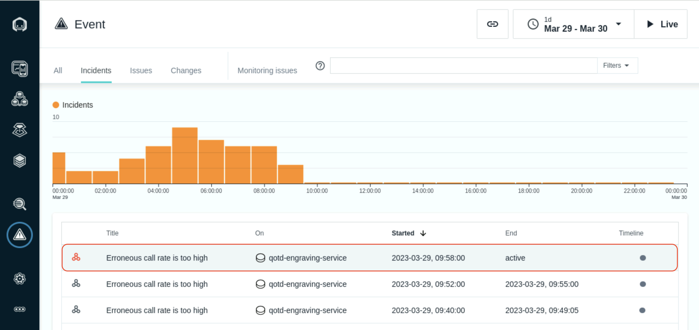
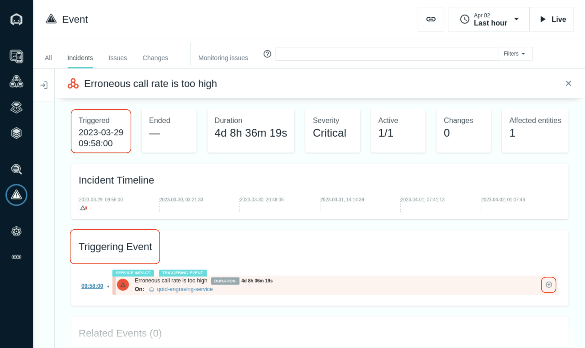
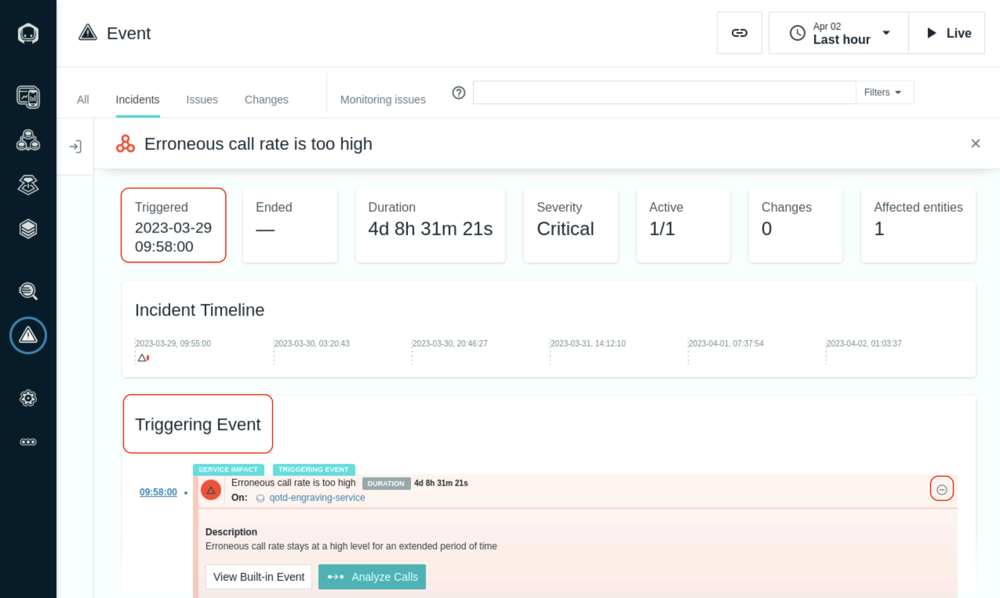
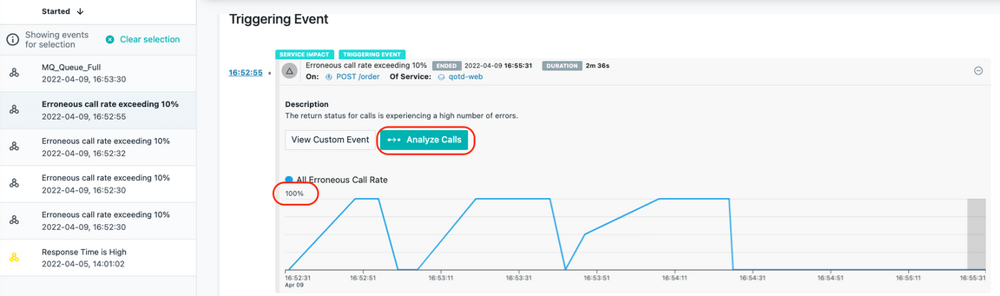
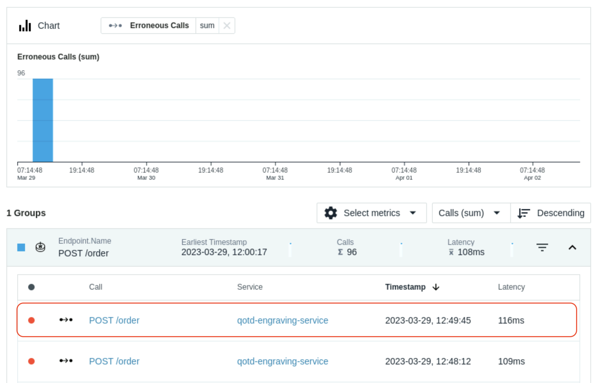
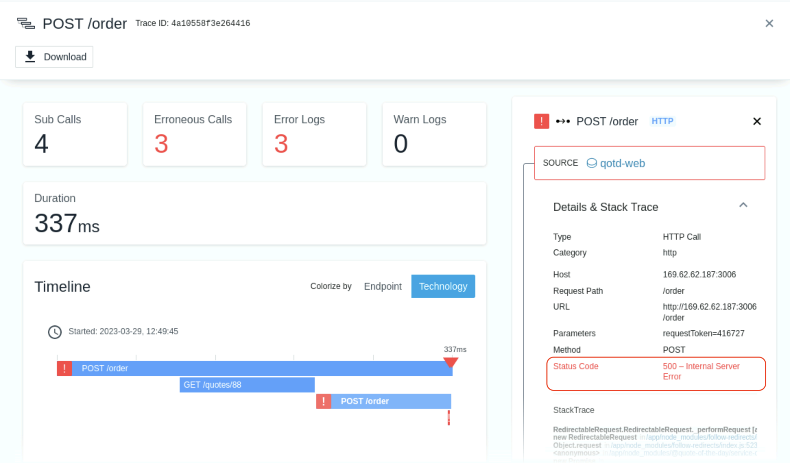
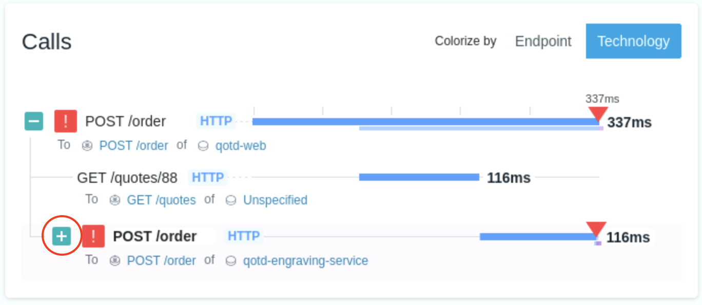
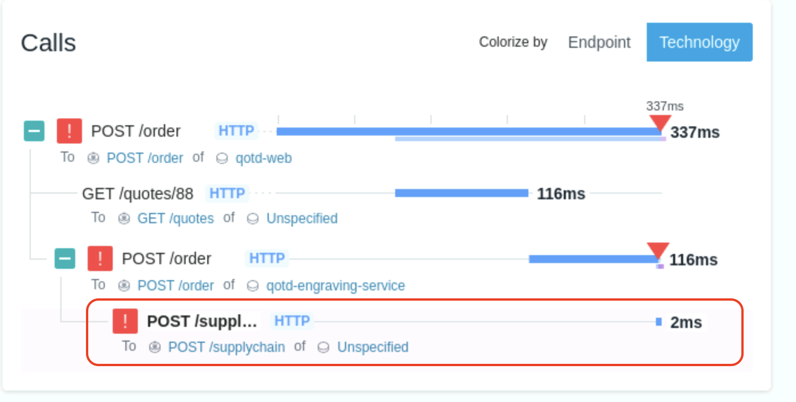
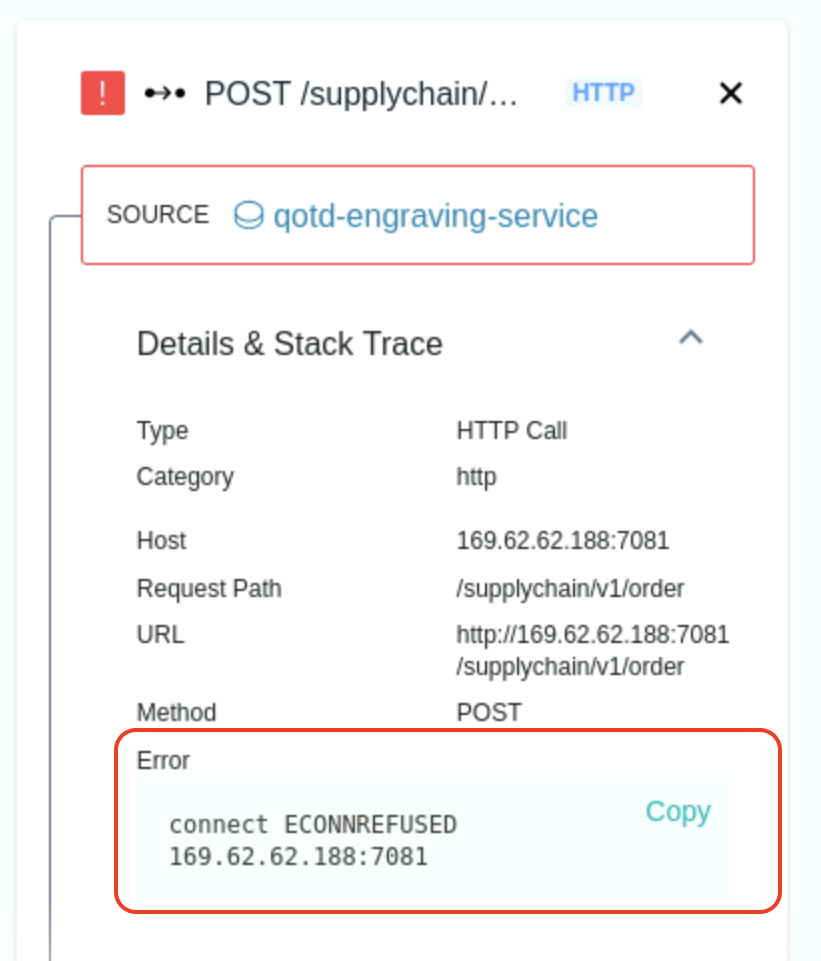

# Troubleshoot an issue

## 

In this section of the lab, you will learn how Instana can help you get to root cause of a problem in a quick and intuitive manner.

## Evaluate the Events via an Incident
On the left side, select **“Events”**

This will open up a panel showing all of the Incidents that are affecting the monitored systems and applications. Incidents are the raw Events that have been correlated via Analytics into an Incident.

Make sure that the time selection in the upper right corner is set to **“Last hour”**

As seen in the previous picture, select the Incident that is triggering on the **“QOTD High Erroneous Call Rate”** request on entity vader-acemq.coc-ibm.com-BK1:EG2. It indicates that there are large numbers of erroneous/failed requests.

You will see the details related to raw Events that were correlated via analytics into an Incident.

In this case, you should see the Triggering Event and a few Related Events. The Triggering Event is the first event that starts to impact a service or a website. The Related Events are events that Instana determined are related by leveraging analytics including the relationships that exist between the various entities, services, and endpoints.

Within the Incident, you can see when the Incident opened and in some cases, when it closed. And, you can see the Incident Timeline. This is the time when each event opened and closed. If the event is still open, it will be color coded with the event severity.

On the right side, click on the **”+”** symbol to expand the Triggering Event.

You can see in the historical graph that there are periods of time where erroneous (failed) calls are high.

## Analyze the Calls
Next, click the “Analyze Calls” button to analyze the calls.

You will be taken to an analytics screen where you can see all of the failed calls for **“POST /order”**. gen.supplychain is the ACE flow. You can also see latency for the calls is high and you can see a number of calls are failing.

Select one of the failing **“POST /order”** calls

You will be taken to a screen where you can see the Call Stack and Stack Trace data. You explored this previously, but you did it with a good transaction. Now you are examining a failed transaction.

Scroll to the bottom of the page where you see the **“Calls”**. This shows you the timeline of the calls for this single transaction.

You’ll notice that there are plus signs. Click on the plus signs to expand the call stack.

When you see errors, normally you go to the bottom of the call stack. That’s because the error in the last call is likely affecting the upstream calls.

Click on the last call and examine the information on the right side. 

In your spare time, you can click on other types of transactions in the Call Stack.

That completes this section of the lab.

## Summary
In this lab, you learned how to diagnose a problem in Instana, determining that the queue was full and preventing transactions from completing.

To continue with the labs, select one of the lab exercises in the upper left corner or select one of the images below.

