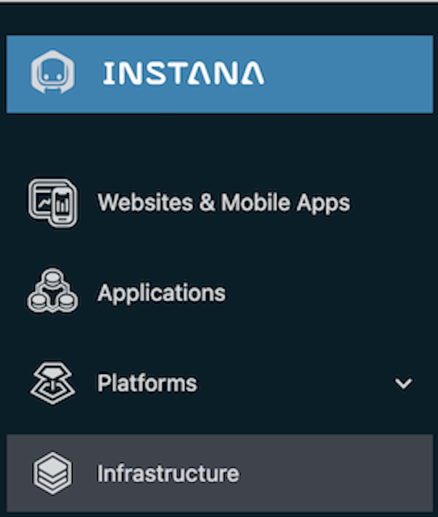
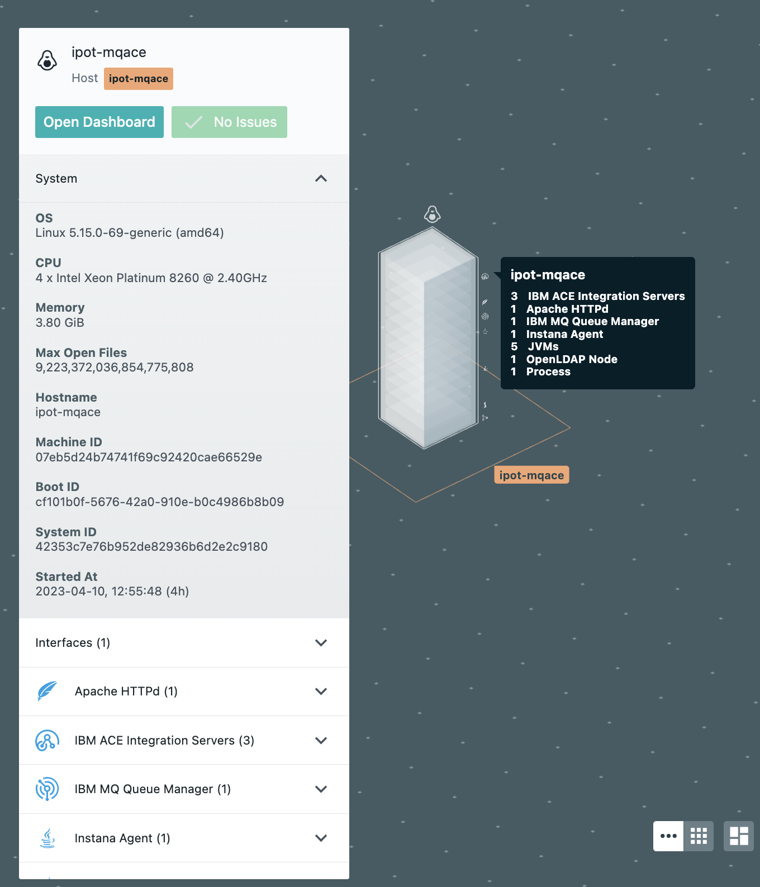
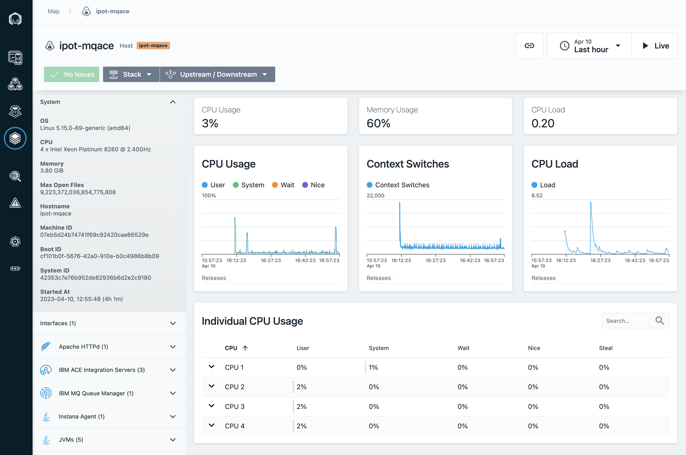
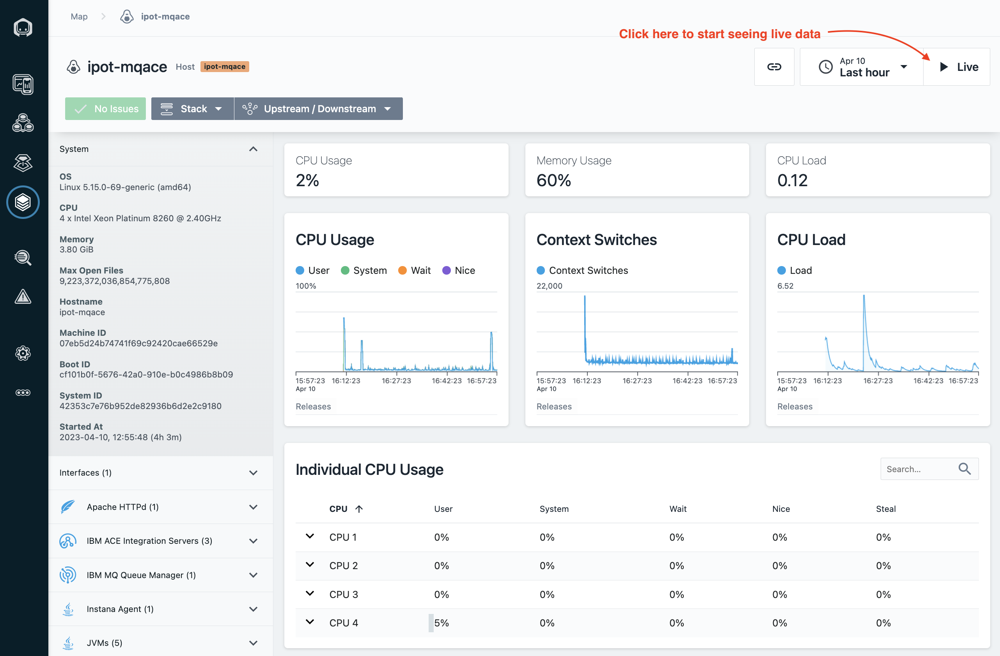
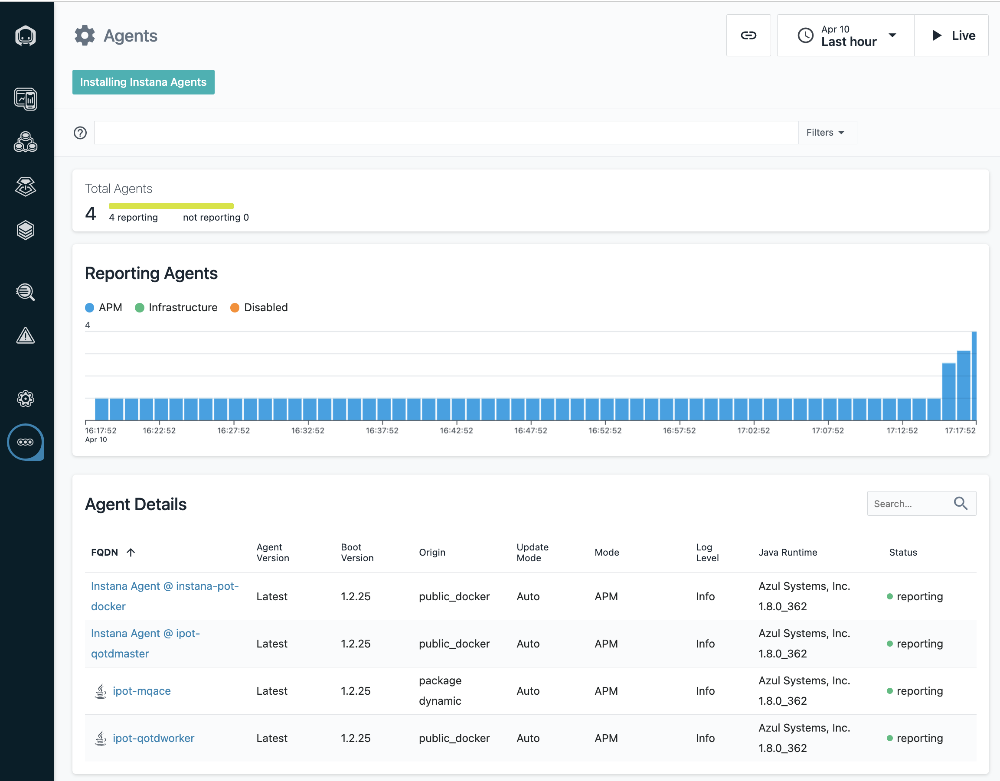

# Instana Agent Installation

:::note

**If you have already installed the agent following the instructions in the "Monitoring a Cloud Native App" lab, then you can skip this section and proceed to the next lab "Configuration"**

:::

In this Proof-of-Technology, we use the Quote Of The Day (QOTD) application to similate the ACE / MQ work load. The QOTD services are deployed into two different runtimes. One is the OKD kubernetes cluster, the other is the docker. ACE/MQ server is deployed in a Linux. Hence, we will deployed Instana agents on all there runtimes. 

## Instana Server Information
## Login into the Instana Server that has been deployed in your environment

Open a web browser and login to the Instana Server UI: 

    https://169.62.62.167.nip.io/#/home

Use the following credentials:

E-Mail: admin@instana.local

Password: please refer to **credentials.txt** on the Instana server

## Instana Agent Deployment Options (Review the Install UI page)

Before we start the agent installation, let's do a quick review/tour of the options available so you can familiarize yourself with the interface. Instana has a variety of agent installation options including the mirror repository and static agents that allow customers to meet strict change control processes. They can be accessed by clicking the "Deploy Agent" button as shown below in **Image 1** from the Instana UI (The link you opened above): 

***Image 1***

Some of the available options are listed below:

    . OS specific installer (Linux, macOS, Windows, Unix)
    . Hosted Cloud Services (AWS, Azure, Google Cloud)
    . Docker (and other container managers)
    . Kubernetes
    . OpenShift
    . Cloud Foundry and BOSH
    . VMWare Tanzu
    . Integrations (IBM)

You begin by choosing the platform where you will be installing the agent. Then you can selected the Technology dropdown and choose from a list of installation options. For example, on Linux, you can choose a automatic one-liner installation, RPM, or TAR file installation. For OpenShift/kubernetes, you have multiple options including operator, helm, and yaml installs. **Image 2** shows all the available agent installation options and will be the default screen when you login the first time to the Instana UI.

(**Don't Install yet, we will be doing the actual installation in the next section, just familiarize yourself with the interface and available options**)

***Image 2***

### HINT: Instana agent install needs privileges! ROOT!!

Instana collects data from monitored systems by using a single host agent on each host. The host agent runs on your hosts to collect and aggregate data from various sensors before it sends the data to the Instana backend. 

The Instana Host Agent has two types, **dynamic** and **static**, based on whether it can update itself or not. What does it mean? Here is the excerpt from [Instana agent documentation](https://www.ibm.com/docs/en/instana-observability/current?topic=instana-host-agent).

A **dynamic** host agent downloads on startup the latest set of sensors from repositories. By default, a dynamic agent updates itself daily with the latest and greatest capabilities that are released. It is also possible to tightly control the updating of dynamic host agents by pinning a version. 

**By default, dynamic host agents use the Instana repository to pull updates**, but it is possible to set up your own managed mirror. Currently, the mirror must be a Nexus repository. This is probably the best option for must customers because it allows them the benefits of automatic updates, while at the same time controlling the content that is in the repository.

A **static** host agent is a self-contained host agent that includes all the latest available components at the time of its release, and has no dynamic update capabilities. **The static host agent has a stable "bill of materials" that never changes after the host agent's installation.**

#### TIP: Static host agents require no internet connection to the Instana repository, and are recommended in restrictive network setups.

Let's move on and get some actual work done. 

# Install Agent(s)

## 1: Installing Instana Agent on Linux VM (mqace)

In this section of the lab, you will be installing the Instana Agent on the mqace Linux vm that have been provisioned for you for this lab:

    IP: 169.62.62.188 - itz-#####-ipot-mqace 

Replace the ###### with the name from the environment that was provisioned for you as shown below in **Image 3**.

***Image 3***

The steps below show the installation on the **itz-#####-ipot-mqace** server. 
 
Open up a terminal window from the bastion VM and login to the mqace vm as shown below:

**ssh -p <port_number> user_name@ip_address**

     ssh -p 2022 cocuser@169.62.62.188

Then use sudo to switch to root  

    sudo -i

In Instana UI, select the "Stan" the robot icon in the upper left corner as shown below in **Image 4**

***Image 4***

Next, click the "Agent" **(1)** item from the left nav and then click on the button **(2)** near the upper left corner as shown below in **Image 5**

***Image 5***

A window will open with a list of different environments where you can install the Instana Agent. 

This is a Linux server, so select Linux on the left side of the screen and select the options in the order (1 to 7) as highlighted below in **Image 6**

***Image 6***

Btw, when you pull down the "Technology" dropdown you will notice that you can install the Instana agent in several ways such as perform rpm installs or simply download a tar file. The method we are using in this lab is "Automatic Installation (One-Liner)". 

Next, copy and paste the curl command into the terminal window you had opened for the **itz-#####-ipot-mqace** server.

The install will progress and you will see an output similar to the screen capture shown below in **Image 7** 

***Image 7***

At this point, the Linux Agent is installed and up and running on the following **itz-#####-ipot-mqace** server (169.62.62.188).

The Agent will automatically start monitoring the operating system and start discovering key processes and middleware. In many cases it will automatically instrument those technologies. 

### Update configuration.yaml file on server

Next, we need to edit the configuration.yaml and assign this VM to a Zone so it is grouped correctly in Instana:

Use the SSH session from the previous steps to edit the configuration.yaml file. 

    cd /opt/instana/agent/etc/instana
    vi configuration.yaml

In the configuraiton.yaml file, search for Zone and update the file as shown below in **Image 8**

***Image 8***

Removing the **"#"** for all the three lines, and put two spaces in front of the second and the third line. 

IMPORTANT
YAML files are very strict about indentation. Each line within the file must be indented by 0, 2, 4, 6, etc. spaces. Do not use tabs and do not indent by odd numbers of characters. Make sure that all of the characters line up vertically within the text. If you see a line that is commented out and you need to uncomment it, just remove the single "#" character.

#### Configure the ACE and MQ Sensors

Within the editor, scroll down to the section titled **"# IBM ACE"**

You will need to uncomment the required entries and change the parameters to match the ACE/MQ configuration on this server. If you read the description on each line, you'll see that some parameters are optional.

For more information about about the ACE configuration, view the online documentation found here: link

There are multiple options for configuring the sensor. The information shown matches this particular environment. A few key possibilities:

If ACE is configured for MQTT, the configuration will be different than if ACE is configured to use MQ.
The configuration will be different if you are doing remote monitoring vs. local.
Pay careful attention to the required vs. optional parameters. For example, in some environments the MQ Channel Authentication is disabled and you don't need to specify credentials.
Edit the IBM ACE section of the file so that it looks like this. If you want, you can copy this text and replace the entire section. Or, you can change the individual parameters.

IMPORTANT
When you paste this information, you must replace [mqm password] with the password provided by the lab proctor.

    com.instana.plugin.ace:
      enabled: true
      poll_rate: 20
      NodesOrServers: # Multiple Integration node instances or multiple standalone Integration Servers can be specified
        BK1: # specify the Integration node/server name (required)
          restApiPort: "4414" # ACE rest api port (required)
          mqport: "1414" # Sets the port for remote administration IBM MQ channel port or the MQTT server port (required)
          queuemanagerName: "QM1" # Queue Manager name (required for IBM MQ)
          channel: "ACE.SVRCONN" # Remote administration channel (required for IBM MQ)
          mqUsername: "mqm" # MQ channel authentication's username if security enabled (optional for IBM MQ)
          mqPassword: "[mqm password]" # MQ channel authentication's password if security enabled (optional for IBM MQ)

In the example above, QM1 is the Queue Manager name. BK1 is the name of the Integration Server. ACE.SVRCONN is the channel that the sensor will connect to in order to query the performance KPIs. The username of mqm is the admin username for MQ, but the sensor does not require administrative permissions. Any valid MQ user can be specified as long as it has permissions to connect to the channel.

Next, you will need to edit the MQ sensor settings. Scroll further down in the file until you find the section titled "IBM MQ". You will be editing this section of the configuration to match the settings of the MQ server. There are a number of mandatory and optional parameters. For more information on the configuration settings, see the online documentation: link

Edit the # IBM MQ section of the file so that it looks like this. If you want, you can copy this text and replace the entire section. Or, you can change the individual parameters.

IMPORTANT
When you paste this information, you must replace [mqm password] with the password provided by the lab proctor.

    
    # IBM MQ
    com.instana.plugin.ibmmq:
      enabled: true
      poll_rate: 5
      queueManagers: # Multiple Queue Manager instances can be specified
        QM1:
          channel: "ACE.SVRCONN" # Remote administration channel
          username: "mqm"
          password: "[mqm password]"
    

Save the file.

Next, let's validate the agent is installed, Open a web browser and login to the Instana Server UI: 
    
    https://169.62.62.167.nip.io/#/home

Use the following credentials:

E-Mail: admin@instana.local

Password: please refer to **credentials.txt** on the Instana server

In Instana UI, select the "Stan" the robot icon in the upper left corner as shown below in **Image 9**

***Image 9***

To view the installed Agent, from Instana UI, under the **three dots**  on the left hand menu, select **Agents** page as shown below in **Image 10**

***Image 10***

On the **Agents** page, you will see the deployed agent view as shown below in **Image 11**.

You can click on the item to get the detail information. 

***Image 11***

Next, Click Infrastructure as shown below in **Image 12**

***Image 12***

Next, verify you see the Linux server **ipot-mqace** and click on the edge of the box when it say "ipot-mqace" as shown below in **Image 13** 

***Image 13***

Now click on "Open Dashboard" in **Image 14**

***Image 14***

You should be able to see the details of the linux server being monitored using Instana. Click on the "Live" button as shown below in **Image 15** 

***Image 15***

That's it you have now successfully installed the linux agent on the ipot--mqace server.

Next, let's move on to installing the Kubernetes agents.

## 2: Installing Instana Kubernetes Agent

In this section, you will be installing the Instana Kubernetes Agent on the following server that have been provisioned for you for this lab.

    . IP: 169.62.62.174 **itz-######-ipot-qotdmaster**

Replace the ##### with the name from the environment that was provisioned for you as shown below in **Image 16**.

***Image 16***

The steps below show the installation on the **itz-#####-ipot-qotdmaster** server. 
 
Open up a terminal window and login to the vm as shown below:

     ssh -p 2022 cocuser@169.62.62.174

In Instana UI, select the "Stan" the robot icon in the upper left corner as shown below in **Image 17**

***Image 17***

Next, click the "Deploy Agent" button near the upper right corner as shown below in **Image 18**

***Image 18***

A window will open with a list of different environments where you can install the Instana Agent. 

In this case, we will be installing the Kubernetes agent, so select Kubernetes on the left side of the screen and select the options in the order (1 to 2) as highlighted below in  **Image 19**

***Image 19***

Run the above command on the command line and the agent should be installed. 

Next, let's move on to installing the Docker agent.

## 3: Installing Instana Docker Agent

In this section, you will be installing the Instana Docker Agent on 1 server that have been provisioned for you for this lab.

    . IP: 169.62.62.187 **itz-######-ipot-docker**

Replace the ##### with the name from the environment that was provisioned for you as shown below in **Image 20**.

***Image 20***

The steps below show the installation on the **itz-#####-ipot-docker** server. 

Open up a terminal window and login to the vm as shown below:

     ssh -p 2022 cocuser@169.62.62.187

In Instana UI, select the "Stan" the robot icon in the upper left corner as shown below in **Image 21**

***Image 21***

Next, click the "Deploy Agent" button near the upper right corner as shown below in **Image 22**

***Image 22***

A window will open with a list of different environments where you can install the Instana Agent. 

In this case, we will be installing the Docker agent, so select Docker on the left side of the screen and select the options in the order (1 to 3) as highlighted below in  **Image 23**

***Image 23***

Please enter the value **ipot-docker** as shown above 

Next, copy and paste the curl command into the terminal window you had opened for the **ipot-docker (169.62.62.187)** server.

The install will progress and you will see an output similar to **Image 24** shown below.

***Image 24***

At this point the Agent is installed and up and running. The Agent will automatically start monitoring and discovering key processes and middleware. In many cases it will automatically instrument those technologies. 

Next, let's validate the agent is installed, Open a web browser and login to the Instana Server UI: 
    
    https://169.62.62.167.nip.io/#/home

Use the following credentials:

    E-Mail: admin@instana.local

    Password: <please refer to credentials.txt> on the Instana server

In Instana UI, select the "Stan" the robot icon in the upper left corner as shown below in **Image 25**

***Image 25***

Next, Click Infrastructure as shown below in **Image 26**

***Image 26***

Next, verify you see the Docker server **ipot-docker** as shown below in **Image 27** 

***Image 27***

Click on it and then click "Open Dashboard" and you should be able to see the details of the docker server being monitored using Instana as shown below in **Image 28**

***Image 28***

That's it you have now successfully installed the docker agent on the ipot-docker server.

## Complete Infrastructure View of your entire environment

Once you are done with all the above instructions, you can reconfirm that you have 7 agents reporting into your instana server as shown below in **Image 29** and **Image 30**

***Image 29***

***Image 30***

Finally, you should see a similar Infrastructure view of all the agents you have installed as shown below in **Image 31**

***Image 31***

Congratulations, you have completed this entire lab for installing the agents. If you are ready, move forward to the next lab "Explore Instana"

