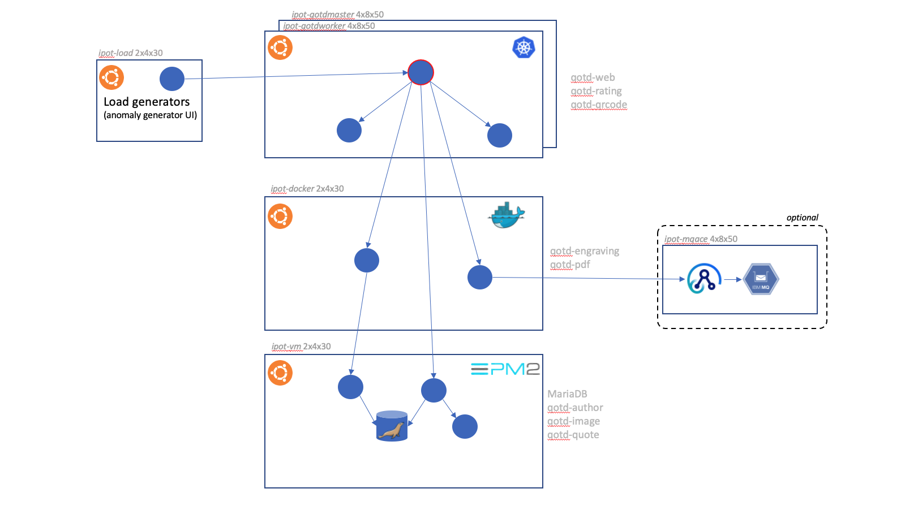

# Overview

## Introduction

This lab present's Instana value proposition in context of other IBM middleware . In this section, you will find guidance about configuring and using Instana with the following IBM middleware technologies:

- MQ
- App Connect Enterprise (ACE)

## Architecture

## URLs to access Instana and Applications

**Instana:**
https://169.62.62.167.nip.io/#/home

E-Mail: admin@instana.local
Password: **see password file**

**Robot Shop**
http://169.62.62.185:31965

**QotD Home:**
http://169.62.62.174:32000

**Number Factory Home:**
http://169.62.62.187:5000

**Anomaly Generator:**
http://169.62.62.164:3012

