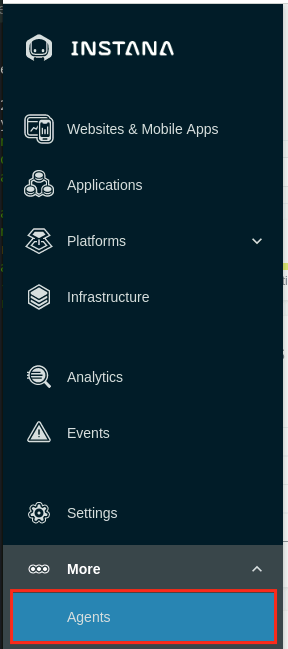

# Instana Agent Installation

## Instana Server Information
## Login into the Instana Server that has been deployed in your environment

Open a web browser and login to the Instana Server UI: 

    https://169.62.62.167.nip.io/#/home

Use the following credentials:

    **E-Mail:** admin@instana.local

    **Password:** "please refer to credentials.pdf" on the Instana server

## Instana Agent Deployment Options (Review the Install UI page)

Before we start the agent installation, let's do a quick review/tour of the options available so you can familiarize yourself with the interface. Instana has a variety of agent installation options including the mirror repository and static agents that allow customers to meet strict change control processes. They can be accessed by clicking the "Deploy Agent" button as shown below in **Image 1** from the Instana UI (The link you opened above): 

***Image 1***

Some of the available options are listed below:

    . OS specific installer (Linux, macOS, Windows, Unix)
    . Hosted Cloud Services (AWS, Azure, Google Cloud)
    . Docker (and other container managers)
    . Kubernetes
    . OpenShift
    . Cloud Foundry and BOSH
    . VMWare Tanzu
    . Integrations (IBM)

You begin by choosing the platform where you will be installing the agent. Then you can selected the Technology dropdown and choose from a list of installation options. For example, on Linux, you can choose a automatic one-liner installation, RPM, or TAR file installation. For OpenShift/kubernetes, you have multiple options including operator, helm, and yaml installs. **Image 2** shows all the available agent installation options and **this will be the default screen when you login the first time to the Instana UI. Just click on "Go to Instana" at the bottom of the page***

(**Don't Install yet, we will be doing the actual installation in the next section, just familiarize yourself with the interface and available options**)

***Image 2***

### HINT: Instana agent install needs privileges! ROOT!!

Instana collects data from monitored systems by using a single host agent on each host. The host agent runs on your hosts to collect and aggregate data from various sensors before it sends the data to the Instana backend. 

The Instana Host Agent has two types, **dynamic** and **static**, based on whether it can update itself or not. What does it mean? Here is the excerpt from [Instana agent documentation](https://www.ibm.com/docs/en/instana-observability/current?topic=instana-host-agent).

A **dynamic** host agent downloads on startup the latest set of sensors from repositories. By default, a dynamic agent updates itself daily with the latest and greatest capabilities that are released. It is also possible to tightly control the updating of dynamic host agents by pinning a version. 

**By default, dynamic host agents use the Instana repository to pull updates**, but it is possible to set up your own managed mirror. Currently, the mirror must be a Nexus repository. This is probably the best option for must customers because it allows them the benefits of automatic updates, while at the same time controlling the content that is in the repository.

A **static** host agent is a self-contained host agent that includes all the latest available components at the time of its release, and has no dynamic update capabilities. **The static host agent has a stable "bill of materials" that never changes after the host agent's installation.**

#### TIP: Static host agents require no internet connection to the Instana repository, and are recommended in restrictive network setups.

Let's move on and get some actual work done. 

# Install Agent(s)

## 1: Installing Instana Agent on Linux VM (s)

In this section of the lab, you will be installing the Instana Agent on 2 Linux vm's that have been provisioned for you for this lab:

    IP: 169.62.62.165 - itz-#####-ipot-vm
    IP: 169.62.62.188 - itz-#####-ipot-mqace 

Replace the ###### with the name from the environment that was provisioned for you as shown below in **Image 3**.

***Image 3***

The steps below show the installation on the **itz-#####-ipot-vm** server. (**Repeat these steps on the itz-#####-ipot-mqace server as well**)
 
Open up a terminal window on your bastion vm and login to the vm as shown below:

**ssh -p <port_number> user_name@ip_address**

     ssh -p 2022 cocuser@169.62.62.165

Use the following credentials:

    **user:** cocuser

    **password:** "please refer to credentials.pdf" on the Instana server

Then use sudo to switch to root:

    sudo -i

Switch back to Instana UI, select the "Stan" the robot icon in the upper left corner as shown below in **Image 4**

***Image 4***

Next, click the "Deploy Agent" button near the upper right corner as shown below in **Image 5**

***Image 5***

A window will open with a list of different environments where you can install the Instana Agent. 

This is a Linux server, so select Linux on the left side of the screen and select the options in the order (1 to 7) as highlighted below in **Image 6**

***Image 6***

When you pull down the "Technology" dropdown you will notice that you can install the Instana agent in several ways such as perform rpm installs or simply download a tar file. The method we are using in this lab is "Automatic Installation (One-Liner)". 

Next, copy and paste the curl command into the terminal window you had opened for the **itz-#####-ipot-vm** server.

The install will progress and you will see an output similar to the screen capture shown below in **Image 7** 

***Image 7***

At this point, the Linux Agent is installed and up and running on the following **itz-#####-ipot-vm** server (169.62.62.165).

The Agent will automatically start monitoring the operating system and start discovering key processes and middleware. In many cases it will automatically instrument those technologies. 

### Update configuration.yaml file on server

Next, we need to edit the configuration.yaml and assign this VM to a Zone so it is grouped correctly in Instana:

    cd /opt/instana/agent/etc/instana
    vi configuration.yaml

In the configuraiton.yaml file, search for Zone and update the file. Remove the "#" sign and update the availability-zone variable as shown below in **Image 8**.  

***Image 8***

Save the file

**Repeat the above step on the itz-#####-ipot-mqace server and put the value of 'ipot-mqace' in the availability-zone variable in the configuration.yaml file when you install on that server**

Next, let's validate the agent is installed, Open a web browser and login to the Instana Server UI: 
    
    https://169.62.62.167.nip.io/#/home

Use the following credentials:

    **E-Mail:** admin@instana.local

    **Password:** "please refer to credentials.pdf" on the Instana server

In Instana UI, select the "Stan" the robot icon in the upper left corner as shown below in **Image 9**

***Image 9***

To view the installed Agent, from Instana UI, under the **three dots**  on the left hand menu, select **Agents** page as shown below in **Image 10**

***Image 10***

On the **Agents** page, you will see the deployed agent information in the **Agent Details** section as shown below in **Image 11**

***Image 11***

Next, Click Infrastructure as shown below in **Image 12**

***Image 12***

Next, verify you see the Linux server **ipot-vm** and click on the edge of the box when it say "instana-pot-vm" as shown below in **Image 13** 

***Image 13***

Now click on "Open Dashboard" as shown below in **Image 14**

***Image 14***

You should be able to see the details of the linux server being monitored using Instana. Click on the "Live" button as shown below in **Image 15** 

***Image 15***

That's it you have now successfully installed the linux agent on the ipot-vm server.

### Please don't forget to repeat the above steps for the itz-#####-ipot-mqace server

***One of the things that needs to be done on the itz-#####-ipot-mqace (IP: 169.62.62.188) is to update the configuration.yaml file and put the value of 'ipot-mqace' in the availability-zone variable in that file as shown below***

Next, open up a terminal window and login to the **itz-#####-ipot-mqace** as shown below(This is after you have installed the agent):

**ssh -p <port_number> user_name@ip_address**

     ssh -p 2022 cocuser@169.62.62.188

Use the following credentials:

    **user:** cocuser

    **password:** "please refer to credentials.pdf" on the Instana server

Then use sudo to switch to root:

     sudo -i

Install the agents using the same steps above and once done we need to edit the configuration.yaml and assign this VM to a Zone so it is grouped correctly in Instana:

    cd /opt/instana/agent/etc/instana
    vi configuration.yaml

In the configuraiton.yaml file, search for Zone and update the file as shown below in **Image 16**

***Image 16***

Save the file

Follow all the remaining steps from above to validate the itz-#####-ipot-mqace server shows up in Instana.

Next, let's move on to installing the Kubernetes agents.

## 2: Installing Instana Kubernetes Agent (s)

In this section, you will be installing the Instana Kubernetes Agent on the following 2 servers that have been provisioned for you for this lab.

## Note: Do not install Kubernetes agent as "ROOT"

    . IP: 169.62.62.185 **itz-######-ipot-rsmaster**
    . IP: 169.62.62.174 **itz-######-ipot-qotdmaster**

Replace the ##### with the name from the environment that was provisioned for you as shown below in **Image 17**.

***Image 17***

The steps below show the installation on the **itz-#####-ipot-rsmaster** server. (**Repeat these steps on the itz-#####-ipot-qotdmaster server as well**)

 
Open up a terminal window and login to the vm as shown below:

     ssh -p 2022 cocuser@169.62.62.185

Use the following credentials:

    **user:** cocuser

    **password:** "please refer to credentials.pdf" on the Instana server

Switch to Instana UI, select the "Stan" the robot icon in the upper left corner as shown below in **Image 18**

***Image 18***

Next, click the "Deploy Agent" button near the upper right corner as shown below in **Image 19**

***Image 19***

A window will open with a list of different environments where you can install the Instana Agent. 

In this case, we will be installing the Kubernetes agent, so select Kubernetes on the left side of the screen and select the options in the order (1 to 5) as highlighted below in  **Image 20**

***Image 20***

We will be using the helm chart option to install the agent. Please enter the value **ipot-robotshop** for "cluster" and "agent zone" fields  as shown above 

Next, copy and paste the curl command into the terminal window you had opened for the **ipot-rsmaster (169.62.62.185)** server.

The install will progress and you will see an output similar to **Image 21** shown below.

***Image 21***

At this point the Agent is installed and up and running. You can verify by running the command below:

    kubectl get all -n instana-agent

**Image 22** shows the output you should expect to see if the agent is installed correctly.

***Image 22***

The Agent will automatically start monitoring and discovering key processes and middleware. In many cases it will automatically instrument those technologies. 

Next, let's validate the agent is installed, Open a web browser and login to the Instana Server UI: 
    
    https://169.62.62.167.nip.io/#/home

Use the following credentials:

    **E-Mail:** admin@instana.local

    **Password:** "please refer to credentials.pdf" on the Instana server

In Instana UI, select the "Stan" the robot icon in the upper left corner as shown below in **Image 23**

***Image 23***

You can access and validate the agent has been installed successfully and is montioring the ipot-robotshop (cluster) by clicking Kubernetes on the left side of the screen as shown below in **Image 24**

***Image 24***

Next, review the metrics on the rsmaster cluster as shown below in **Image 25**

***Image 25***

Next, click on the cluster name and it will show the details of the kubernetes cluster as shown below in **Image 26**

***Image 26***

Next, click on the Nodes (2) tab and it will show the 2 nodes that make up this kubernetes cluster (master and worker) as shown below in **Image 27**

***Image 27***

That's it you have now successfully installed the kubernetes agent on the robotshop cluster.

The steps above show the installation on the **itz-#####-ipot-rsmaster** server. 

### Please don't forget to repeat the above steps for the itz-#####-ipot-qotdmaster server

**One of the things that needs to be done on the itz-#####-ipot-qotdmaster (IP: 169.62.62.174) is to enter the value **ipot-qotd** for "cluster" and "agent zone" fields  as shown below**

Open up a terminal window and login to itz-#####-ipot-qotdmaster vm as shown below: 

     ssh -p 2022 cocuser@169.62.62.174

Use the following credentials:

    **user:** cocuser

    **password:** "please refer to credentials.pdf" on the Instana server

In this case, we will be installing the Kubernetes agent, so select Kubernetes on the left side of the screen and select the options in the order (1 to 5) as highlighted below in  **Image 28**

***Image 28***

Run the above command on the command line and the agent should be installed as shown previously. 

Next, let's move on to installing the Docker agent.

## 3: Installing Instana Docker Agent

In this section, you will be installing the Instana Docker Agent on 1 server that have been provisioned for you for this lab.

    . IP: 169.62.62.187 **itz-######-ipot-docker**

Replace the ##### with the name from the environment that was provisioned for you as shown below in **Image 29**.

***Image 29***

The steps below show the installation on the **itz-#####-ipot-docker** server. 

Open up a terminal window and login to the vm as shown below:

     ssh -p 2022 cocuser@169.62.62.187

Use the following credentials:

    **user:** cocuser

    **password:** "please refer to credentials.pdf" on the Instana server

Switch to Instana UI, select the "Stan" the robot icon in the upper left corner as shown below in **Image 30**

***Image 30***

Next, click the "Deploy Agent" button near the upper right corner as shown below in **Image 31**

***Image 31***

A window will open with a list of different environments where you can install the Instana Agent. 

In this case, we will be installing the Docker agent, so select Docker on the left side of the screen and select the options in the order (1 to 3) as highlighted below in  **Image 32**

***Image 32***

Please enter the value **ipot-docker** as shown above 

Next, copy and paste the curl command into the terminal window you had opened for the **ipot-docker (169.62.62.187)** server.

The install will progress and you will see an output similar to **Image 33** shown below.

***Image 33***

At this point the Agent is installed and up and running. The Agent will automatically start monitoring and discovering key processes and middleware. In many cases it will automatically instrument those technologies. 

Next, let's validate the agent is installed, Open a web browser and login to the Instana Server UI: 
    
    https://169.62.62.167.nip.io/#/home

Use the following credentials:

    **E-Mail:** admin@instana.local

    **Password:** "please refer to credentials.pdf" on the Instana server

In Instana UI, select the "Stan" the robot icon in the upper left corner as shown below in **Image 31**

***Image 34***

Next, Click Infrastructure as shown below in **Image 32**

***Image 34***

Next, verify you see the Docker server **ipot-docker** as shown below in **Image 35** 

***Image 35***

Click on it and then click "Open Dashboard" and you should be able to see the details of the docker server being monitored using Instana as shown below in **Image 36**

***Image 36***

That's it you have now successfully installed the docker agent on the ipot-docker server.

## Complete Infrastructure View of your entire environment

Once you are done with all the above instructions, you can reconfirm that you have 7 agents reporting into your instana server as shown below in **Image 37** and **Image 38**

***Image 37***

***Image 38***

Finally, you should see a similar Infrastructure view of all the agents you have installed as shown below in **Image 39**

***Image 39***

## Summary

Congratulations, you have completed this lab. In this lab, you learnt how to install 3 different types of agents: Linux VM, Kubernetes and Docker. You have seen how easy it is get things up and running and reporting back in Instana. 

You also noticed how Instana collects data at 1-sec granularity when you click the "Live button" in the UI. This is a very powerful feature which can provide insights into how quickly your environment can change and you can review the changes in seconds. 

If you are ready and don't need a break, please move forward to the next lab and "Explore Instana".

