# Alerts and Alert channels

## Create Alert & Alert Channels

Instana can Alert on your website or your backend applications or the underlying infrastructure supporting the application. Instana has two types of alerting mechanisms.

- Smart Alerts
    Smart Alerts is available for Backend application and website which is front end monitoring. Smart Alerts come with out-of-the-box blueprints for Applications looking at the following metrics:
    - Slow Calls
    - Erroneous Calls 
    - HTTP status Codes 
    - Unexpectedly high or low number of calls

    Smart Alerts are also available for Front-end website monitoring which also come with out-of-the-box blueprint Key performance indicators like:
    - Slowness measured by OnLoad Time which is the time taken before the user is able to interact with the webpage
    - JS Errors (JavaScript Errors)
    - HTTP Status Codes
    - Unexpectedly Low Number of Page Loads
    - Unexpectedly High Number of Page Loads
    - Custom Events which can include custom parameters which can be tracked by the Javascript Agent API (https://www.ibm.com/docs/en/instana-observability/current?topic=websites-javascript-agent-api#reporting-custom-events)

### Creating a Smart Alert
We are going to create Smart Alert for an Application:
Click on Left hand tool bar and select "Applications" as shown below.

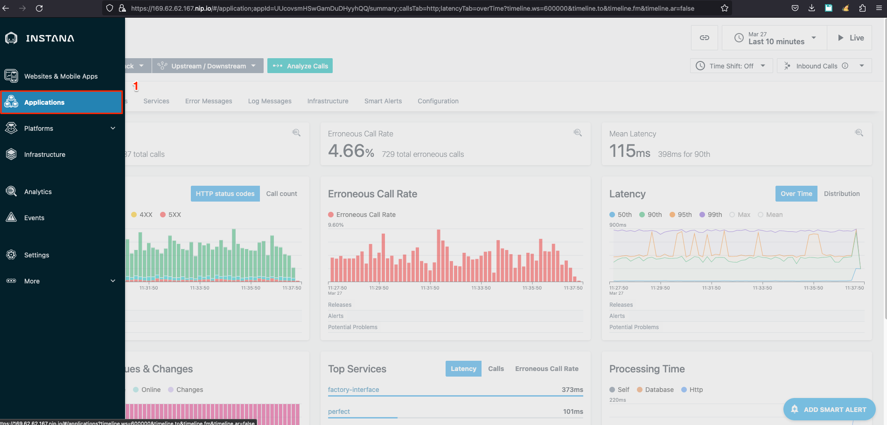

Please Select "All Services"

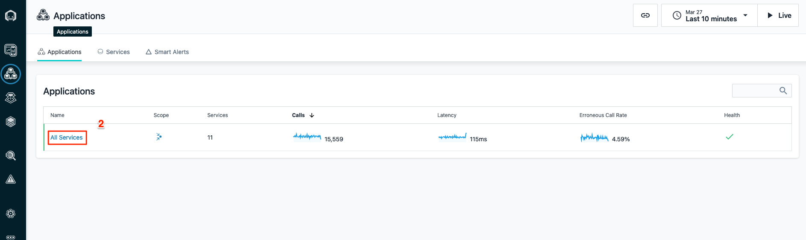

Now Click on "Add Smart Alert" on the bottom of your screen as shown below.

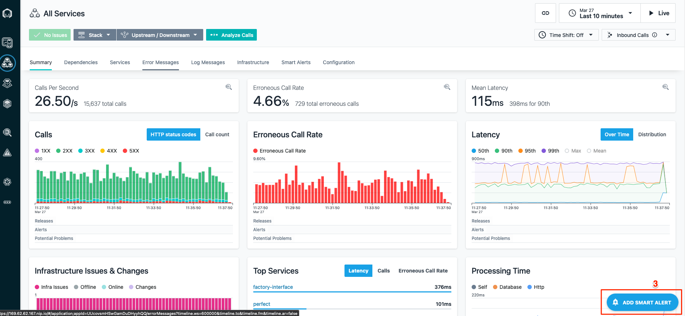

In this Example we are trying to create an alert with the Slow Calls Metric. This means we will be looking at all the Slow Calls from our application services. As you can see in the picture below, we can see the Graph of Last 24 hours and the Graph of Last 7 days. Click on "Last 24 Hours" as shown below.

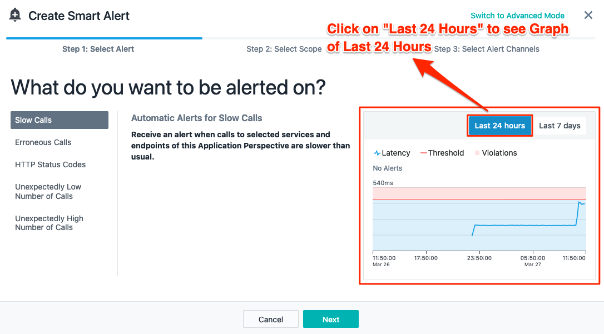

Now you can click on Last 7 days to see the Graph of Last seven days as it relates to the latency of all your services from your Application.

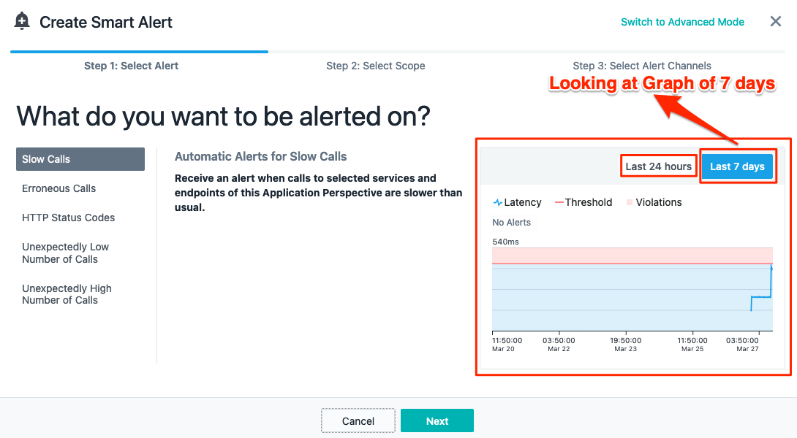

Now that you have seen both the graphs, we can look the values on the graphs. The red line shows us the Threshold is set by default by Instana and the Blue Line on the graph shows the actual slow calls which has happened in last 24 hours or 7 days whichever graph is being looked at. If you put your mouse/cursor on the Red Line or the blue line on the Graph you can see the actual threshold limit and the actual latency (how slow or fast all your services are taking) as shown below.

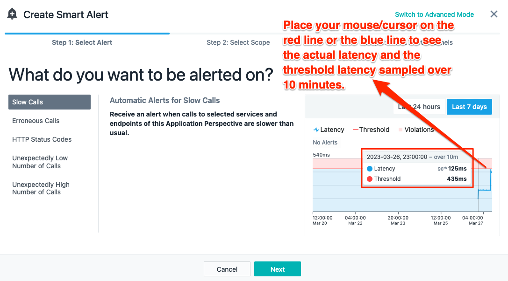

Now we can click "Next" in the pop message as shown below.

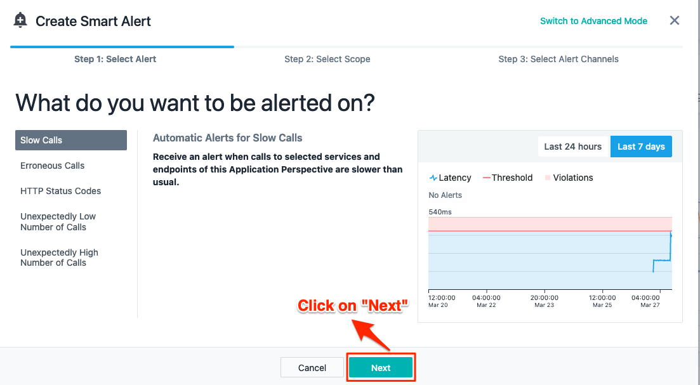

In this pop you will be shown all the Services which your application is using when you click on the downward arrow as shown below.

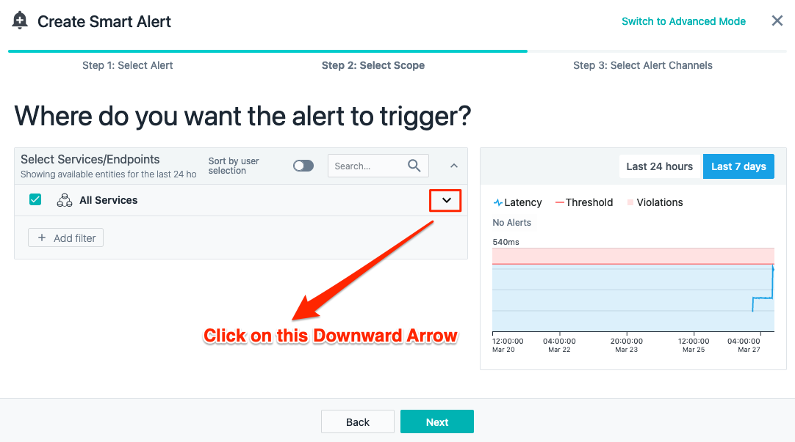

By default all the services are selected but you can deselect all of them by clicking all Services and pick the ones you are interested in creating a alert on. 

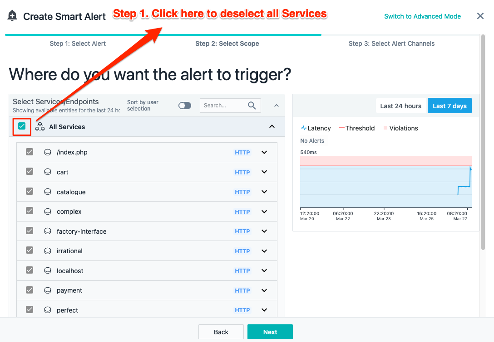

Now you can select any number of services which you want to get alerted. In this example I am selecting one service for the sake of our discussion as shown below.

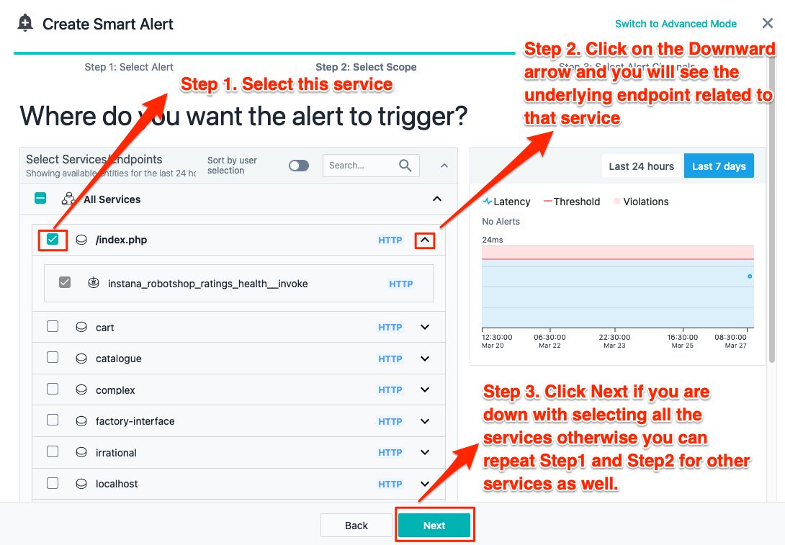

Now you can select an existing Alert Channel if you have already created one by Clicking "Select Alert Channels" or you can create a new Alert Channel. We are going to be creating a new Alert Channel today.

### Creating an Alert Channel

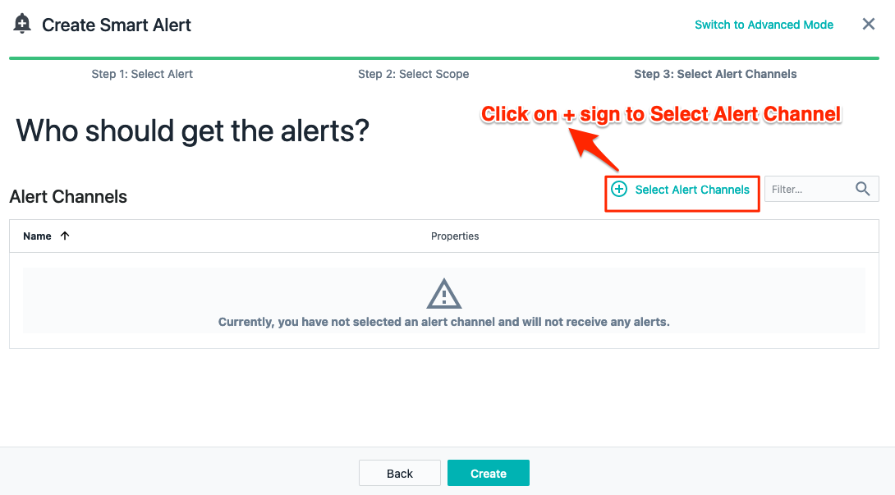

Now click on Create New Alert Channel as shown in the picture below.

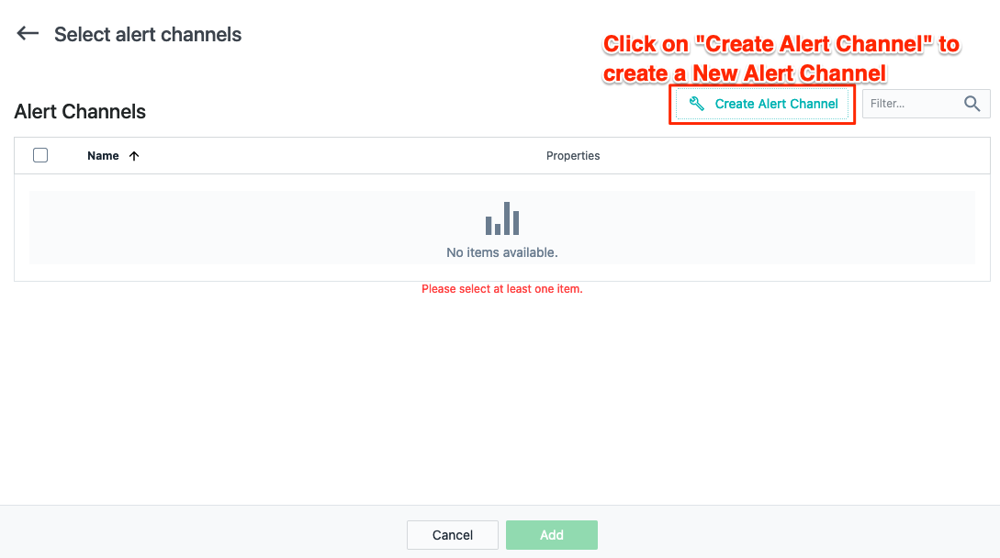

Now you can see all the options which you have in creating an alert channel today.

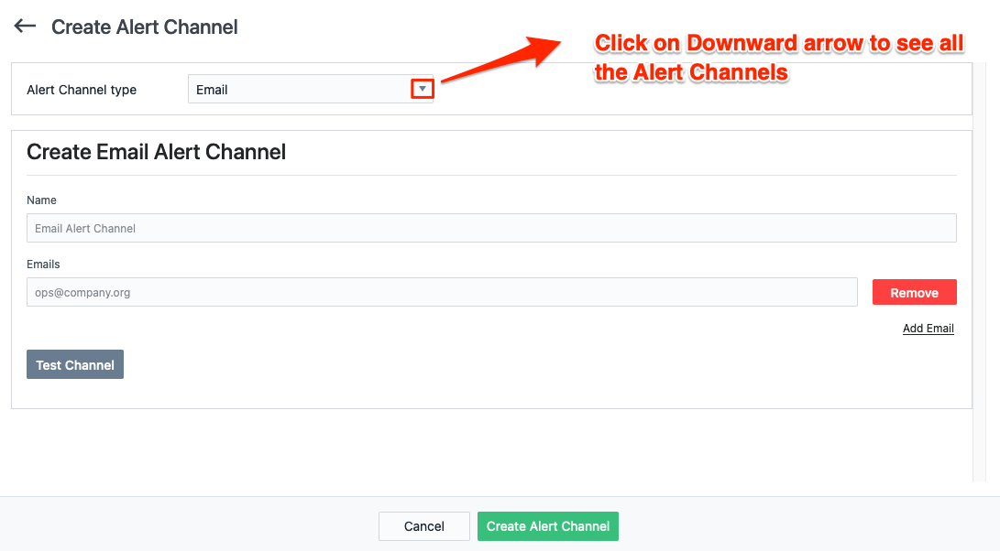

Now you will see all the options Instana provides to communicate to the respective team members or the teams using one of these alert channel Options.

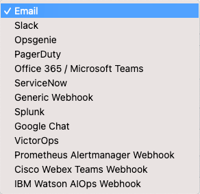

We are going to be creating a alert channel using our email address today as an example. 

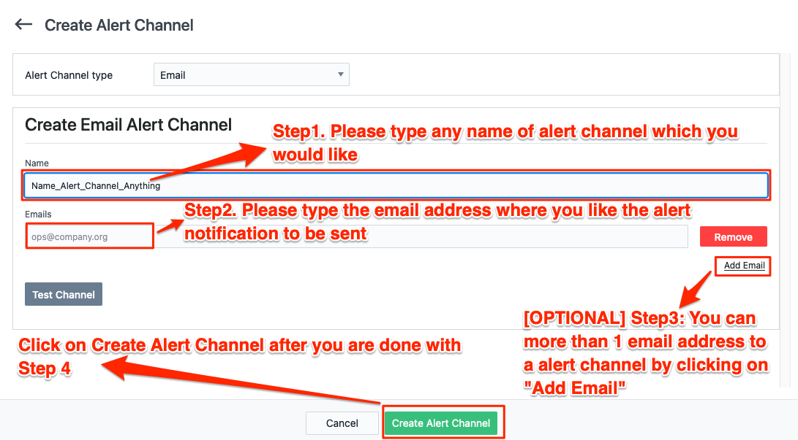

After Creating the Alert Channel, we can select that Alert Channel

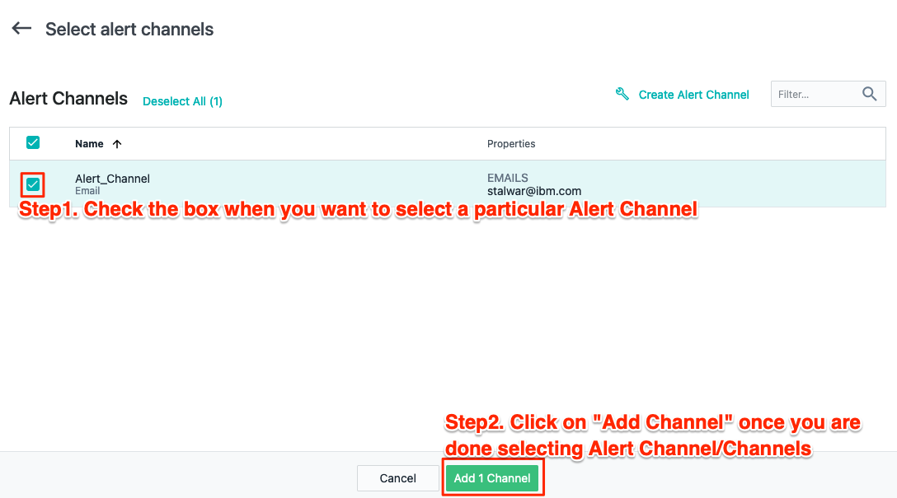

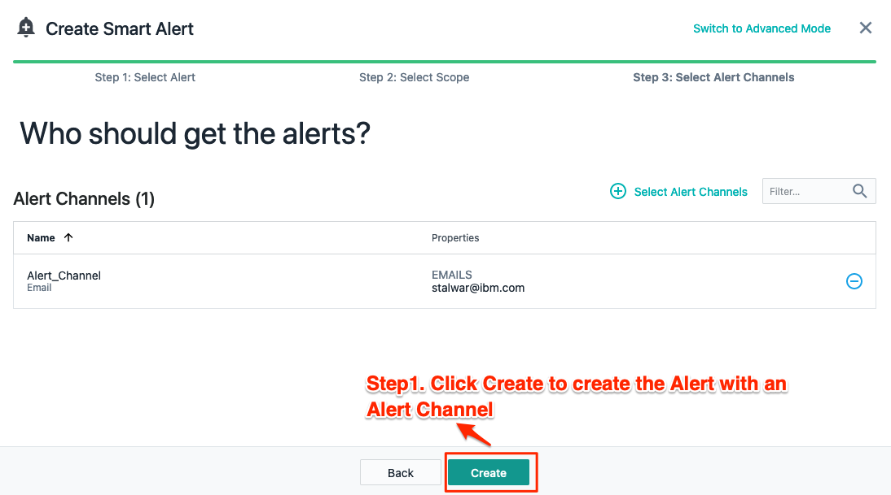

You will see a dialog message appear after you have created the alert on top right.
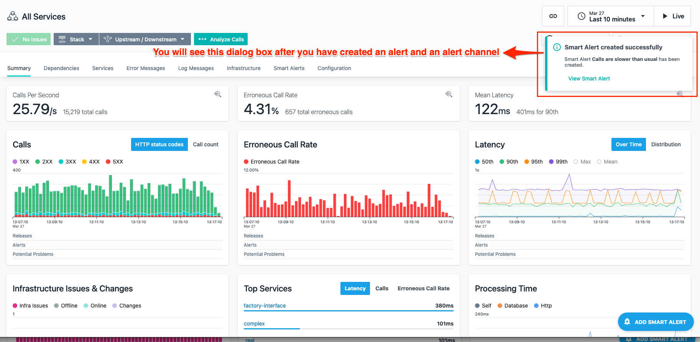

You have now successfully completed this lab. In this lab, you learnt how easy it is to create Alerts and define "Alert Channels". You create the email Alert channel in the above example but as you saw there are lots of options available thus making it easy to integrate Instana with other tools.

Proceed to the next lab.

