# Define App Perspectives

## 1: Create an Application Perspective for Robot Shop

Before we can investigate Applications within Instana, we need to create an
**Application Perspective**. This section describes how to define the
**Application Perspective**.

**Application Perspectives** allow you to group together a number of different
services and endpoints into dashboard that shows the health and performance of a
business application. In this section, you will create and **Application
Perspective** for the **Robot Shop** application.

On the left hand navigation, select **"Applications"**. 
**Image 1**

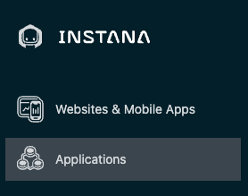

You will see a screen open up that contains a list of all applications that are defined in the
environment. Initially, this list maybe almost empty showing just **All
Services** generic bucket as shown below:
**Image 2**
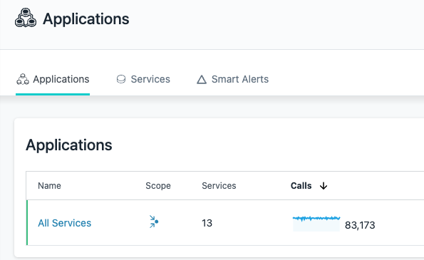

The next thing you are going to do is define an application. You will see an
**"Add"** button in the bottom right corner.

**Image 3**
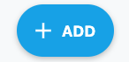

Click the **"Add"** button

A dialog will open with two options (one if Smart Alerts feature is not enabled
yet on your server). We'll examine the "Global Smart Alerts" in the
Administer Instana section of this lab. For now, click on the **"New Application Perspective"** button

**Image 4**
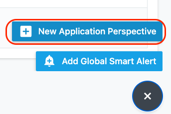

Switch to the Advanced View Mode in the upper right corner. Then complete the
definition to look like below. 

Enter the Application name as "Robot Shop". Next, in section 2, click "add filter" button and type in **kubernetes** and then select
**namespace**. Then, click in the **value** field. You'll notice that when you
click on it, the field is pre-populated with **kubernetes namespaces** that have
applications being monitored. Select the **robotshop** namespace.

This selection will allow the **application perspective** to limit the scope to
all transactions within the **robotshop** kubernetes namespace.

Scroll down further in the dialog and select to include **All Calls** within the
dashboard.

Finally, click the **Create** button to create the application perspective.
**Image 5**
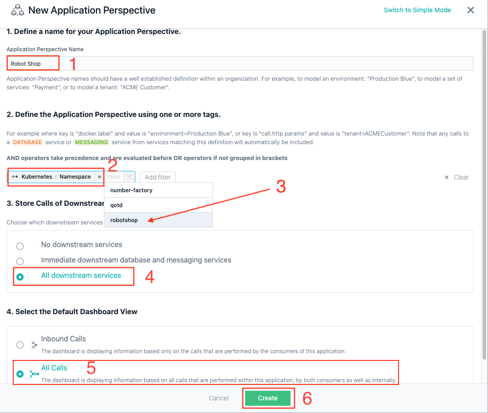

Once the application is created, you will be taken to the "RobotShop" Dashboard page, please click on "Live" on upper right corner and switch time to last 5 minutes to start seeing data.

**Image 6**
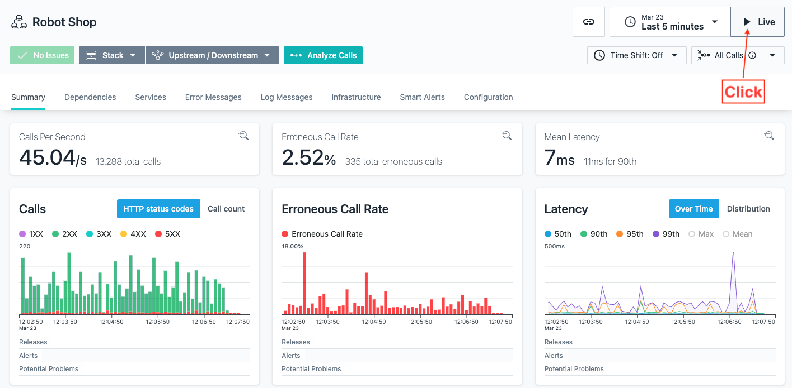

You have now created an application perspective for Robot Shop

## 2: Create an Application Perspective for QOTD

In this section, you will create and **Application
Perspective** for the **Quote of the Day** application.

On the left hand navigation, select **"Applications"**. You will see a screen
open up that contains a list of all applications that are defined in the
environment. Initially, this list maybe almost empty showing just **All
Services** generic bucket.

The next thing you are going to do is define an application. You will see an
**"Add"** button in the bottom right corner.

**Image 7**

Click the **"Add"** button

A dialog will open with two options (one if Smart Alerts feature is not enabled
yet on your server). We'll examine the "Global Smart Alerts" in the
Administrative section of this lab. For now, click on the **"New Application
Perspective"** button

**Image 8**

Swich to the Advanced View Mode in the upper right corner. Then complete the
definition to look like below. As you add filters, you'll notice that Instana
automatically populates the fields like the service name. As you add filters,
notice that you need to add a combination of AND and OR conditions to achieve
the results that you want.

**Image 9**
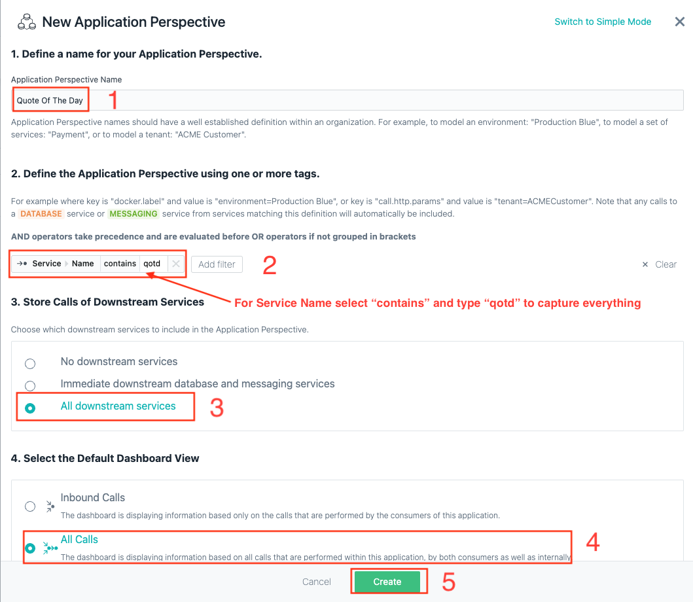

What this Application Perspective is doing is the following. We are matching any service that contains the word **qotd**. We're including any transactions that are in multiple **namespaces** where the Quote of the Day application is installed.
Using namespaces makes it very easy to build **Application Perspectives** for
cloud native applications. 

Once the application is created, you will be taken to the "Quote Of The Day" Dashboard page, please click on "Live" on upper right corner and switch time to last 5 minutes to start seeing data.
**Image 10**
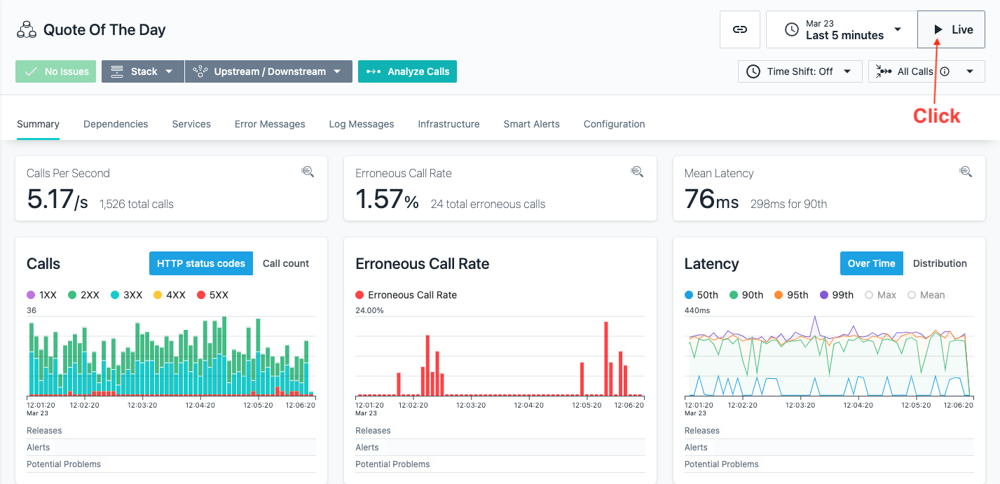

You have now created an application perspective for Robot Shop and Qoute Of The Day applications. 

On the left hand navigation, select **"Applications"**. 

**Image 11**

You will see a screen open up that contains a list of all applications that are defined in the environment. 

You should now see the above Applications you created as shown below:

**Image 2**
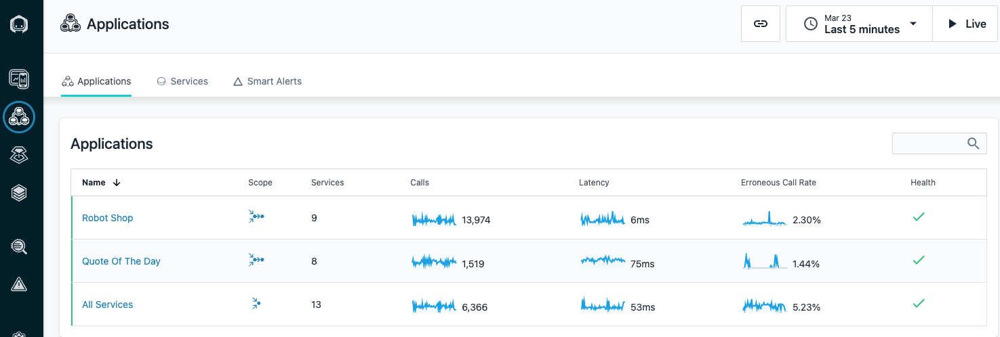

In the next section, you'll
explore the application (it can take few minutes before the data for application
is populated).

## 3: Exploring "Quote of the Day" Application

After creating the application, your screen should have automatically changed context to show the Application Perspective that you just defined.

From the left menu of Instana click on **"Application"**

**Image 13**
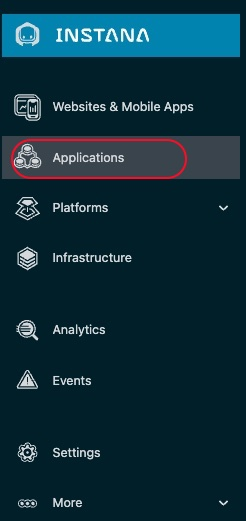

Click on the **"Quote of the Day Application"** you have defined

**Image 14**
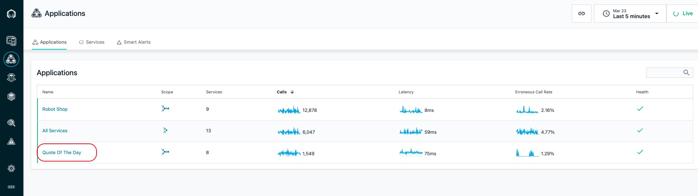

Initially, you probably won't see any metrics on the screen. In the upper right corner, click the **"Live"** button and within a short amount of time you should start to see metrics in the widgets.

**Image 15**
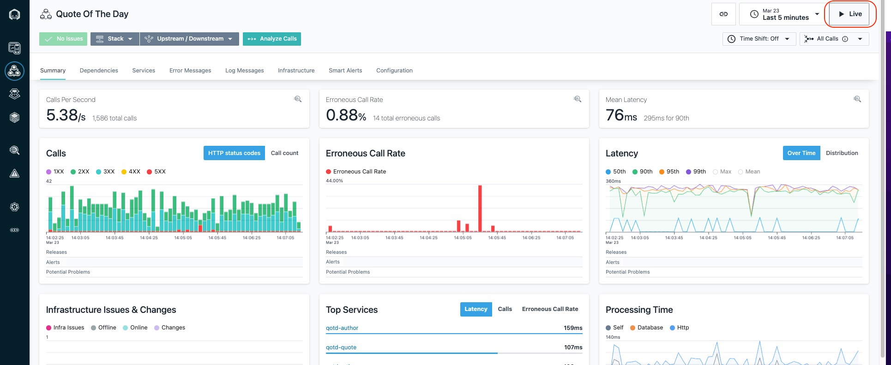

On this page you can see the golden signals which include transaction volumes, the number of erroneous calls, and latency. You'll also see the top services that make up the application.

You'll notice a number of tabs across the top of the screen. Explore these tabs. In particular, let's take a look at the **"Dependencies"** tab.

Click on the **Dependencies** tab.

On the dependencies tab, you'll see a full topology of the application services. This topology is discovered automatically. You can see transactions flowing between the different nodes in the topology. Most of these services are node.js based cloud-native services. There should be also be a node with a name that ends in **BK1:EG2**. BK1 is the ACE Integration Node and EG2 is the ACE Integration Server. The **QM1 node in the topology is the MQ Queue Manager named **"QM1"**.

**Image 16**
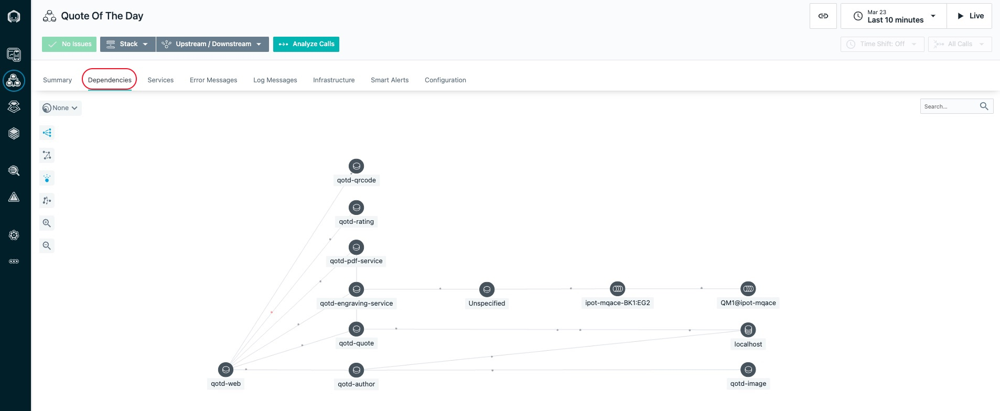

Fly your mouse over the **QM1** node. Flying over any node in the dependency graph will show you a summary of the traces going through that service. You'll see the percentage of calls that are erroneous and the latency of the calls if any.

**Image 17**
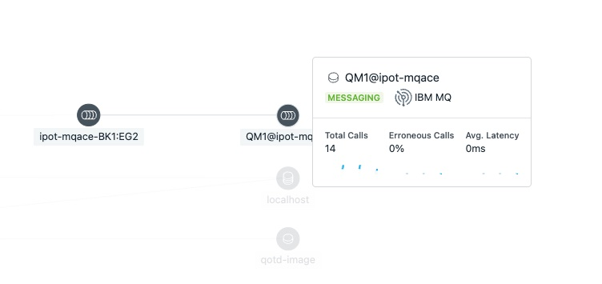

Click on the **"QM1"** node. Notice that there are 3 options that would allow you to navigate to the MQ dashboard, the transaction Flow within MQ, or analyze the transaction calls through MQ. For now, we'll skip this navigation, but we suggest you explore those options later.

**Image 18**
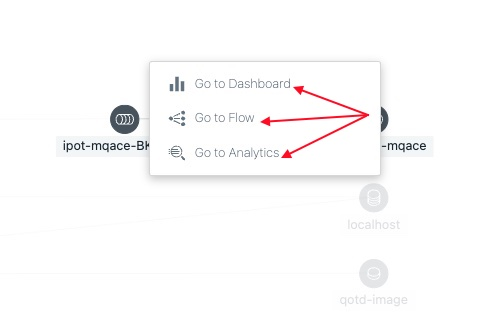

Click on **"Upstream/Downsteam"** near the top of the page. This will allow you to see a list of Upstream and Downstream services for the application.

**Image 19**
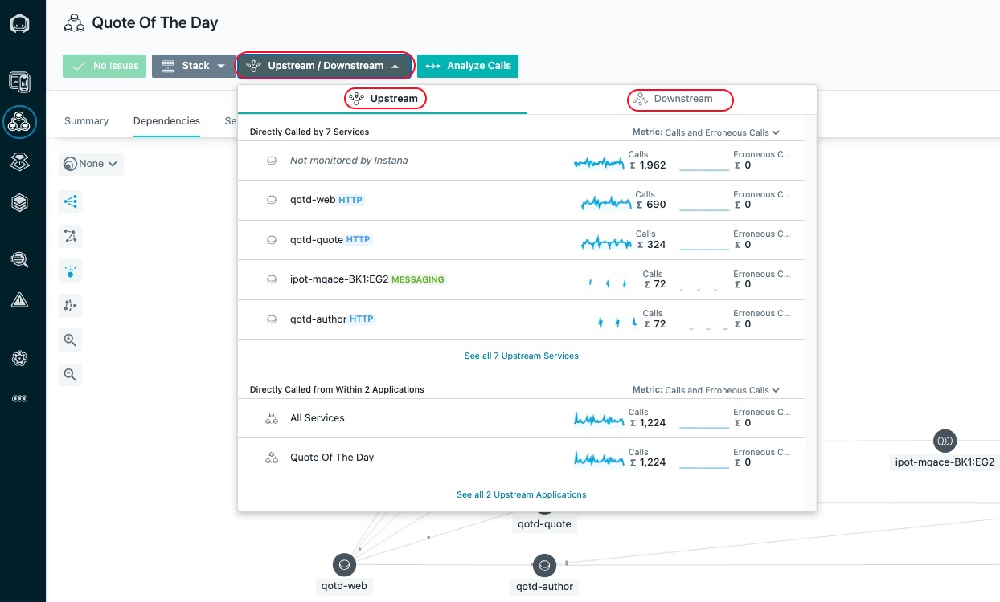

Click on **"Stack"** where you can view the Application, Kubernetes, and Infrastructure stack that makes up the application.

**Image 20**
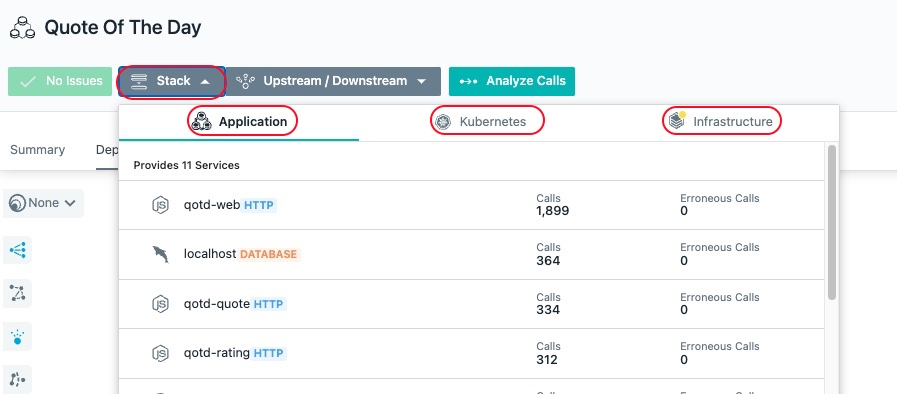

All of this contextual and relationship data helps you analyze and debug you applications to get to root cause as quickly as possible. In addition, Instana's built analytics uses this data to automatically group multiple related **"Events"** into a single **"Incident"** for diagnosis.

Close the **Stack** dialog by either clicking on the **Stack** button or somewhere else on the background of the Instana GUI.

Note: There are a few other tabs on this screen that you can explore on your own. For now, we're going to focus on the **Services**.
Click on the **Services** Tab

**Image 21**
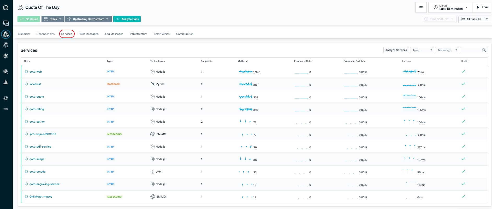

You will see a list of services that make up the application.

Scroll down on the page until you see the **"qotd-engraving"** service.

Click on the **qotd-engraving** link on the left Column. The qotd-engraving service is the service that calls and ACE flow and then puts a message on the MQ queue. We want to explore this service in more detail.

**Image 22**
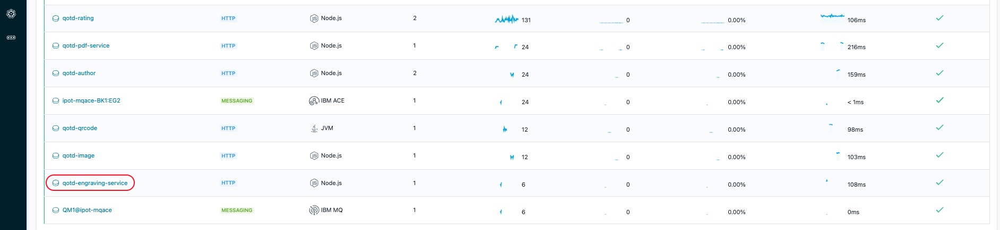

You should see a page showing the transactional data filtered down to just the qotd-engraving service.

Click on the **"Analyze Calls"** button to analyze the individual transactions that are executing within the **"*qotd-engraving"** service.

**Image 23**
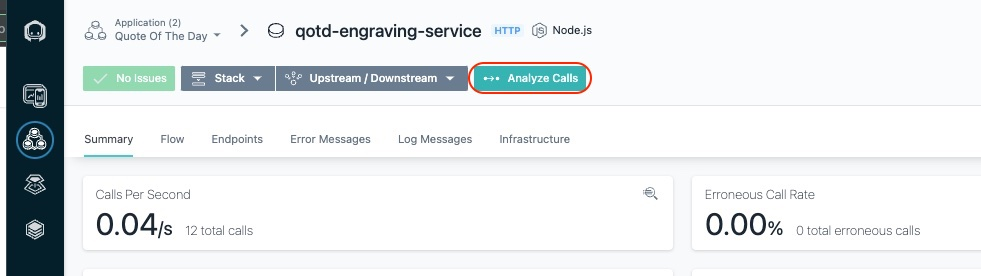

This will take you to a screen showing all of the different types of calls taking place within the qotd-engraving service. At the top, there is a summary of all calls in terms of transaction rates, return codes, erroneous calls, and latency.

On the right side, click the arrow to expand the list of qotd-engraving **"POST /order"** calls. Instana is capturing 100% of the transactions so that you don't miss intermittent problems that might be occurring in the environment.

**Image 24**
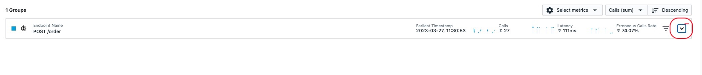

Select one of the requests

**Image 25**
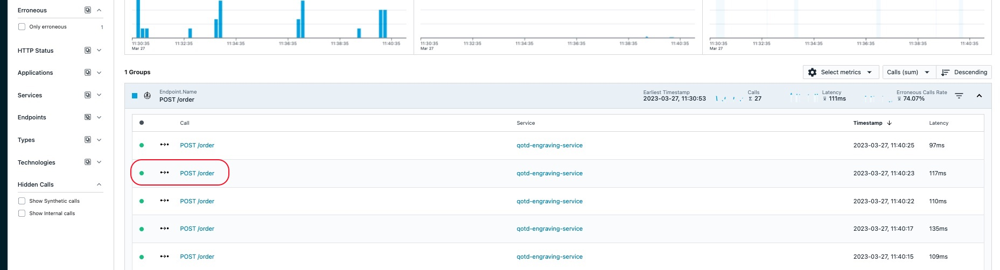

You are now looking at the tracing data for a single transaction. At the top of the screen, you will see a summary of the latency, sub-calls and timeline. On the right side of the screen, you'll see the details and stack trace.

**Image 26**
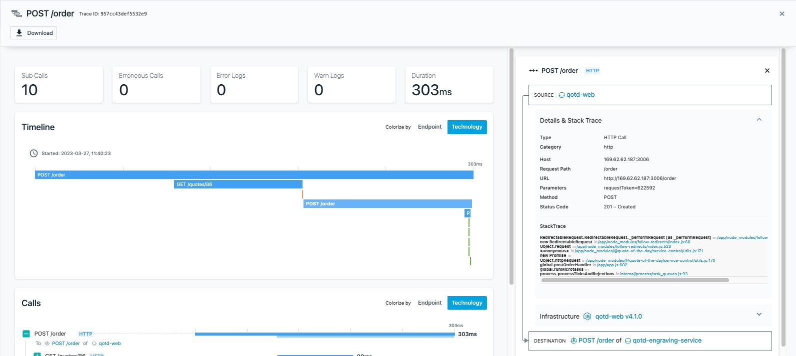

Scroll down and you will see the service endpoint list

**Image 27**
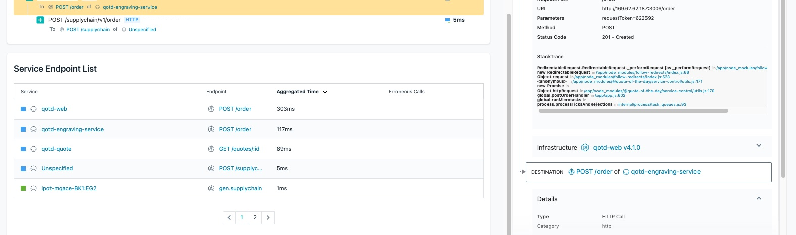

Finally, scroll to the bottom of the screen and you will see a detailed call stack **Calls**. The call stack gives you the timing and sequence of the call going through the application.

Note: If errors were captured in the logs, they would be shown at the bottom of the screen, below the call stack.

If you select the text on the left or the timeline bar, the "Details & Stack Trace" context will change.

Explore the different types of calls going through this transaction by selecting the individual call. When you select an entry, examine the detailed information on the right.

**Image 28**
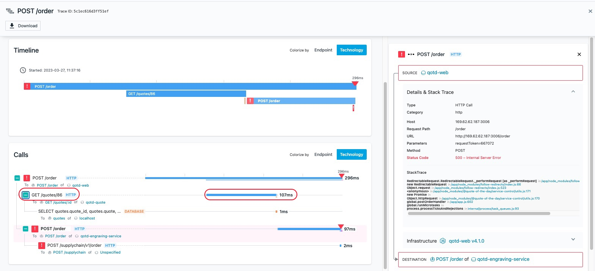

You should notice that different request types are color coded differently. Blue represents the HTTP requests going through an App Server or java process. Orange represents a database call. And green represents a messaging call (ACE and MQ).

When you select the Node.js App Server requests, you'll see the **StackTrace** on the right hand side. Within the **StackTrace**, click one of the URLs.

**Image 29**
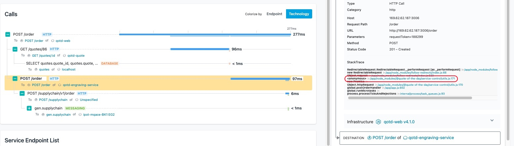

When you click on the link, Instana will decompile the code and show you the lines of code. The exact line of code that is executing will be highlighted in yellow.

**Image 30**
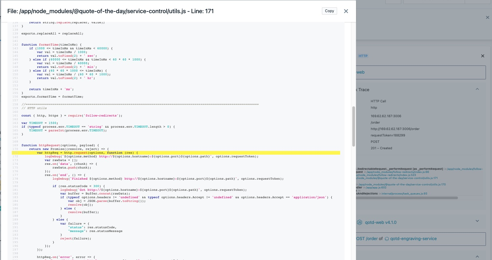

Click the X in the upper right corner to close the dialog.

When you select the ACE portions of the call Stack (gen.supplychain, msgFlowTransaction, and postOrder) you will see key information including the flow name, Integration Node, Integration Server, IP address, and more on the right side of the screen.

**Image 31**
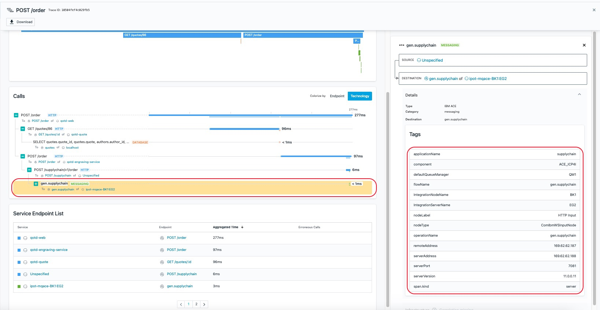

## 

You have now successfully completed this lab and have learnt how to "Define an Application Perspective" and navigate your application and it's components using Instana. Please proceed to the next lab where you will learn about EUM ("End User Monitoring").

