## 1: Websites and Mobile App Monitoring

:::note

You should first generate some traffic in the monitored application.

Navigate to the Quote Of The Day application with the route URL 

You could use http://169.62.62.174:32000/

Use the application to navigate to generate randon quotes , PDFs, and to buy some engraving.

:::


Next, let's take a look at Website and Mobile Application Monitoring. In this environment, Instana does not include any native mobile applications, but know that Instana can gather End User Monitoring (EUM) data from Mobile Applications. For now, we'll investigate the website monitoring.

Using the left side navigation, select **Websites & Mobile Apps**

**Image 1**

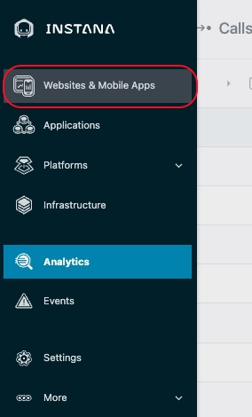

**Website monitoring**, often called **End-User Monitoring (EUM)** or **Real-User Monitoring (RUM)**, is an important tool to understand digital user experience.

Instana supports website monitoring by analyzing actual browser request times and route loading times. It allows detailed insights into the web browsing experience of users, and deep visibility into application call paths. The Instana website monitoring solution works by using a lightweight JavaScript agent, which is embedded into the monitored website.

To Configure *EUM*,  Click on **"Add Website"** 

**Image 2**
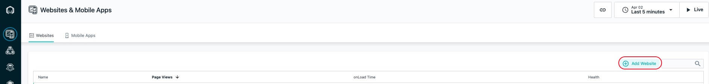

Type in the name as **"QOTD"**

**Image 3**
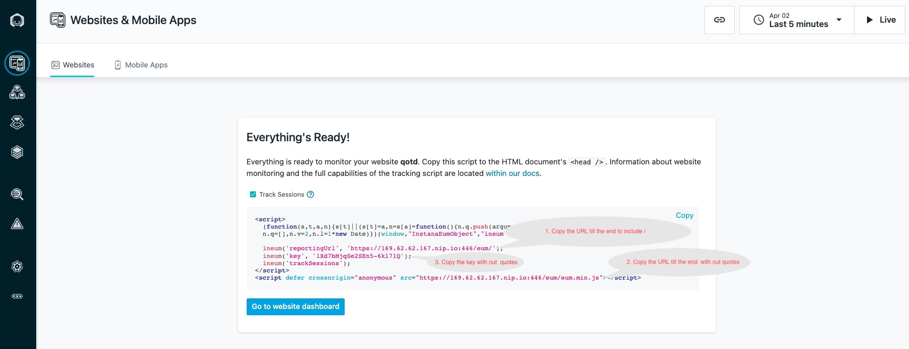

Copy the 3 values as shown in **Image 3** to add these to the environment variables of the **QOTD** app deployment.

Login to the qotd master vm by typing the following in  Terminal window on the bastion vm

  ```console
  ssh -p 2022 cocuser@169.62.62.174
  
  ```
Edit the qotd deployment to add the env variables you copied - refer  **Image 3** above

```console
kubectl -n qotd edit deployment qotd-web

```
Scroll down the file to the to the section as shown here
 
      creationTimestamp: null
      labels:
        app: qotd-web
    spec:
      containers:
      - env:
        - name: LOG_LEVEL
          value: info
        - name: ENABLE_INSTANA
          value: "true"
        - name: INSTANA_REPORTING_URL
        - name: INSTANA_ENUM_MIN_JS_URL
        - name: INSTANA_KEY
        - name: USE_REQ_TOKEN
          value: "true"
        - name: POLLING_FREQUENCY
          value: "5000"
        - name: ANOMALY_GENERATOR_URL
          value: http://169.62.62.164:3012/services/web
        - name: QUOTE_SVC
          value: http://169.62.62.165:3001

Add values which were copied earlier as shown in **Image 4** below.

      creationTimestamp: null
      labels:
        app: qotd-web
    spec:
      containers:
      - env:
        - name: LOG_LEVEL
          value: info
        - name: ENABLE_INSTANA
          value: "true"
        - name: INSTANA_REPORTING_URL
          value: https://169.62.62.167.nip.io:446/eum/
        - name: INSTANA_ENUM_MIN_JS_URL
          value: https://169.62.62.167.nip.io:446/eum/eum.min.js"
        - name: INSTANA_KEY
          value: 1Xd7bMjqSe2SEn5-6kl71Q
        - name: USE_REQ_TOKEN
          value: "true"
        - name: POLLING_FREQUENCY
          value: "5000"
        - name: ANOMALY_GENERATOR_URL
          value: http://169.62.62.164:3012/services/web

**Image 4**

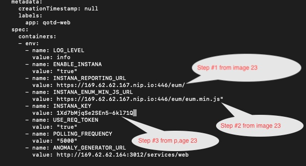

Once you save and close the file, the pod will restart.
Wait for a min and go to instana home page 
https://169.62.62.167.nip.io/

Using the left side navigation again, select Websites & Mobile Apps

**Image 5**


You will see a list of websites that are being monitored. In this environment, you'll see the **Quote Of The Day"** application website you just configured. Click on the blue link for the website to drill down for more details.

**Image 6**

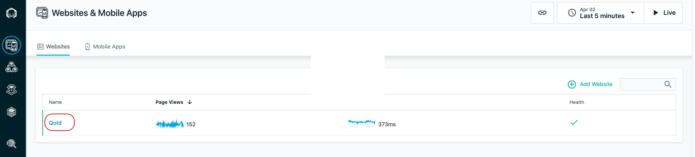

Explore the additional data available within the website monitoring by clicking on some of the other tabs.

**Image 7**

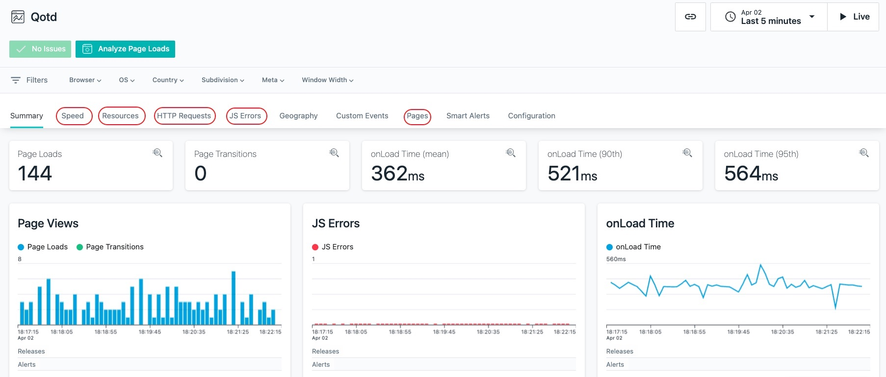

Next, explore the **Filters** that you see at the top of the screen.
In this environment, the filters will not be very interesting because there is only automated workload coming from a single location. But, usually, you can use this information to filter the web traffic down to specific browser types, OS's, geographic locations and key metadata tags. This can be very useful in identifying whether specific network locations, browser, or OS's are having performance problems. If you want to see typical EUM data, you can look at one of the IBM sales or Business Partner demo environments.

**Image 8**

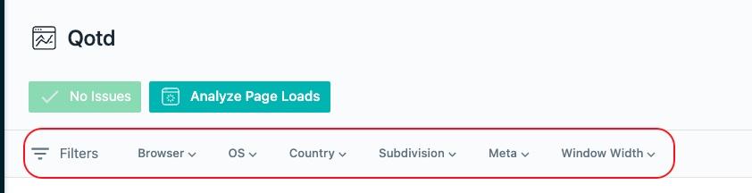

At the top of the screen, click on the **Analyze Page Loads button**

**Image 9**
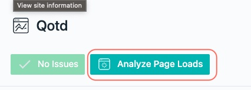
 
You will see a detailed list of the web requests grouped by URL path.

**Image 10**

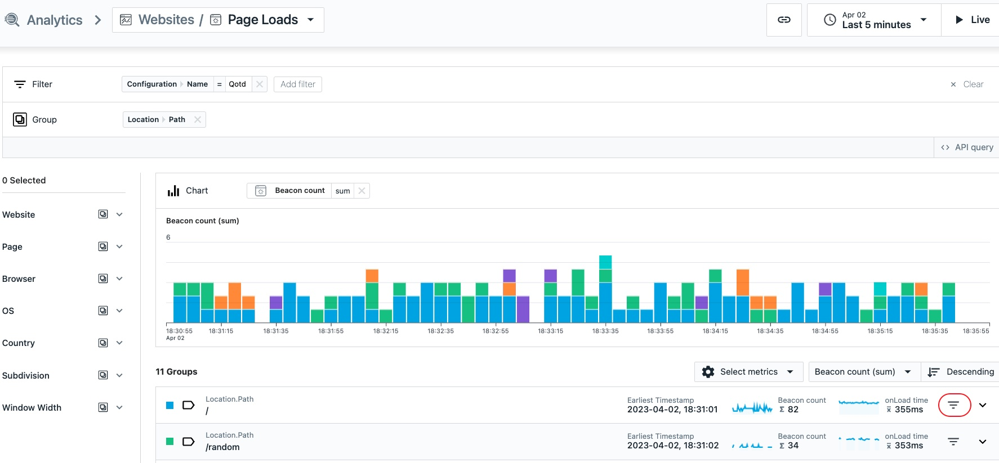

Next, select one of the requests. You will see a detailed page showing the EUM data and more. At the top of the page, you'll notice that you can see the user that made the request. This sensitive data can be omitted by Instana if the customer desires. You'll also see the Browser version and operating system that was used to access the web page. Depending on the environment, you'll also see geolocation data for where the person accessed the application. In some cases the private IP addresses are not mapped and the **User Location** data will be empty. 
example select here is **order/92**

**Image 11**

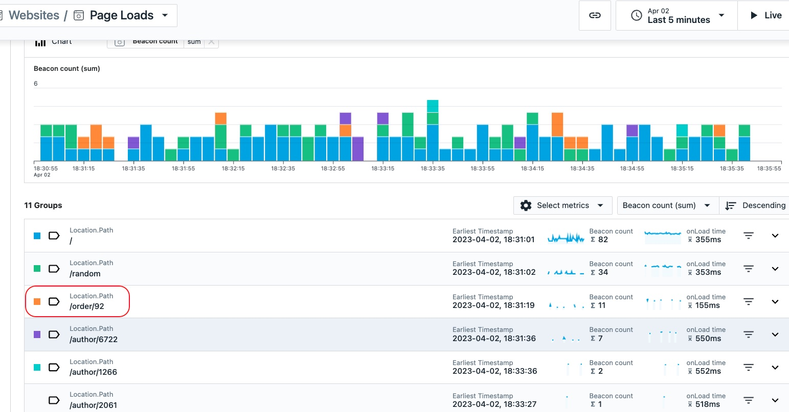

**Image 12**

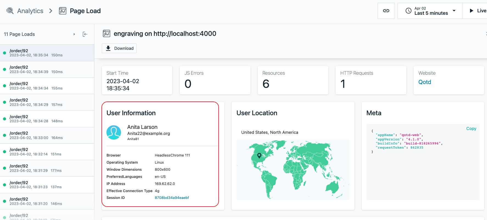
 
Scroll down on the page and you'll see a detailed breakdown of the request including timings for the key page content.

Expand one of the entries on the right by clicking the down arrow to view more details.
**Image 13**

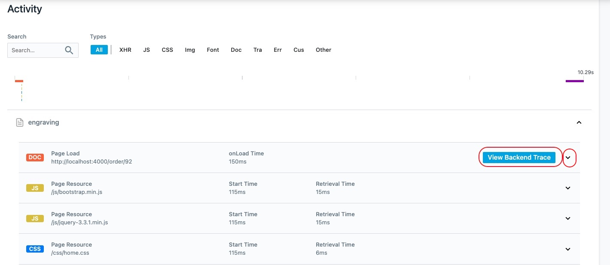
If you click on the View Backend Trace button, you can investigate the backend trace data that you saw earlier in the lab.
###

## 2: Analytics
Next, we're going to investigate Instana's unbounded analytics. Navigate to the **Analytics** using the left side navigation.

**Image 14**

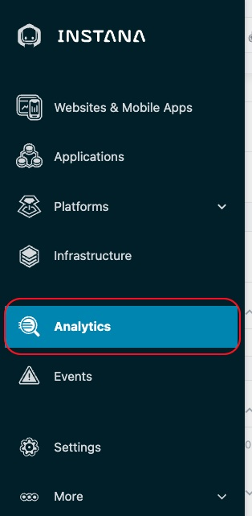

Initially, you will see a screen showing 100% of the **Application Calls** that are happening in the environment.

Select the dropdown at the top of the page labeled **Applications / Calls** to view other options. For example, you could analyze the traces, websites, mobile applications, or profiles. For now, close the dialog and we'll analyze the **Application Calls**

**Image 15**

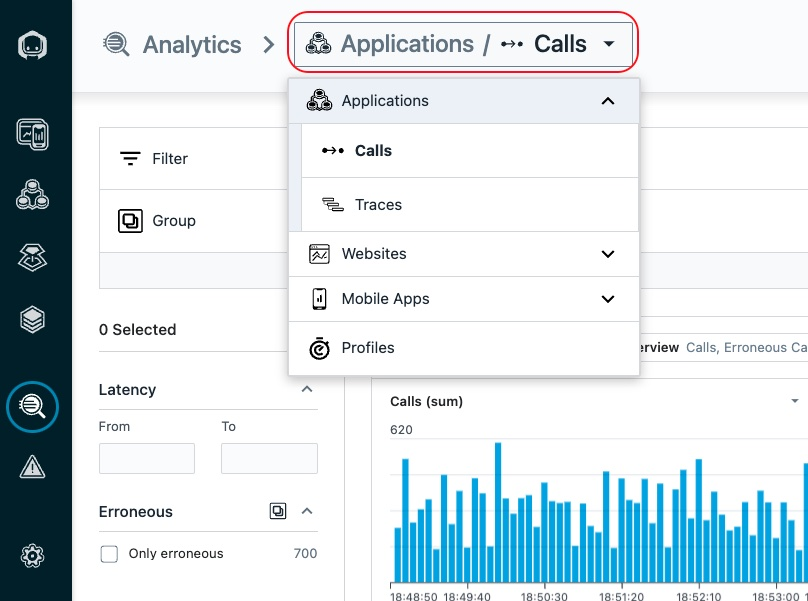
One of the key Instana capabilities is **unbounded analytics**. This allows you to apply ad-hoc queries to easily find the data you are looking for. On the screen, you'll see a couple of different ways that you can query/filter the metrics.

On the left side, you'll see a number next to the box filters. Expand the dropdown arrows to see the options. Then, select one of the checkboxes to filter the data. (in this example select **Quote Of The Day**)

**Image 16**

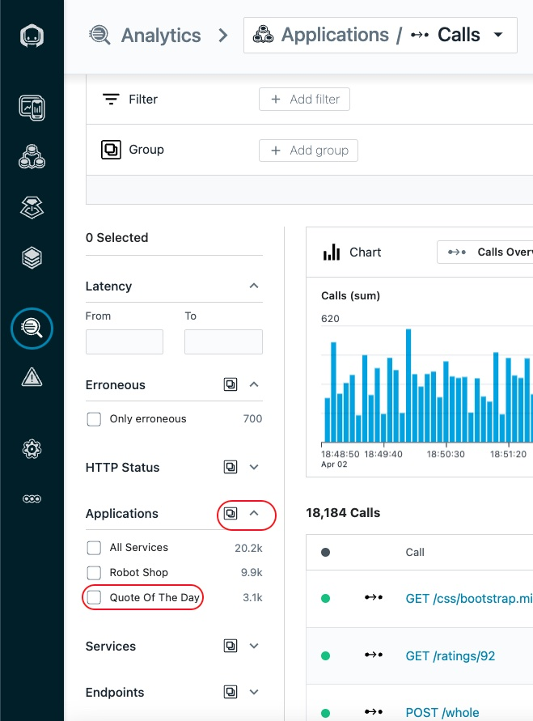

Now, uncheck the checkbox to remove the filter.

Another option is to use the **Filter** and **Group** options at the top of the page. Let's try out an example. Let's say you want to find the slowest SQL statements in the environment. Let's try to implement a **Filter** and **Group** to accomplish that.

Select the **Add Filter** button at the top of the page. Then, select **Call Type** and select **Database**

Click on the **Add Group** button. Then, type **database statement** in the filter box and select **Database >Statement**


**Image 17**

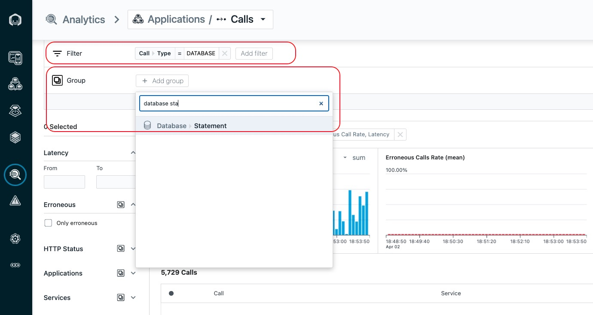

This will group all of the Database statements by unique SQL statements. You can then sort these statements by latency, erroneous calls, etc.

**Image 18**

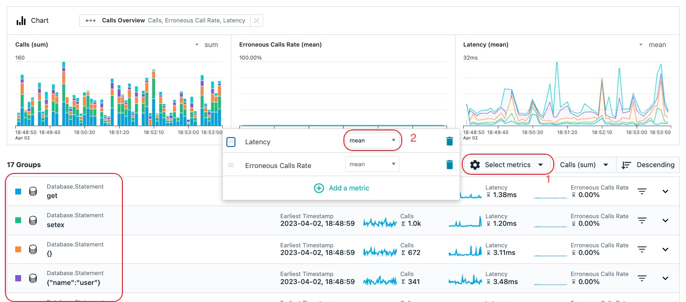

Note: You also have the option **select metrics** to choose the metrics that you want to see on the screen. For example, change latency from Average to 95th percentile.

---

Now, let's explore one more key capability within Instana.

In the upper right corner of the screen, there is an icon of a chain link. Click on the link and a dialog will open. By clicking the Copy button, you can send a link to a team member. When they open the link, it will take them to a screen with the exact same context that you are looking at. This can be very valuable when collaborating with team members to diagnose a problem. Within the dialog, you'll see that there is a checkbox to **Lock current time range**. By locking the current time range, when the link it opened, it will take the person to a view with the exact same time range that you are looking at. Otherwise, they are taken to the most recent time range.

**Image 19**

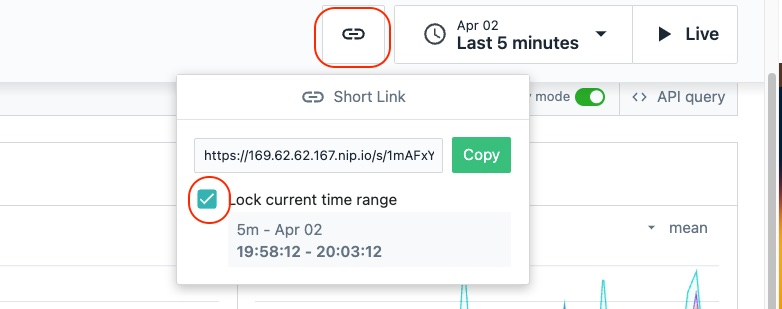

That completes this lab. In the lab you learnt how to set up **End User Monitoring** for your application and reviewed a lot of functionality including analyzing calls for your application.  

Next, please proceeed to the lab where you will learn how to troubleshoot an issue. 

---
