# Troubleshoot an issue

## Troubleshooting Ratings Endpoint Failures
We are going to simulate the following (Ratings Endpoint Failures) failures in the system using Anomaly Generator running at http://169.62.62.164:3012
Please visit the URL: http://169.62.62.164:3012

Double Click on qotd-rating Endpoint Failures as shown below.

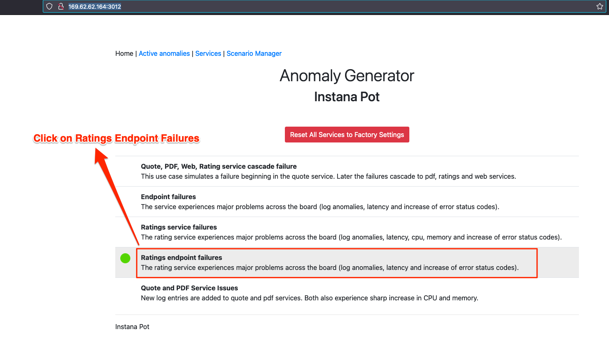

Now Click on "Start" whenever you are ready to inject the following failures as shown below in the picture.

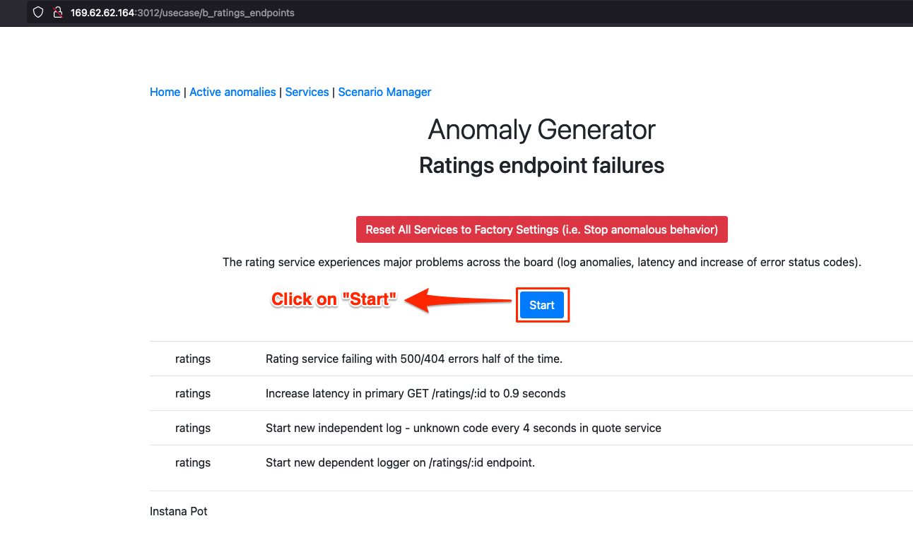

Now the system will take time to simulate the failures. Please give atleast 3-5 minutes for the system to simulate the failures.

All of these failures will be in the qotd-rating service. There are going to be 4 failure scenarios in the qotd-rating service.

1. Rating service failing with 500/404 errors half of the time.
2. Increase latency in primary GET /ratings/:id to 0.9 seconds
3. Start new independent log - unknown code every 4 seconds in quote service
4. Start new dependent logger on /ratings/:id endpoint.

Our troubleshooting can start with looking at the qotd-rating service in Applications. Please set the time duration to the last 10 minutes and go to Ratings service in Applications view.

Our goal is to show you the steps to troubleshoot this scenario. Please click on Applications as shown in the picture below. 

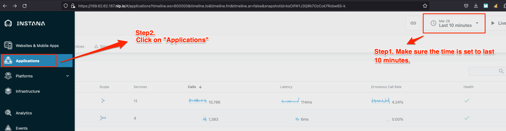

Please click on qotd-rating application as shown in the picture below. 

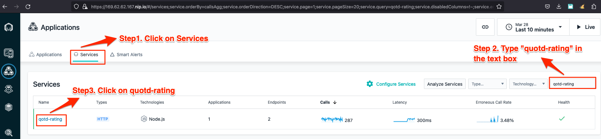

Now we will surface only the 4XX and 5XX errors from these services as shown in the picture below.

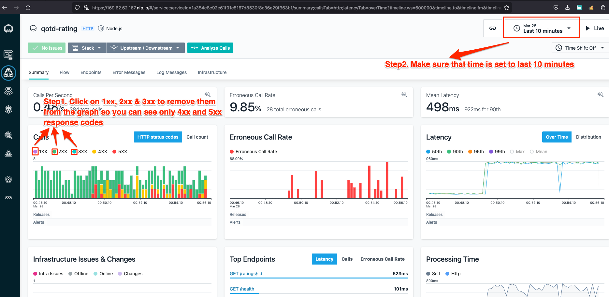

Now we will try to drag and drop into the time period where the errors were being produced and the time period on the top right corner will get changed on its own from 10 minutes to the drag and drop time period as shown below. We are trying go back in time to see the errors. 

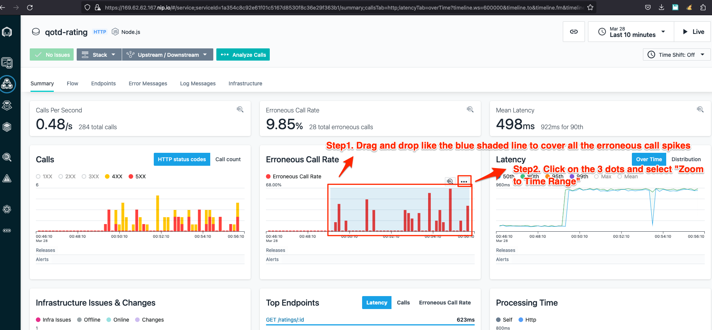

Now we are going to look at qotd-rating application and verify all the simulated failure conditions based on the information we see in the graphs. For example: we can see the latency spike to 0.9 second as shown in Step 2 and Step 3. This proves Condition 2 in the failures section. You can see this from the picture below. 

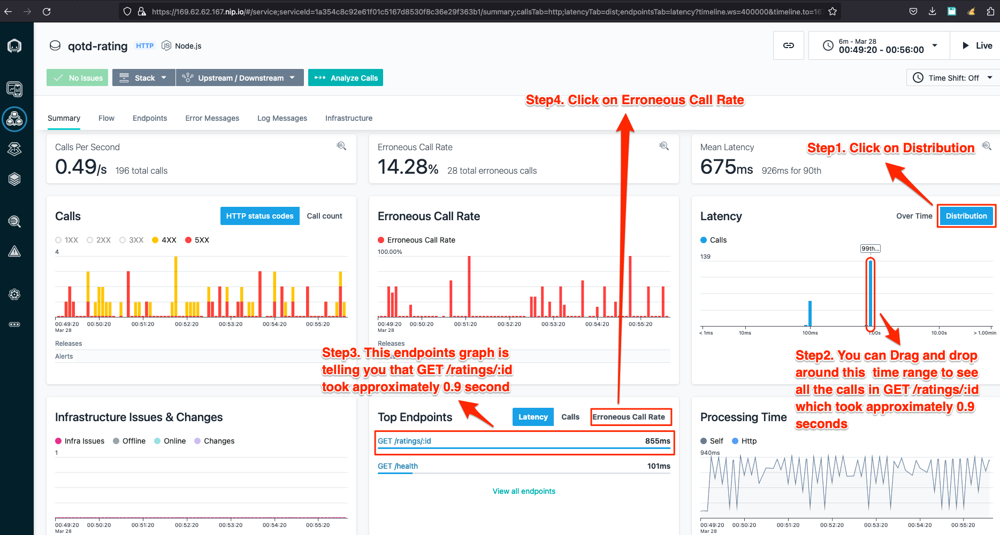

Now we can see all the end points getting errors as shown in the picture below which satisfies Condition 1. 

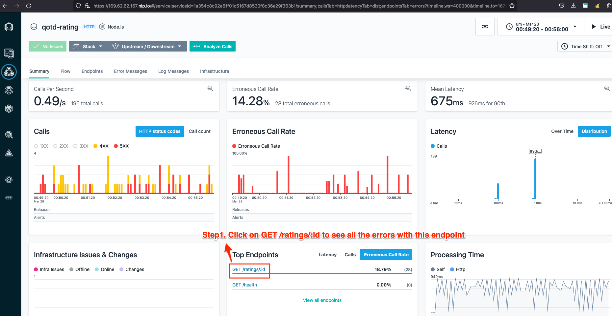

Next, we will analyze all the failures in the qotd-rating service by clicking "Analyze Calls" as shown in the picture below.

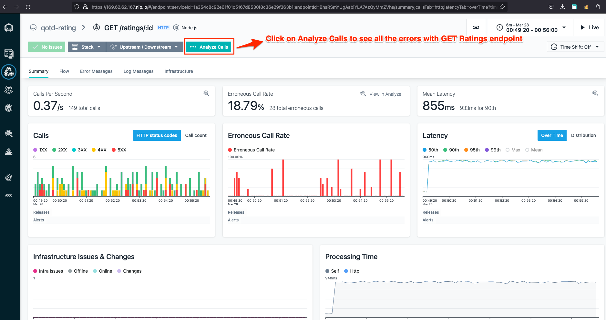

In this Analytics screen you can see that we are automatically looking at qotd-rating service and trying to expose only the 4XX and 5XX response codes as shown in the picture below.

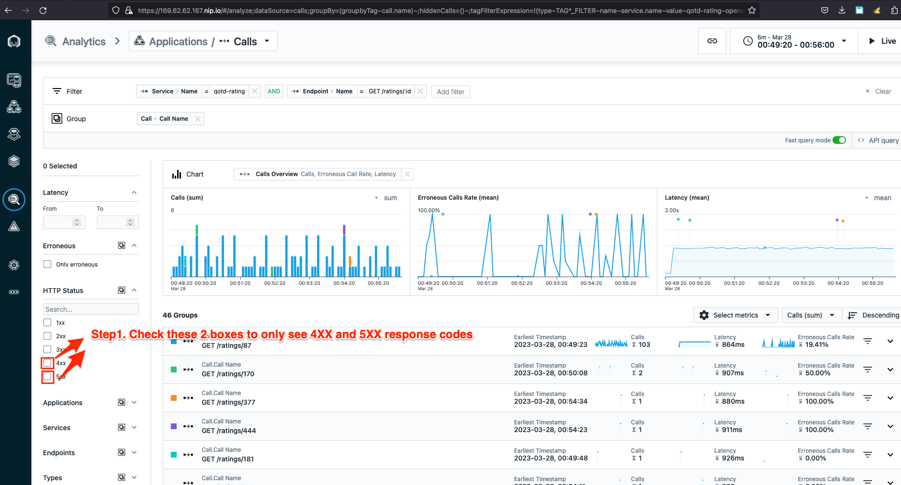

Next, select the top group which has the most 4XX and 5XX errors. Notice you did not have to type any SQL query to get to this result since Instana automatically knows the context of your troubleshooting scenario.

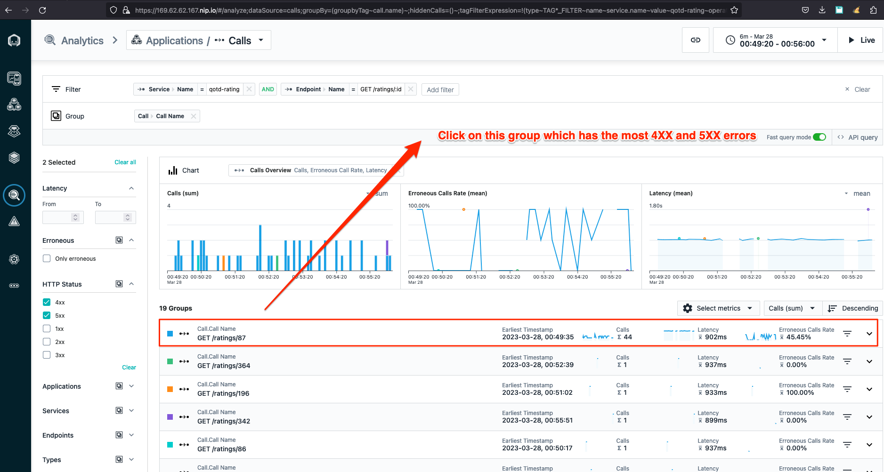

Now we have all the traces with 4XX and 5XX response codes and we can select any one of them to see what is going on inside our code.

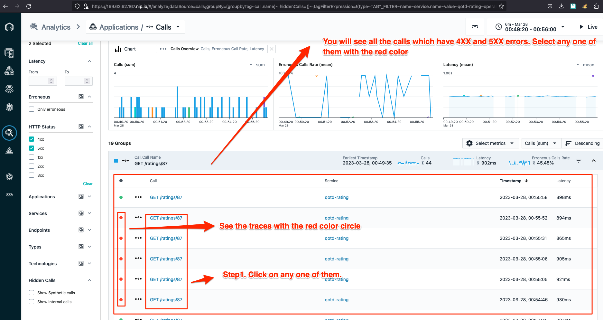

you can see the 500 response code and warning Log message below along with the stack trace which will tell you the exact code with the line number responsible for the problem.

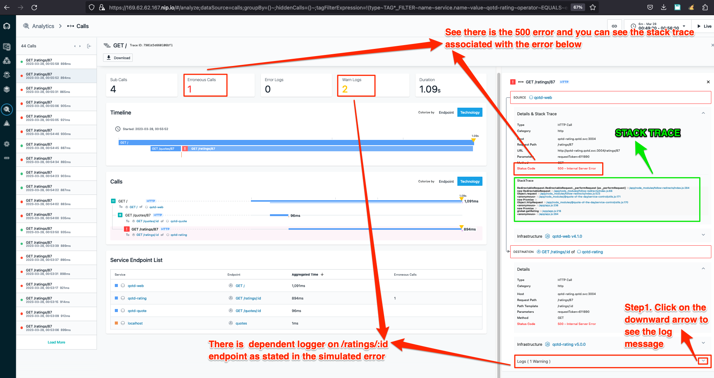

Lastly you can see the log message which the simulation injected. 

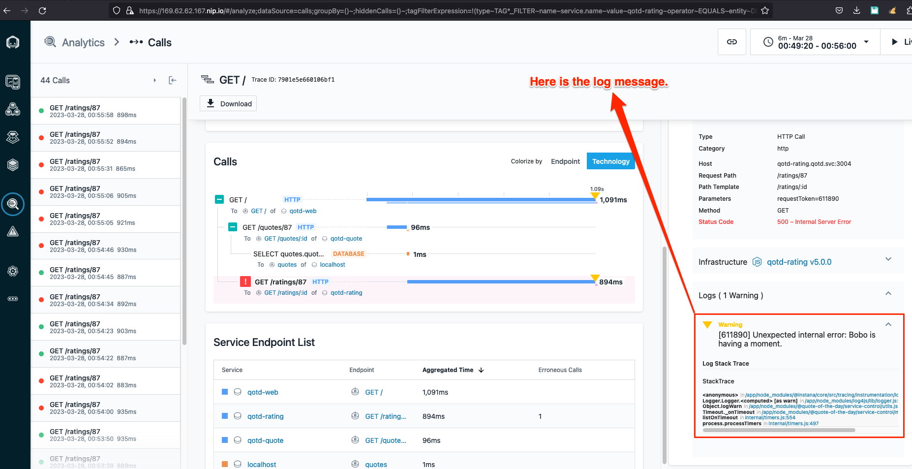

You have successfully completed this lab. In this lab, you learnt how to successfully troubleshoot some common issues. 

If you ready, move on to the next lab where you will learn how to define Alerts and Alert Channels.

