# Explore Instana

=======

# Instana UI Tour
Follow the tutorial below to explore some key Instana capabilities including monitoring of Kubernetes, monitoring of applications, and monitoring of infrastructure.

## 1: Explore Kubernetes
Open the browser tab for the Instana user interface.

On the left navigation, select Platforms and then Kubernetes

**Image 1**
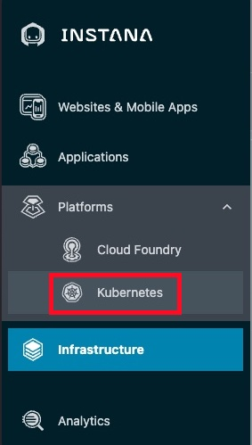

When you select **Platforms** in your environment, you will only see **kubernetes and Cloud Foundry**. But, there are additional feature flags that can be enabled to add in other technologies like VMware, Power HMC, and Z HMC. You saw the feature flags for those technologies when you performed the Instana server installation.

You will see a list of Kubernetes clusters. Look for the Cluster name that you chose when you installed the Instana Agent into OpenShift.

**Image 2**
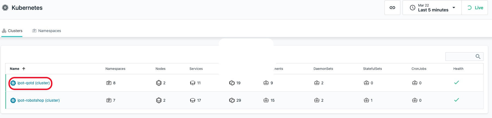

Assuming that your cluster shows up properly, click the cluster name to open the dashboard. If it doesn't show up, ask one of the proctars for help and review your setup.

You should see a screen similar to the one below where you can see overall utilization of the Kubernetes cluster.

**Image 3**
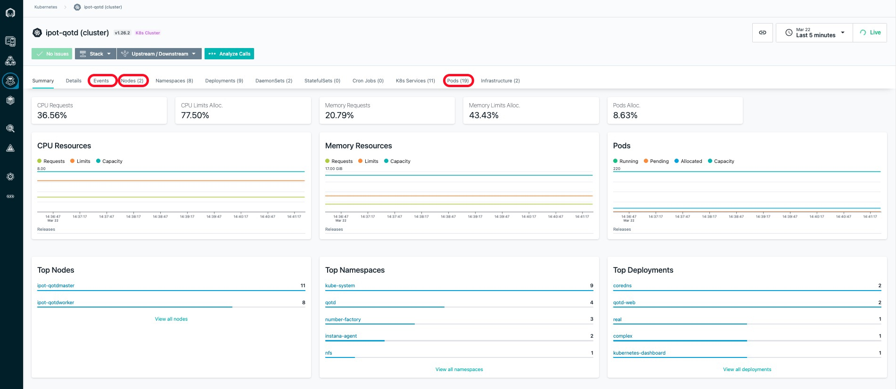

Select some of the other tabs to explore the Kubernetes monitoring. We recommend you look at the Events, Nodes, and Pods tabs. When you select the pods tab, you will see a list of all pods running within the cluster.

Select Pods tab and then in the upper right corner, add **qotd** into the search widget. You'll notice that it will filter the list to the pods related to the Quote of the Day application.

**Image 4**
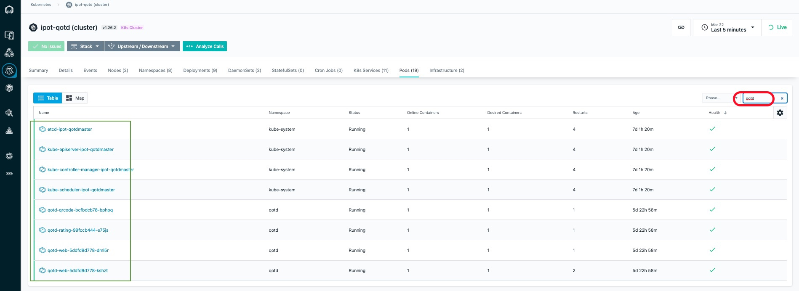

Click on one of the links marked in **Green** box  on the left side and drill into the pod utilization details.
   _______________________________________________________________________________________________________ 

## 2: Explore the Infrastructure View

Next, explore the Infrastructure view. To do this, click on the "Infrastructure" icon on the left side.

**Image 5**
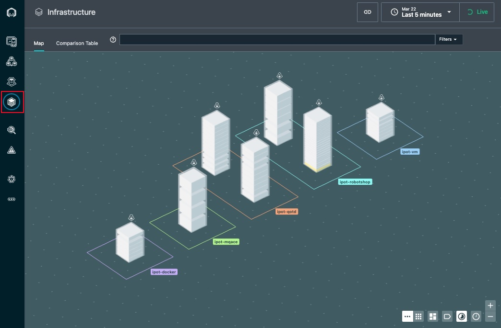

You'll notice that there is a square/rectangle  surrounding the "towers" with the zone names that you specified. The square/rectangle is a "zone". If you recall, you specified a zone name when you performed the install of the Instana Agent. The multiple towers contained within the zones ipot-robotshop and ipot-qotd represents the kubernetes worker and master nodes. Also you should see towers represeting where you installed linux agents ie. ipot-vm and ipot-mqace and another tower ipot-docker where you installed docker agent.

HINT: If you cannot see 7 hosts in your zones, then one of the Agents is not connecting properly. If you see a host show up in the Undefined Zone, it means that you did not specify a zone name in the Agent configuration.

In a large environment, it can be difficult to find the server or zone that you are looking for. Fortunately, there are a number of ways that you can search for things within the Infrastructure view.

In the bottom right corner(image 6 below), click on some of the icons and explore different ways of organizing and filtering the Infrastructure view.

**Image 6**

Or, you can use the lucene query language in the filter/search bar at the top of the page. Before beginning the search, flyover one of the towers and identify the hostname of one of the servers. For example ipot-mqace.

- Click in the filter bar and select **"Entity"**
- A list will popup. Start typing **host** and you will see the list filtered to
  "host". Once you see the single entry, select **host**.
- Once you have select "Host", another list will popup. Select **name**.
- Now, you will see **"entity.host.name:"**. After the ":", you can do a
  wildcard search. For example **"entity.host.name:\*abc\*"**. Type in a
  wildcard string that matches the beginning of the hostname you found earlier.
  In my example, I could specify **"entity.host.name:\*mqace\*"** to filter on
  the MQ/ACE server.(The * is needed in the start and end so you can search for anything with mqace in the above example)

**Image 7**

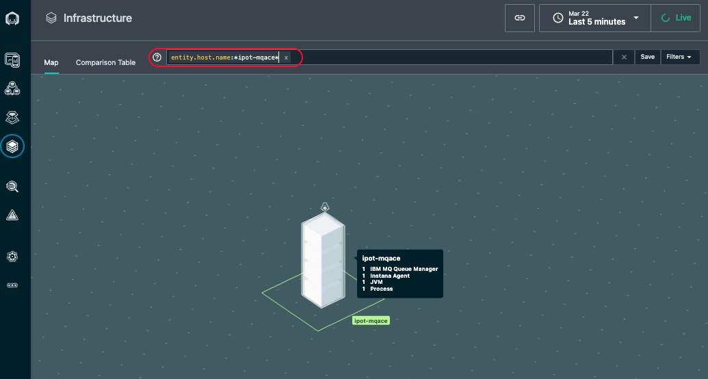

There are many other types of queries that can be executed using the filter/search bar. For example, you can specify AND, OR, and NOT conditions. You can find detailed information on the lucene query language in the product documentation found here: [lucene query language](https://www.ibm.com/docs/en/instana-observability/current?topic=instana-filtering-dynamic-focus)

Clear the filter at the top of the page by clicking on the X

Next, hover over with the mouse cursor to the tower that represents either the ipot-vm server or the ipot-rsmaster kubernetes worker or master node. They taller the tower the more entities are discovered running on those servers. You'll notice that each tower is actually comprised of multiple pizza boxes. Each one represents an **"Entity"** such as Docker Container or a Node js App.

**Image 8**

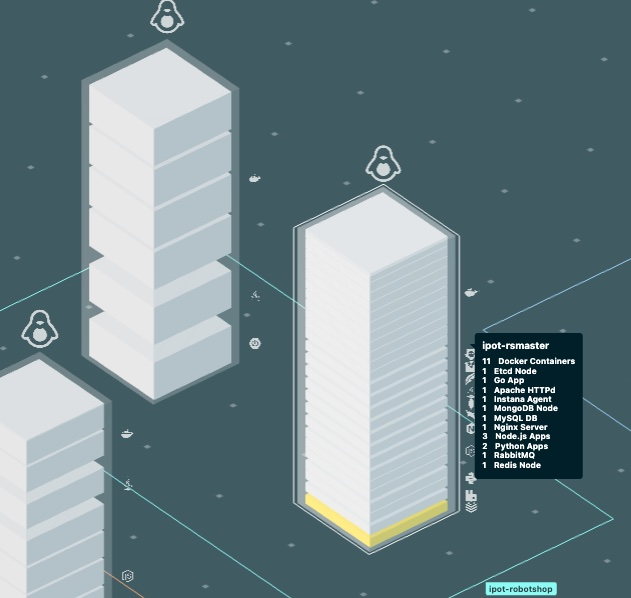

You'll notice that a number of components were automatically discovered and are instrumented for monitoring. When you hover over the vm ensure you can see the multiple components and not a single component. 

Next, hover over with your mouse on the ipot-mqace tower.

**Image 9**

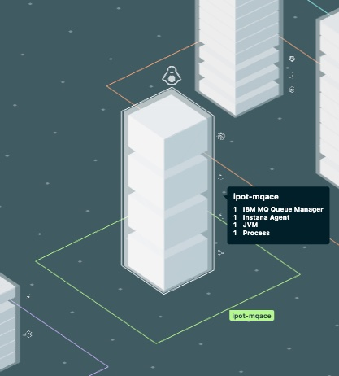

This is the ACE and MQ server. You can see the MQ and other components along with a discovered JVM, and more.

Next, click on the **"Comparison Table"** near the top of the page.

**Image 10**

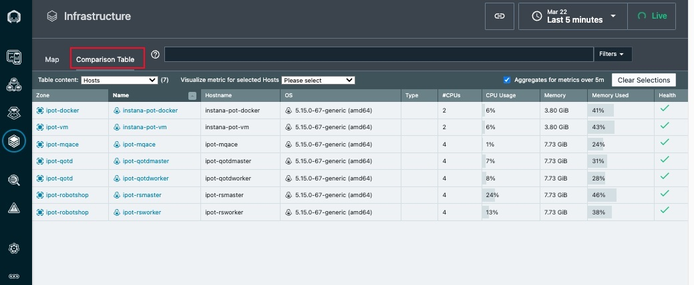

This table shows a sortable and searchable list of the Hosts that make up this environment. You can quickly find hosts consuming high CPU, high memory, or have poor health.

In addition, if you select where is says **"Hosts"**, there is a dropdown list that allows you to see lists of JVMs, containers, etc.

**Image 11**

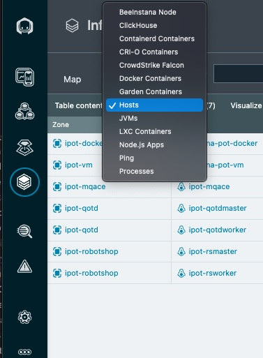

Change from **"Hosts"** to **"Docker Containers"** in the dropdown list and you'll see a complete list of containers and their utilization and health.

Switch back to the Map view by clicking on **"Map"** near the upper left corner.

**Image 12**

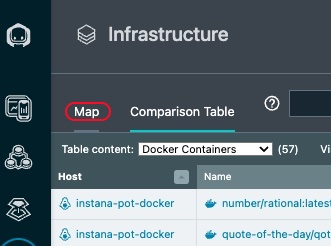

You'll notice that each tower is actually comprised of multiple pizza boxes. Each one represents an **"Entity"** such as an MQ Queue Manager or an JVM Node.

**Image 13**

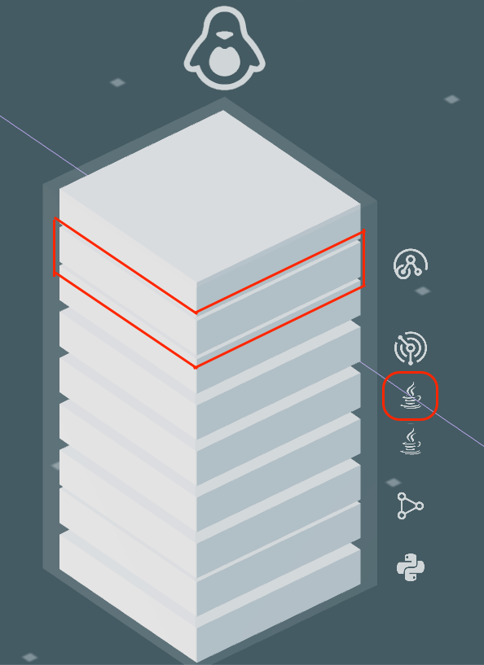

Flyover to the ipot-mqace server again until you see a list of all discovered Entities. If you only see 1 entity, move your mouse to one of the corners of the tower. Once you see all of the entities, click your mouse. You'll see a dialog open as below.

**Image 14**

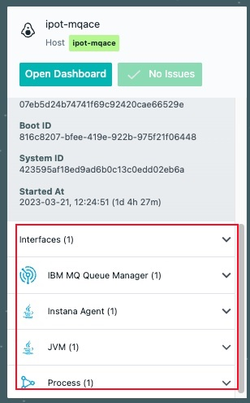

**Image 15**

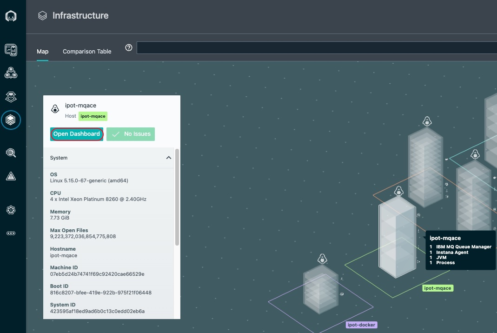

It is possible to click on either the "Open Dashboard" button or the links for the individual entities. If you clicked, you could navigate to either the Host operating system metrics or the specific middleware entity.

Click on the "Open Dashboard" button and we'll examine the Host Agent dashboard.

After you click on the button you'll see a screen that looks like this:

**Image 16**

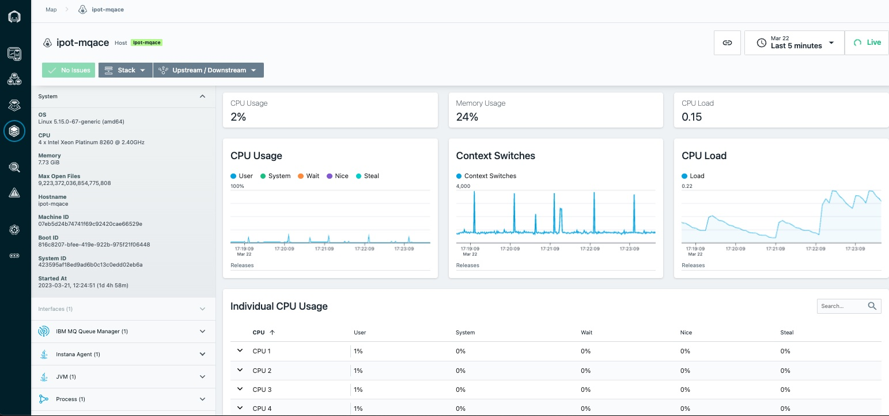

You can see fine grained metric data for the Host operating system. Most metrics are gathered at 1 second granularity. This can be very valuable in diagnosing problems. To see the 1 second metric data, let's shorten the time interval on the screen. Click on the **time range** dropdown in the upper right corner and select **last minute**. This will filter the data to the last minute of metric data.

**Image 17**

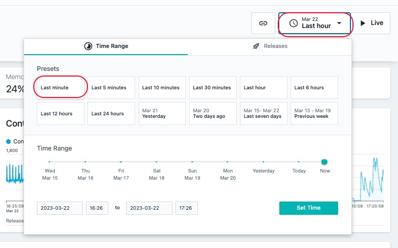

Now, click the **Live** button in the upper right corner. This will show you Live data as it is streaming into the Instana server in near-realtime.

**Image 18**

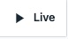

After examining the data, click the **time range** dropdown and select **Last Hour** to look at a more typical view within Instana.

Scroll down and explore the other metrics on the page.

As you scroll down the page, you'll notice a section on the left side of the screen that contains a list of Entity types that were discovered. This is the same list that you saw earlier on the Infrastructure view. By placing these links in context and leveraging the relationships that are discovered by Instana, it makes it easier to diagnose problems.

**Image 19**

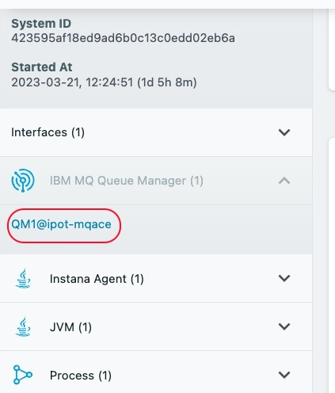

Expand the IBM MQ Queue Manager section and select the link for the **QM1@ipot-mqace** queue manager

You will navigate to the dashboard for the MQ Queue Manager. Scroll down the page and examine the metrics. There are many tables that contain links that would allow you to drill into the listener, topics, queues, channels, and more. Let's focus on the Queues. Scroll down to the table labeled **"Queues"**.

**Image 20**

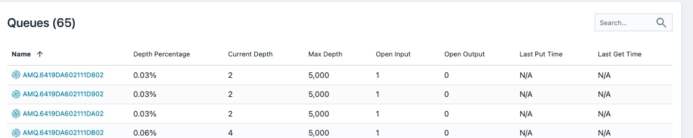

Click on the blue text on the left to drill into the Queue. Examine the Queue metrics on the page.

Next, look at the top of the screen. You'll notice that this is a breadcrumb that allows you to navigate back to where you were earlier in your navigation. It is also possible to use the back button in your browser.

**Image 21**

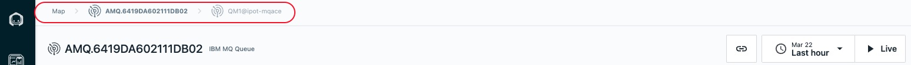

You have now successfully completed this lab. You explored the Kubernetes and Infrastructure view and learnt how easy it is to navigate through your application components in Instana. Please proceed to the next lab where you will learn about how to Define an Application perspective and dive deeper into the sub-components of your application.

