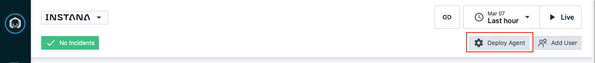
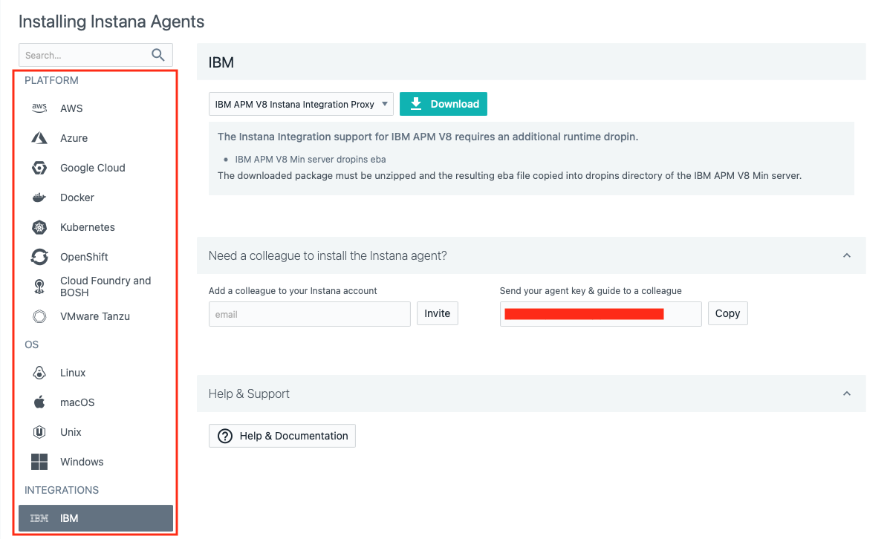
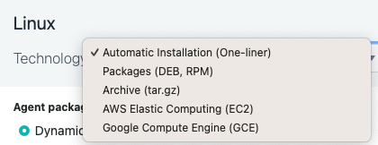
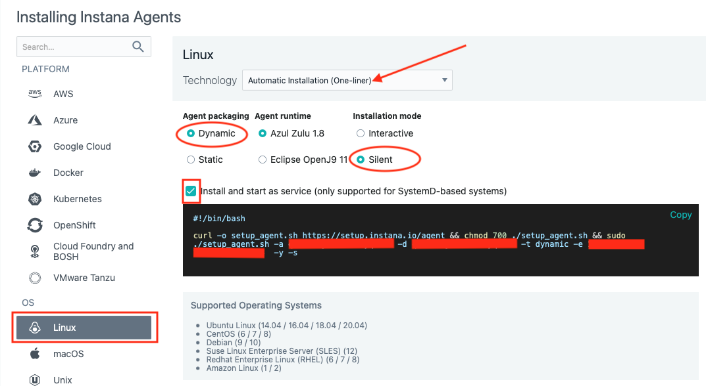
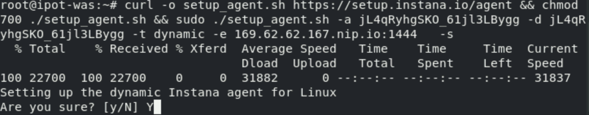
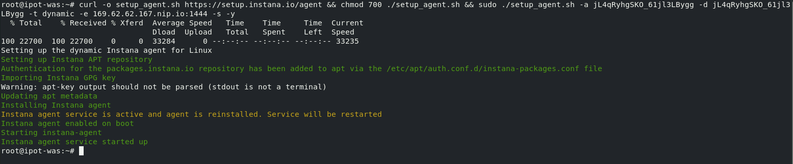
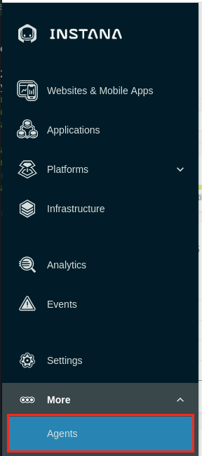
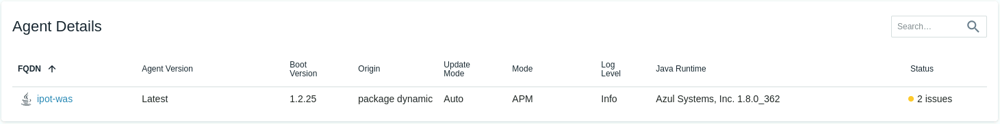
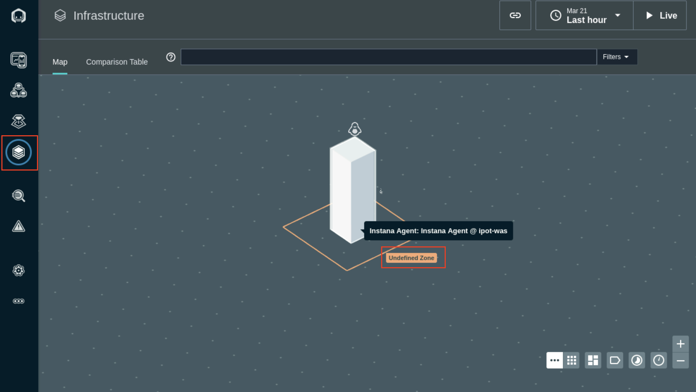

# Instana Agent Installation

Instana collects data from monitored systems by using a single host agent on each host. The host agent runs on your hosts to collect and aggregate data from various sensors before it sends the data to the Instana backend. Subsequent steps in this section will show how tos and options to install Instana agent. 

## Instana Agent Deployment Options

Instana has a variety of agent installation options including the mirror repository and static agents that allow customers to meet strict change control processes. They can be accessed by clicking the "Deploy Agent" button as shown below from the Instana UI - << Pallavi - Placeholder for Instana URL>>: 



Some of the available options are listed below:

- OS specific installer (Linux, macOS, Windows, Unix)
- Hosted Cloud Services (AWS, Azure, Google Cloud)
- Docker (and other container managers)
- Kubernetes
- OpenShift
- Cloud Foundry and BOSH
- VMWare Tanzu
- Integrations (IBM)


You begin by choosing the platform where you will be installing the agent. Then you can select the **Technology** dropdown and choose from a list of installation options. For example, on Linux, you can choose a automatic **one-liner** installation, RPM, or TAR file installation. For OpenShift/kubernetes, you have multiple options including operator, helm, and yaml installs.



### HINT: Instana agent install needs privileges! ROOT!!

The Instana Host Agent has two types, **dynamic** and **static**, based on whether it can update itself or not. What does it mean? Here is the excerpt from [Instana agent documentation](https://www.ibm.com/docs/en/instana-observability/current?topic=instana-host-agent).

A **dynamic** host agent downloads on startup the latest set of sensors from repositories. By default, a dynamic agent updates itself daily with the latest and greatest capabilities that are released. It is also possible to tightly control the updating of dynamic host agents by pinning a version. 

**By default, dynamic host agents use the Instana repository to pull updates**, but it is possible to set up your own managed mirror. Currently, the mirror must be a Nexus repository. This is probably the best option for must customers because it allows them the benefits of automatic updates, while at the same time controlling the content that is in the repository.

A **static** host agent is a self-contained host agent that includes all the latest available components at the time of its release, and has no dynamic update capabilities. **The static host agent has a stable "bill of materials" that never changes after the host agent's installation.**

#### TIP: Static host agents require no internet connection to the Instana repository, and are recommended in restrictive network setups.

## Installing Instana Agent on WebSphere Application Server and DB2 VM

You will be installing the Instana Agent on the VM where WebSphere Application Server and DB2 are provisioned for you for this lab -  **ipot-was** server. 

1. Select the Bastion Remote Desktop in your TechZone POT reservation and open a Terminal window from the **Activities** menu on the upper left

2. Open up a new terminal window and login to the vm as shown below:

**ssh -p <port_number> user_name@server_name**

example:
```sh
ssh -p 2022 cocadmin@ipot-was 
```

5. Switch to the root user

```sh
sudo -i
```

6. Navigate to the Instana url https://169.62.62.167.nip.io/#home and select the "Stan" the robot icon in the upper left corner


Next, click the "Deploy Agent" button near the upper right corner.


A window will open with a list of different environments where you can install the Instana Agent. **ipot-was** is a **Linux** server, so select Linux on the left side of the screen.

Just to see what your options are, select the **Technology** dropdown list to see the different ways that you can install the Instana Agent. You'll notice that you can perform rpm installs or simply download a tar file. But, the easiest method is the default one, **Automatic Installation (One-Liner)**. Select that option in the dropdown list.



Notice that there are a few other options such as agent packaging, agent runtime and installation mode. Pick Dynamic from agent packaging, leave runtime as default and pick silent as installation mode.

Next, select the checkbox next to **Install and start as service**. This will setup the systemctl autostart process and will also start the Agent immediately after it is installed.




Finally, copy and paste the curl command into the terminal window you had opened for the **ipot-was** server and press enter. You should see a screen that will look similar to the one below. Please enter “y” and hit enter. This will start the installation process.



The install will progress and you will see an output similar to the screen capture shown below.





At this point the Agent is installed and up and running.

To view the installed Agent, from Instana UI, under the **three dots**  on the left hand menu, select **Agents** page 



On the **Agents** page, you will see the deployed agent information in the **Agent Details** section. Wait for a few seconds if it doesn't appear immediately.



## Configuring Instana Agent

The Agent will automatically start monitoring the operating system and start discovering key processes and middleware. In many cases it will automatically instrument those technologies. In the case of some technologies (eg. MQ an and App Connect Enterprise), there are manual configuration steps required due to the need to provide credentials for accessing those applications.

In our scenario, we did not get any option to set the **Zone name** while installing Instana agent on the Linux server. You can see in the Infrastructure view below by **Undefined Zone** popup:



To include the **Zone name** for the Websphere Server host infrastucture, we will now update agent configuration file. 

Log in to the **ipot-was** host and backup the existing Instana configuration yaml file by running following command:

```sh
mv /opt/instana/agent/etc/instana/configuration.yaml /opt/instana/agent/etc/instana/configuration_orig.yaml
```

Following command will create a new configuration.yaml file in the same folder and *enable* the hardware plugin and add **Zone name (availability-zone)**. Copy paste the following command and press enter.


```sh
cat << EOF > /opt/instana/agent/etc/instana/configuration.yaml
# Hardware & Zone
com.instana.plugin.generic.hardware:       
  enabled: true # disabled by default
  availability-zone: 'ipot-was'
EOF
 ```

Changes to the configuration yaml file are automatically picked up. Refresh the **Infrastucture** page to see the **ipot-was** Zone and host information


## Agent Configuration Troubleshooting

:::warning Information Only

This section is here for informational purposes. There are no steps to execute.

:::

The first place to look when the agent does not start properly or does not work
as expected is agent log file. By default it is located in
`/opt/instana/agent/data/log/agent.log` . This is the path for a traditional
server.

In case of Kubernetes based deployment you have to look at logs of
`instana-agent` pods running in `instana-agent` namespace.

---

## Configuring GitOps for Agents

:::warning Information Only

This section is here for informational purposes. There are no steps to execute.

:::

If you don't want to modify the Instana agent configuration files for each agent
locally, you can setup a centralized git repository for configuration files and
instruct Instana agent to use these files. To accomplish that, follow the steps
from the
[documentation](https://www.ibm.com/docs/en/obi/current?topic=configuration-git-based-management#git-based-configuration-management).

The Instana agent fetches configuration updates from the remote repository:

1. Upon the startup or restart.
1. Through a reboot initiated over the Agent Management Dashboard.
1. Through a configuration change over the Agent Management Dashboard.
1. Through the Web API as described in the Host Agent section and the
   integrations that rely on it like the GitHub Update Agent action.
