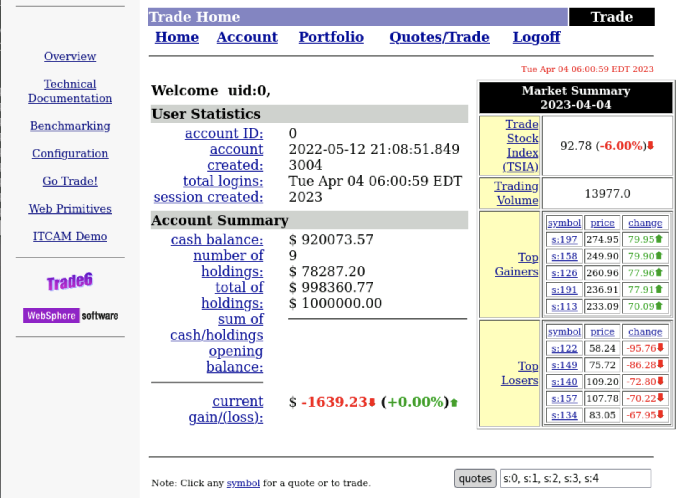

# Create an Application Perspective

## Introduction

In this section of the lab, you will verify the Stock Trader application. The application is pre-configured to include any required chnages needed to enable monitoring. Some technologies such as java don't require any configuration, but others require monitor configuration changes so that the application can be monitored. 

## Start the Stock Trader application 

1. Sign in to the Bastion host and select the Terminal icon from the Activities menu. 
2. ssh to the ipot-was Virtual Machine
   ```sh
   ssh -p 2022 cocadmin@ipot-was
   ```
   Enter the password for the cocadmin user.

3. Sudo to the root user
   ```sh
   sudo -i
   ```

4. Verify the Websphere Application server is in Active status
   
   ```sh
   systemctl status was
   ```
    


## Test the Stock Trader Application

In this section you will verify the Stock Trader application by logging in as a trader and submitting a test stock trading request.

1. Sign in to the **Bastion host** and select the **Firefix** Web Browser from the **Activities** menu. 
   
2. Enter the URL to the trader application homepage
   http://ipot-was:9080/trade

    

3. Select the **Go Trade** application link.
   
   

4. Login with the user **uid:0** and password **xxx**

    

5. Select the quotes button to load sample stock quotes.
   
   

6. Select the **Buy** button for any of the five stocks to create a new trade.
   
    

7. The stock order confirmation page shows the new trade order.

    

## Apply a load Generator

In this section you will generate sample load that will request stock quotes and creat trade orders in the application.

1. In the terminal window, create the load generator script that creates a request to the http://ipot-was:9080/trade/scenario page

    ```sh
    cat << 'EOF' > load.sh
    #!/bin/bash
    
    cat << 'EOFSTOCKS' > stocks.txt
    0
    1
    2
    3
    4
    EOFSTOCKS
    
    stocks=($(cat stocks.txt))

    while true; do sleep 1; curl -s -o /dev/null http://ipot-was:9080/trade/scenario;rand=${stocks[RANDOM % ${#stocks[@]}]}; curl -s -o /dev/null -d "action=buy&symbol=s%${rand}&quantity=100" -X POST http://ipot-was:9080/trade/scenario;
    done
    EOF
    ```

2. Update the script permissions.

    ```sh
    chmod 755 load.sh
    ```

3. Launch the script so that it runs as a background process.
   
    ```sh
    ./load.sh &
    ```

## Create the Application Perspective

1. From the Instana left navigation menu, select the **Applications** icon and select the **ADD** icon at the bottom right of the page.
   

   

2. Select the **New Application Perspective** option to load the Application perspective wizard
   
    

3. Select the **Services and Endpoints** template in the left navigation and select **Next**.

    The Application Perspective menu presents the wide range of templates (see above) for rapidly creating Perspectives for different use cases. These templates were created for common use cases that many of our customers implement and have been continuously improved by feedback from them. There’s also a selection for Custom Tags which lets you assign the information that Instana captures in any way that meets your requirements.

    

4. Select the **Add Filter** button to create a new filter and select the **Zone** attribute

    

5. Select the **ipot-was** Zone. This is the zone name that was used in the previous section. 
   
   

6. Select the **All downstream services** and select Next. This option will automatically include all the services that from the entire end-to-end dependency chain of the core set of services.\
The preview panel information is also carried along to show the services that were selected. This is shown in the figure as follows.
   


7. Enter a name for the Application perspective select **Create**. The **All Calls** options with monitor calls made to the applcation and internal application calls.

    

## Explore the Application Perspective

After creating the application, your screen should have automatically changed context to show the Application Perspective that you just defined.

1. Initially, you probably won’t see any metrics on the screen. Change the timeframe in the **Time Picker** to **Last minute** as shown below so that you can see the metrics populated in the perspective.

    >>

    Alternatively, in the upper right corner, click the **Live** button and within a short amount of time you should start to see metrics in the widgets.

2. You will see something similar to the following screen. Note the columns on this dashboard including columns for each application key performance indicator: **Calls, Latency and Erroneous Call Rate**

    

3. You’ll notice a number of tabs across the top of the screen. Explore these tabs. In particular, let’s take a look at the **Depedencies** tab. On the dependencies tab, you’ll see a complete topology of the application services. This topology is discovered automatically. You can see transactions flowing between the different nodes in the topology. 

    

4. Select on **Upstream/Downsteam** near the top of the page. This will allow you to see a list of Upstream and Downstream services for the application.
   
   

5. Select **Stack** where you can view the Application, Kubernetes, and Infrastructure stack that makes up the application.\

    All of this contextual and relationship data helps you analyze and debug you applications to get to root cause as quickly as possible. In addition, our built-in analytics uses this data to automatically group multiple related **Events** into a single **Incident** for diagnosis.

    

    Close the Stack dialog by either selecting the Stack button or anywhere on the background of the Instana page.

6. Select the **Services** Tab. Under Services, note the number of services included in each Application Perspective.

    


7.  Note additional information provided for each service: **type, technology, latency, endpoints, and health**. 

8. Click on any column header to sort the list based on that column’s value. Note the different filtering options available on the right above the list: **type, technology, and text-based search**. 

9. Notice the dashboard filtering options (upper pane, right side, next to **Analyze Services**). Click on the **Type** box and select ****Http** from the drop down. Notice the information shown on the dashboard based on the **type** filter.

## Troubleshooting 

1. If you do not see data in **Application Perspecive** immediately after creation, make sure to adjust the **time picker** to **Live** or **Last Minute** and give a few seconds and you will see the data flowing.

2. Even after following the step 1, if you still don't see the data immediately and/or lose data after working on the lab for few hours, then please contact your lab instructor. It is possible that the  data retention has caused the space to run out on Instana backend. 

Alternatively,

In the later case, you can try setting **time picker** to past time frame - such as to last 6 hrs, last 12 hrs or provide past dates t0 see the data. However, note that, by doing this, you will be looking at the old data set.