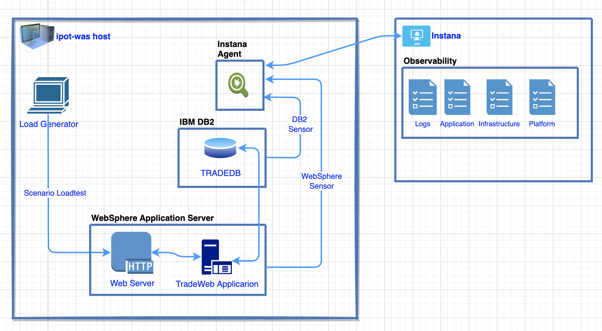
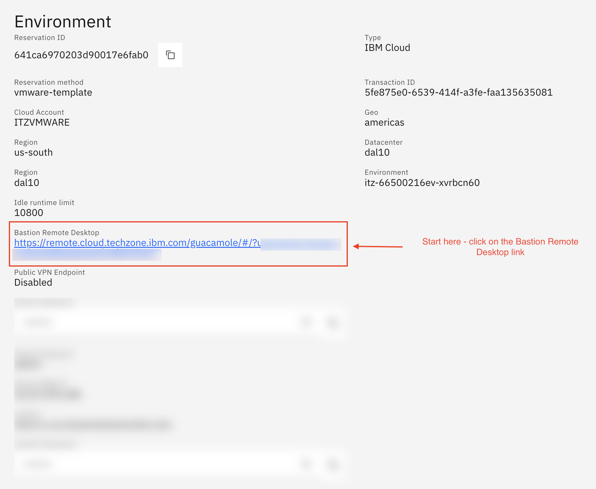
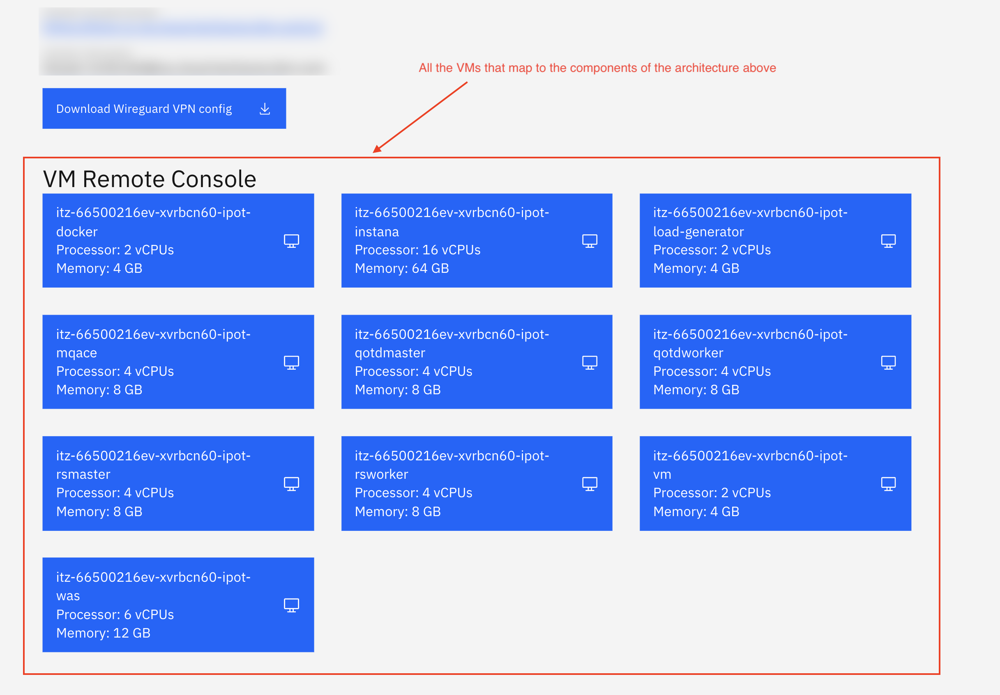
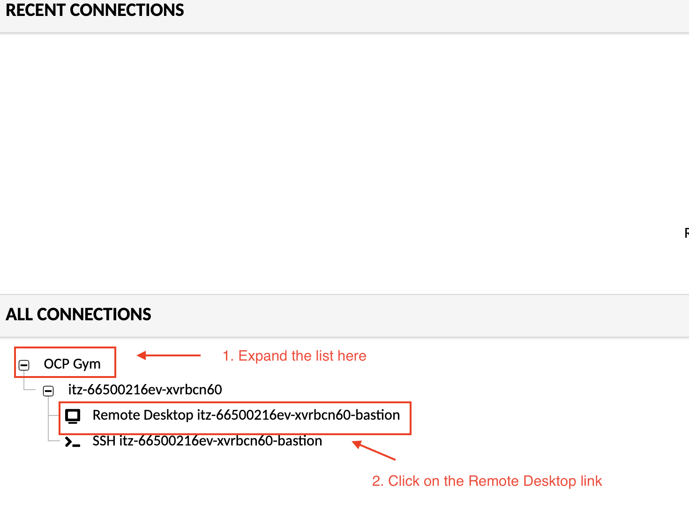
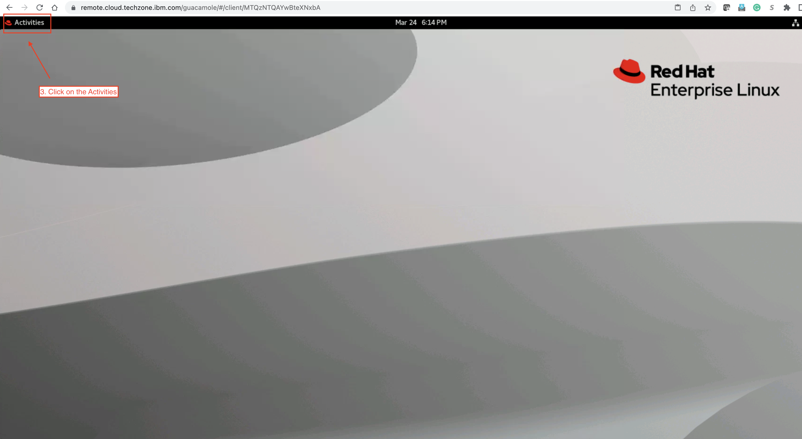
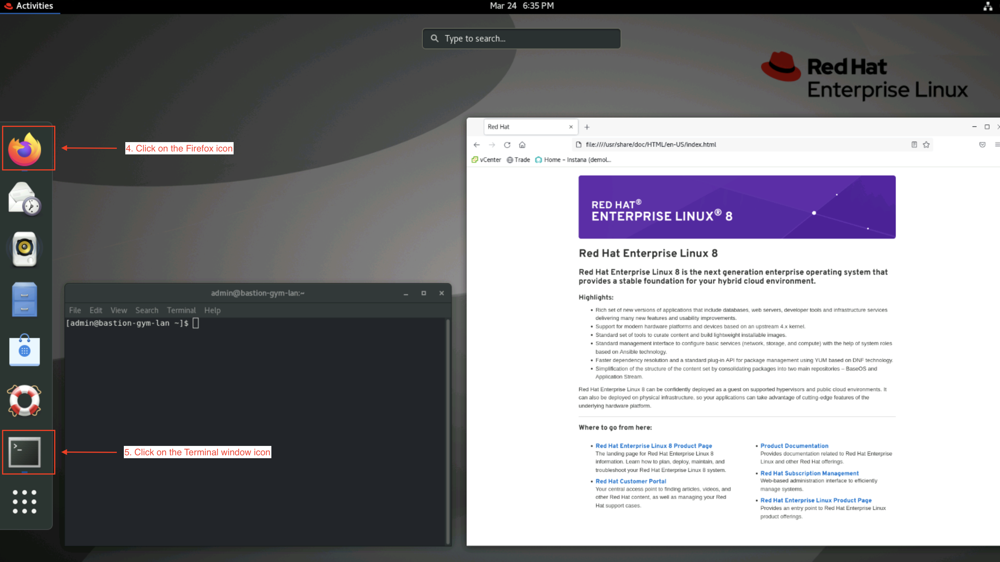

# Overview

## Introduction

In this Instana portion of the AIOps POT lab, you will be going through several
key exercises in order to learn more about how Instana monitors middleware applications.
The lab should be executed in the numbered order that you see on the left side of the screen. 
Some of the sections have dependencies on the previous section.

- First, you will be learning how to install the Instana agent on the Virtual Machine that includes the WebSphere Application and DB2 Database.
- Then, you will learn how to update the agent configuration file to include the infrastucture Zone and verify it is showing the the Instana application.
- Next, you will learn how to setup the Monitoring sensors for **IBM DB2** and
  **IBM WebSphere Application Server \(WAS\)**
- Once you have the applications instrumented with Instana sensors, you will go
  through a series of exercises to explore Instana's capabilities
- Finally, you will learn how to use some of Instana's Administrative
  capabilities.

## Architecture

## Connecting to the Lab Environment

After you request Instana PoT environment from Techzone, you will see all the components/VMs mentioned in the architecture as part of the lab environment setup. Here are the steps to get you started.

1. Click on the link under **Bastion Remote Desktop**

2. You will see **Recent Connections** window. Expand the **OCP Gym** and click on the first link for **Remote Desktop** connection

3. Now you will be taken to a bastion host remot desktop. Click on the **Activities**

4. Next, click on **Firefox** and **Terminal** window from the **Activities** menu

5. You are all set to follow the lab instructions! 