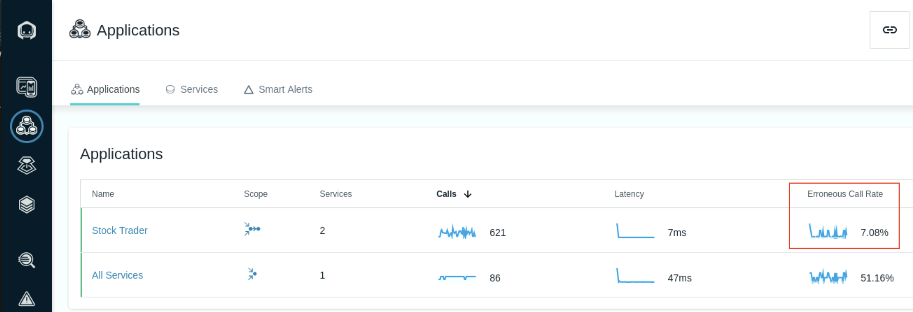

# Troubleshooting an Issue

## Introduction

SREs practitioners face significant problems in today’s world of dynamic applications that are composed of hundreds or possibly thousands of components.  They trawl through log files, look at metrics, comb through events, consult crystal balls, and do whatever it takes to find the answer. It can take hours or days to identify the root cause of an issue, and often, the reason is left unidentified and lurking in the background waiting to reappear. 

This is where Instana comes to an aid. Instana automatically detects changes, issues, and incidents to help you detect, understand, and investigate quality of service issues of your applications.

Instana automatically detects changes to the monitored environment such as:

1. Online / offline
2. Configuration
3. Environment variables
4. Versions

The detected changes are recorded against the entity in the **Dynamic Graph** -  a graph database that stores entity relationships over time. The Dynamic Graph is continuously updated as the data arrives. Therefore Instana knows at any point in time what entity is related to what entity and the state of those entities and helps in determining the root cause of the issue. Knowing the interconnectedness of everything is the key here.

In this section you will learn how to identify application errors with Instana that are causing latency in the application and be able to apply fixes. 

1. Navigation to the Applications tab and notice there is a high number of high number of **Erroneous calls** from the application. 

    

2. Select the **Stock Trader** application perspective and notice that almost every call to the application is resulting in an error. This can be seen in the **Calls** section as well as the **Erroneous calls** section.

    


3. Highlight a portion of the failed calls in the **Erroneous calls** section and Select **View In Analyze**
   
    


4. The **Analytics > Application/Calls** page shows each request from the application with the timestamp and call Latency.

    


5. Select one of the calls to see the timeline of when the error occuered. The **Calls** section shows a post request is made to the application without providing user credentials.

    

6. The errors are occuring from the load generator script that processes a buy transaction from the Stock Trader application but does not authenticate the user before submitting the requst.

Scroll down on the right hand side section till you see **Logs** and expand that section to see the stack trace of the error. As you can see - there are a few exceptions.

   

7. Click on the **log incom.ibm.ws.logging.WsLogger:380** to peek in to the code. Scroll down to check the line no 380. This shows the power of Instana to show errors at code level!


   
To resolve the credentials issue, we will need to stop the load generator and apply a fix to the script. 

   From the terminal, search the load generator script and kill the process using the kill command

   ```sh
   ps -ef | grep load
   ```
    Copy the process id to use for the kill command. In the example screenshot below it is 166762.

   ```sh
   kill <processID>
   ```


7. We will now apply a fixed version of the load script by taking a backup of the existing script and creating the new script.

    ```sh
    mv load.sh load_backup.sh
    ```

    Create the new script using the following command. A new curl statement is added to login the user and saves the SESSIONID to a cookie file that is passed to the POST request when submitting the buy trasaction to the Stock Trader application.

    ```sh
    cat << 'EOF' > load.sh
    #!/bin/bash

   cat << 'EOFSTOCKS' > stocks.txt
    0
    1
    2
    3
    4
    EOFSTOCKS
    
    stocks=($(cat stocks.txt))

    curl -c cookie.txt -s -o /dev/null -k -d "uid=uid:0&passwd=xxx&action=login" -X POST http://ipot-was:9080/trade/app

    while true 
     do 
      sleep 1
      curl -b cookie.txt -s -o /dev/null http://ipot-was:9080/trade/app?action=quotes&symbols=s:0,s:1,s:2,s:3,s:4
      
      rand=${stocks[RANDOM % ${#stocks[@]}]}

      curl -b cookie.txt -s -o /dev/null -d "action=buy&symbol=s:${rand}&quantity=100" -X POST http://ipot-was:9080/trade/app 
    done
    EOF
    ```

1. Change the permissions ot the script and Re-run the load
    
    ```sh
    chmod 755 load.sh
    ```

     ```sh
    load.sh &
    ```


2. Navigate to the applicaiton perspective and select the Live button on the top right to see the application load running in Live mode. You will notice the number of Erroneous calls have decreased which in turn reduces over all latency in the applicaiton.


