# Explore Instana

# 3.1 Navigating the User Interface

1. Notice the navigation bar on the left side of the user interface. Click anywhere on the navigation bar to expand it. 

2. Click on any icon on the navigation bar to open any of our specialized dashboards. Click on **Stan** in the upper left corner to go back to the landing page.  

3. Note the URL link icon on the upper right corner of the landing page. Click on it to copy the URL of the dashboard currently showing on the user interface.Open another tab on your browser and copy and paste this link. 

4. Note the **Time Picker** box next to the URL link icon. Click on it to explore available preset time ranges. Pick one and observe the change of metric information on the dashboard. Change the time range a couple more times and observe how metric information on the dashboard changes.  

5. Next to the **Time Picker**, note the **Live** button. This button gives you access to our Live tool that shows real time information about your environment.   

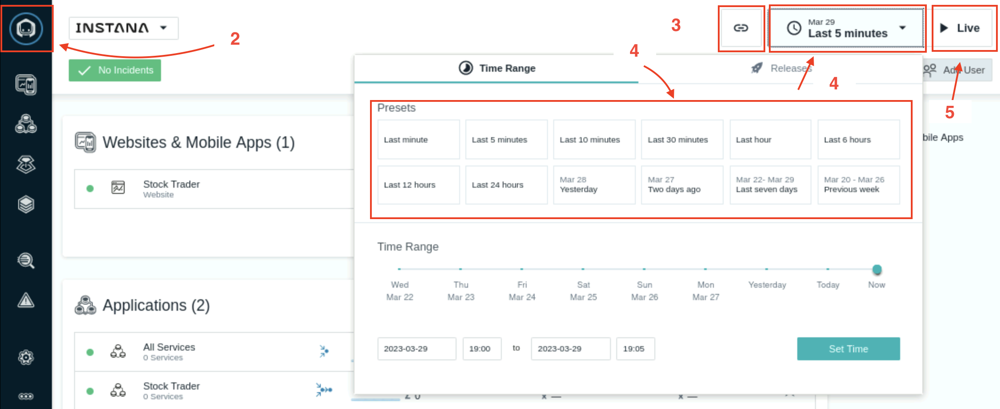

6. Under the Time Picker, you will see our **Deploy Agent** button. You have already gone through this in previous section

7. Click on **Stan** to go back to the landing page. 

8. Click on the **gear wheel** icon in the navigation bar on the left hand side, second from bottom, to open the **Settings** dashboard.  

9. Observe available navigation tabs on the panel of **Settings** dashboard.  

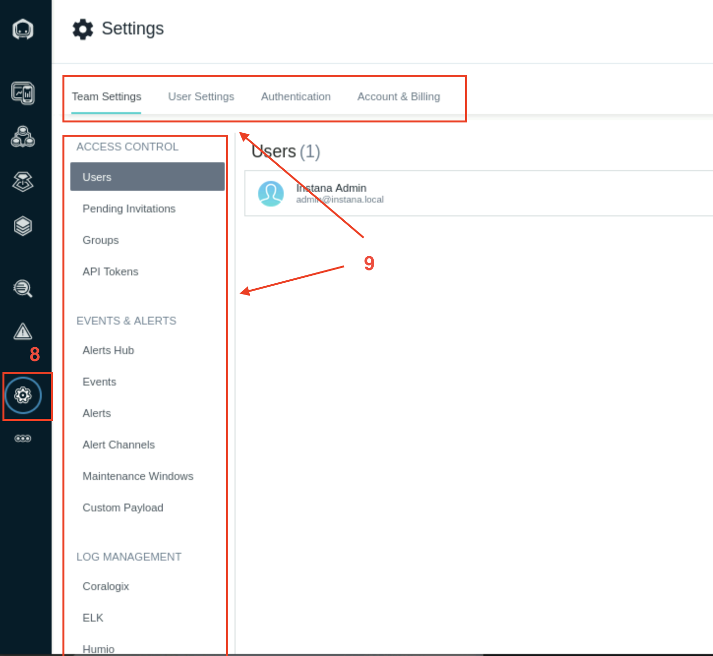

10. Click on Stan to go back to the landing page and click on the **three-dot** icon, first from bottom, to expand the navigation bar.  

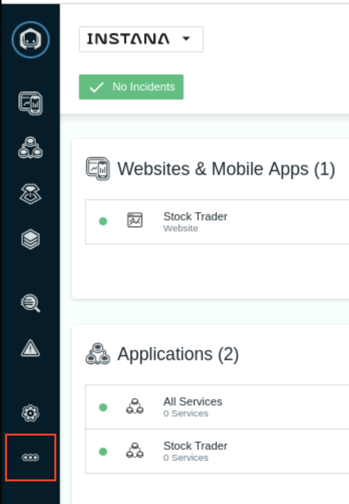

11. Scroll down and click on **About Instana** to review information about the backend. Click on X to close this window.  

12. Click on the three-dot icon again. Scroll down and click on **Documentation** to access Instana’s public documentation.  

13. Click on the three-dot icon again Scroll down and click on **Support** to open Instana’s Support home page. This page will open on a separate tab.  
		
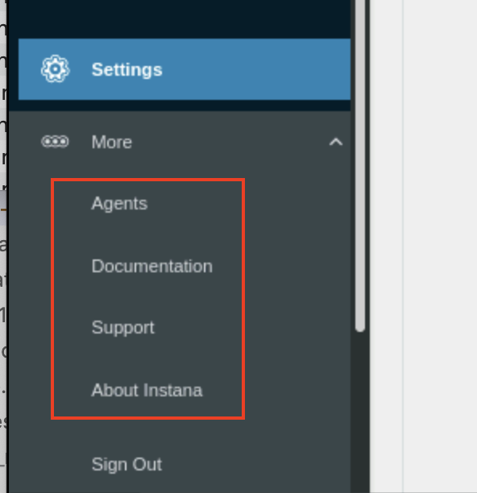

# 3.2 Exploring the Application Monitoring Dashboard 

After creating the application, your screen should have automatically changed context to show the Application Perspective that you just defined.

1. Initially, you probably won’t see any metrics on the screen. Change the timeframe in the **Time Picker** to **Last minute** as shown below so that you can see the metrics populated in the perspective.

Alternatively, in the upper right corner, click the **Live** button and within a short amount of time you should start to see metrics in the widgets.

2. You will see something similar to the following screen. Note the columns on this dashboard including columns for each application key performance indicator: **Calls, Latency and Erroneous Call Rate**

3. You’ll notice a number of tabs across the top of the screen. Explore these tabs. In particular, let’s take a look at the **Depedencies** tab. On the dependencies tab, you’ll see a complete topology of the application services. This topology is discovered automatically. You can see transactions flowing between the different nodes in the topology. 

    

4. Select on **Upstream/Downsteam** near the top of the page. This will allow you to see a list of Upstream and Downstream services for the application.
   
   

5. Select **Stack** where you can view the **Application, Kubernetes, and Infrastructure** stack that makes up the application.

    All of this contextual and relationship data helps you analyze and debug you applications to get to root cause as quickly as possible. In addition, our built-in analytics uses this data to automatically group multiple related **Events** into a single **Incident** for diagnosis.

    

    Close the Stack dialog by either selecting the Stack button or anywhere on the background of the Instana page.

6. Select the **Services** Tab. Under Services, note the number of services included in each Application Perspective.

Services are a part of application monitoring and provide a logical view of your system. Services are derived from infrastructure components such as hosts, containers, and processes. The act of assigning specific components to one or more services, is referred to as service mapping.

Instana automatically maps all services based on an extensive set of predefined rules. Based on these rules, calls and infrastructure data are examined before a service is created.

Note additional information provided for each service: **type, technology, latency, endpoints, and health**. 

7. On the above screen, click on any column header to sort the list based on that column’s value. Note the different filtering options available on the right above the list: **type, technology, and text-based search**. 

8. Click on the **Log Messages** tab and observe the generated Logs. Feel free to click on the log messagess and explore further.

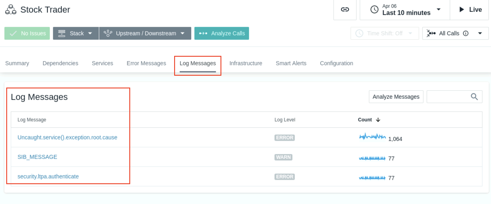

9. Click on the **Error Messages** tab and observe the generated error messages. Feel free to click on the error message and explore further. It shows that our application is continuously generating errors and those need to be addressed.

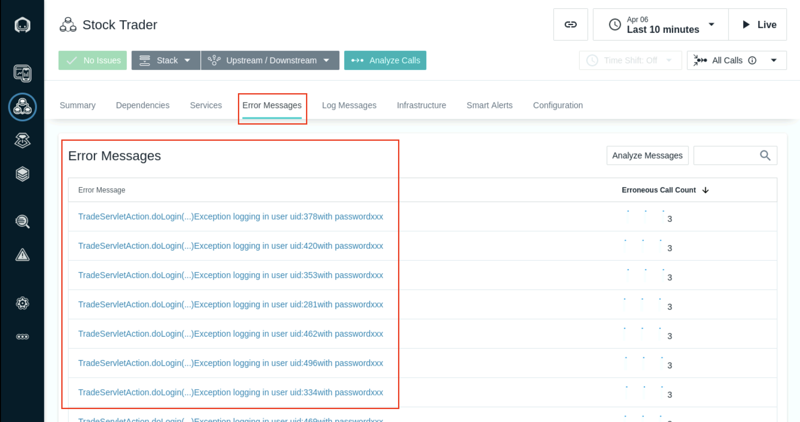

# 3.3 Exploring the Analytics Dashboard

1. On the left navigation bar, click on the **Analytics icon**, fifth icon  from top, to access the Analytics dashboard. 

2. Next to **Analytics > Applications**, click on the down arrowhead to see different dashboards available within Analytics, including: **Calls, Traces or Log (Beta), dashboards**

3. On the Analytics dashboard, traces or calls can be filtered and grouped using arbitrary tags. In Analyze Calls, filters can be connected using the AND and OR logic operators and grouped together with brackets. In Analyze Traces, only the AND operator is available

Note the two upper panes under the dashboard **title, Filter and Group**.  

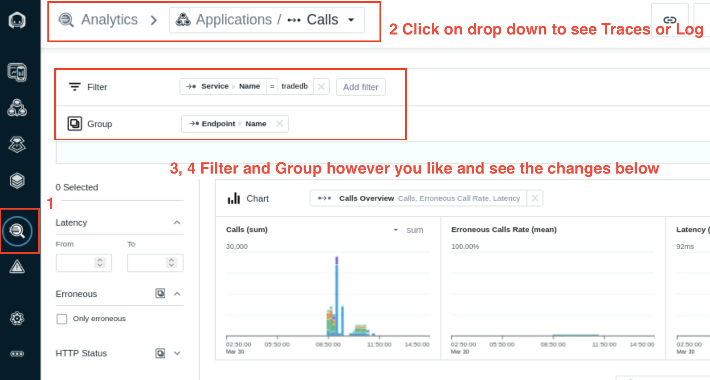

4. Click on **Add Filter** or **Add Group** to see different categories and tags available to filter or group the dataset shown by the Analytics dashboard. 

There are two approaches to filter data:

Query Builder
Filter Sidebar

While both of them are usable on their own, best results are achieved when combining them.

5. Click on **Stan** to go back to the landing page.

# 3.4 Reviewing Metrics Before Enabling WAS or Java Profiling

We will check in this section that Websphere dashboard shows very little information about thread pool/size, average response time or transactions counts - the data required to actively monitor WAS application. Later in the lab, we will enable WAS and Java profiling and then you will be able to see rich dataset to assist with monitoring WAS applications. 

1. Navigate to the Infrastructure icon in the Instana left navigation and select the Websphere service in the ipot-was services tower. Select Open Dashboad to open the WebSphere Application Server dashboard.

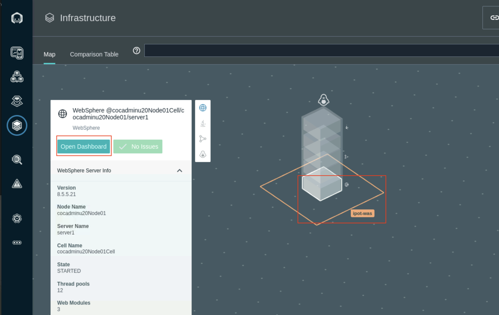

2. The Web Contaainer threads can be monitored in the Threads pools section. It shows the number of active threads and pool size

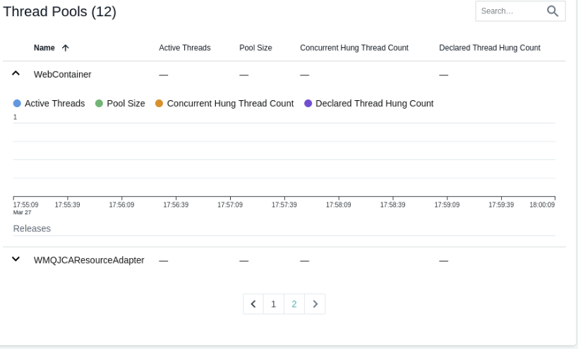

3. Selet the Trade#tradeWeb.war application in the Web modules section to monitor the sessions and servlet request and Average Response times.

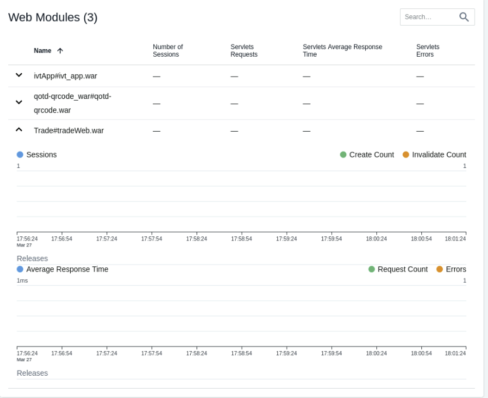   

4. The EJB Modules section lists the EJB Beans and average response times.
   
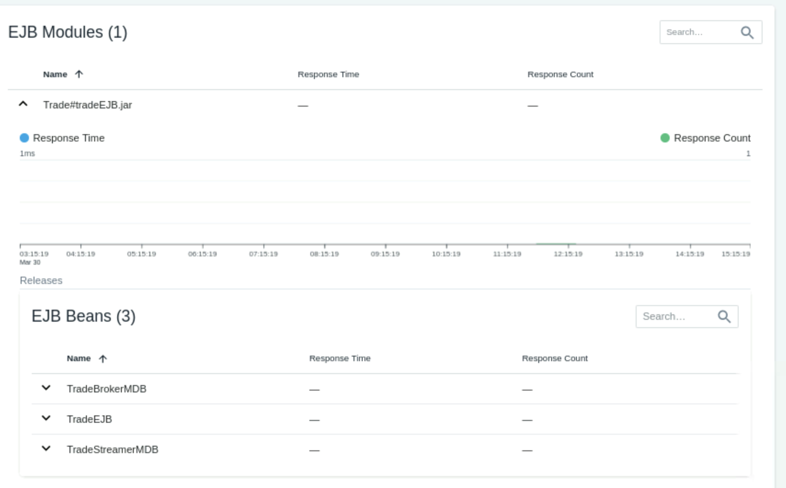

5. The Transation section shows Active and Commited transaction counts.
   
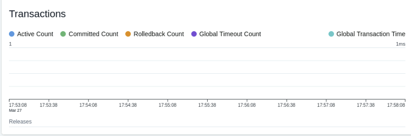

