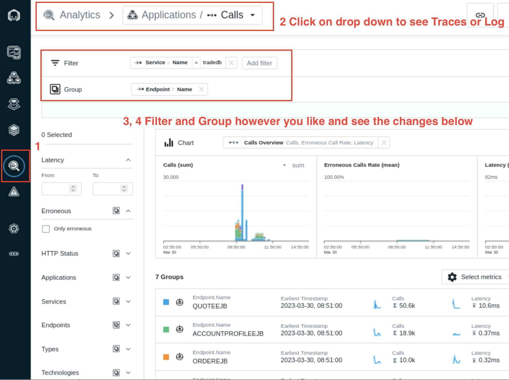

# Explore Instana

# 3.1 Navigating the User Interface

1. Notice the navigation bar on the left side of the user interface. Click anywhere on the navigation bar to expand it. 

2. Click on any icon on the navigation bar to open any of our specialized dashboards. Click on **Stan** in the upper left corner to go back to the landing page.  

3. Note the URL link icon on the upper right corner of the landing page. Click on it to copy the URL of the dashboard currently showing on the user interface.Open another tab on your browser and copy and paste this link. 

4. Note the **Time Picker** box next to the URL link icon. Click on it to explore available preset time ranges. Pick one and observe the change of metric information on the dashboard. Change the time range a couple more times and observe how metric information on the dashboard changes.  

5. Next to the **Time Picker**, note the **Live** button. This button gives you access to our Live tool that shows real time information about your environment.   

6. Under the Time Picker, you will see our **Deploy Agent** button. You have already gone through this in previous section

7. Click on **Stan** to go back to the landing page. 

8. Click on the **gear wheel** icon in the navigation bar on the left hand side, second from bottom, to open the **Settings** dashboard.  

9. Observe available navigation tabs on the panel of **Settings** dashboard.  

10. Click on Stan to go back to the landing page and click on the **three-dot** icon, first from bottom, to expand the navigation bar.  

11. Scroll down and click on **About Instana** to review information about the backend. Click on X to close this window.  

12. Click on the three-dot icon again. Scroll down and click on **Documentation** to access Instana’s public documentation.  

13. Click on the three-dot icon again Scroll down and click on **Support** to open Instana’s Support home page. This page will open on a separate tab.  
		

# 3.2 Exploring the Application Monitoring Dashboard 

Covered in section **#2 Create the Stock Trader Application Perspective**

# 3.3 Exploring the Analytics Dashboard

1. On the left navigation bar, click on the **Analytics icon**, fifth icon  from top, to access the Analytics dashboard. 

2. Next to **Analytics > Applications**, click on the down arrowhead to see different dashboards available within Analytics, including: **Calls, Traces or Log (Beta), dashboards**

3. Results shown on any Analytics dashboards are not filtered or grouped by default. Note the two upper panes under the dashboard **title, Filter and Group**.  

4. Click on **Add Filter** or **Add Group** to see different categories and tags available to filter or group the dataset shown by the Analytics dashboard. 

5. Click on **Stan** to go back to the landing page.

# 3.4 Reviewing Metrics Before Enabling WAS or Java Profiling

We will check in this section that Websphere dashboard shows very little information about thread pool/size, average response time or transactions counts - the data required to actively monitor WAS application. Later in the lab, we will enable WAS and Java profiling and then you will be able to see rich dataset to assist with monitoring WAS applications. 

1. Navigate to the Infrastructure icon in the Instana left navigation and select the Websphere service in the ipot-was services tower. Select Open Dashboad to open the WebSphere Application Server dashboard.

2. The Web Contaainer threads can be monitored in the Threads pools section. It shows the number of active threads and pool size

3. Selet the Trade#tradeWeb.war application in the Web modules section to monitor the sessions and servlet request and Average Response times.

   

4. The EJB Modules section lists the EJB Beans and average response times.
   

5. The Transation section shows Active and Commited transaction counts.
   

