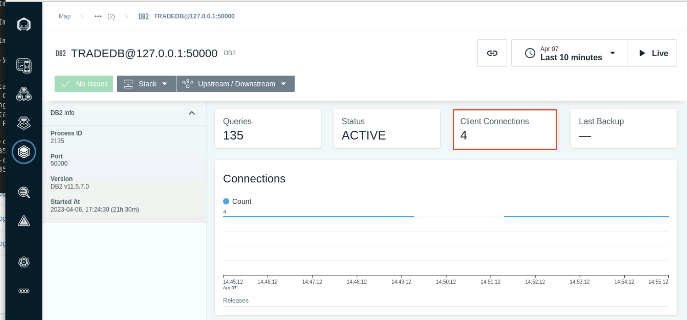
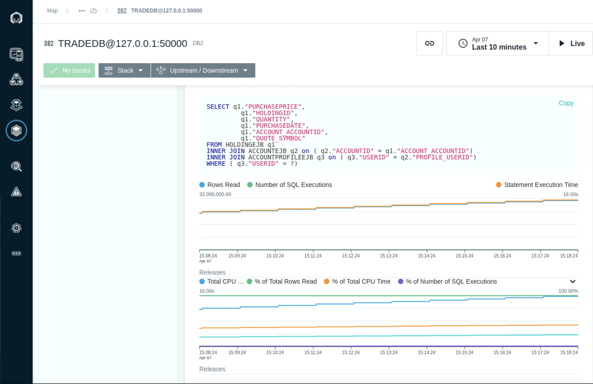
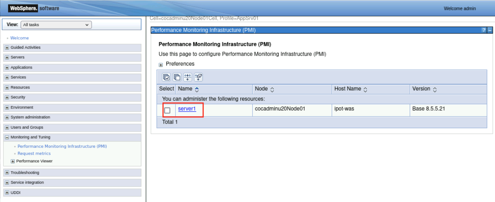
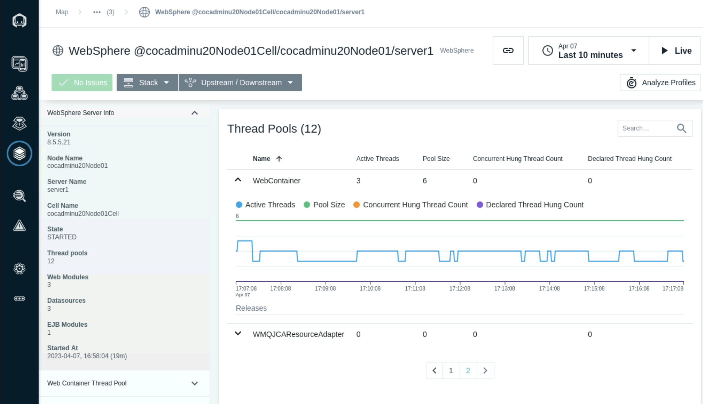
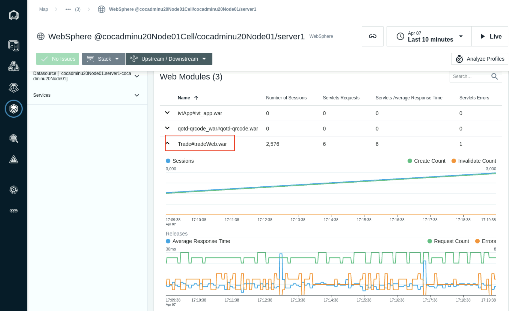

# Enable Sensors

## **Introduction**

In this section of the lab you will enable the WebSphere Application Server, Java and DB2 sensors in the Instana Agent.


## **Enable the DB2 sensor in the Instana Configuration** 

When the Instana agent is deployed into an infrastructure containing IBM DB2, it automatically detects the technology but Instana cannot provide automatic DB2 monitoring for licensing reasons. Once you’ve downloaded and placed the driver jar file, the only further setup required is providing credentials to access the IBM DB2 Monitoring information.

In our scenario, DB2 is installed on a separate system than where we installed the Instana agent. Hence, we will need to manually update the agent configuration file to enable DB2 sensor.

After Instana deploys its IBM DB2 monitoring, it will immediately map out IBM DB2’s infrastructure. The Instana agent sends all data back to Instana's Dynamic Graph model, which stores and contextualizes all collected monitoring data. Typical configuration data collected are:

- Process ID
- Port
- Version
- Start time / Up time

**Some example metrics collected are:**

- Connections
- Rows read
- Rows returned
- Commits
- User Calls Commit Rollbacks
- Rollbacks
- SELECTS
- etc.

Instana collects information about IBM DB2, individual databases, and containers. You will see all that in the following steps.

1. Sign in to the Bastion host and select the Terminal icon from the Activities menu. 
2. ssh to the ipot-was Virtual Machine
   ```sh
   ssh -p 2022 cocuser@ipot-was
   ```
   

3. Sudo to the root user
   ```sh
   sudo -i
   ```
4. The Following command will update the configuration.yaml file to enable the DB2 sensor

  ```sh
  cat << EOF >> /opt/instana/agent/etc/instana/configuration.yaml
  # DB2
  com.instana.plugin.db2:
    # Local monitoring configuration
    local: # multiple local configurations supported
    - instance: 'db2inst1'
      port: '50000'
      user: 'db2inst1'
      password: '#PASSWORD#'
      poll_rate: 5 # seconds
      databases:
        - 'TRADEDB'
  EOF
  ```

5. Update the password for the db2inst1 user using the password in the credentials.pdf file

```sh
sed -i.bak "s|#PASSWORD#|<Password from credentials.pdf>|g" /opt/instana/agent/etc/instana/configuration.yaml
```


To verify the Sensor has been enabled, you can view the Instana agent log file. The Output should indicate the Sensor is enabled for the **TRADEDB** DB2 database

Enter the following command and press enter.

  ```sh
   tail -f /opt/instana/agent/data/log/agent.log
   ```

 

## **Verify the DB2 Metrics**

In this section you will look at the DB2 metrics that have been captured by the sensor.


1. Navigate to the **Infrastructure** icon on the Instana left navigation menu and hover over the **ipot-was** infrastructure tower and select **DB2 TRADEDB** service. Selet Open Dashboard link to load the DB2 Metrics Dashboard page.


  The **Dashboard** shows various metrics captured by the Sensor.

  The **Connections** section will show the number of open connections to the Database based on the selected time.

  

  The **Table Spaces** section shows the table space names and usage. A Custom Event can be created to monitor and set of an alert when the tables spaces are getting close to full capacity.

  

The **Rows and Commits/Rollbacks** views show the number of rows read from the database and commited.

  

Scroll down further until you see the **Top Total CPU**.  This section show the top executing SQL statments and the Total CPU for each.


Select the SQL Statement with the high number of Rows read and CPU consumtion to see the detailed SQL statement and graph based on the selected timeline.



## **WebSphere Application Server PMI metrics**

1. Login to the WebSphere Admin Console **http://ipot-was:9060/ibm/console**
   Enter the user: **admin** and password: **refer to the credentials.pdf file**

2. Navigate to **Monitoring and Tuning** and select **Performance Monitoring Infrastructure (PMI)**
   
3. Select **server1** 
   
   

4. In the General Properties section, select the **Enable Performance Monitoring Infrastucture** checkbox and Select the **Basic** option

5. Click **Apply** and **Save** changes to the master configuration


4. Restart the WebSphere Application Server by sunning the following command in the terminal

```sh
systemctl restart was
```

## **Enable the Java and WebSphere Application sensors in the Instana Configuration**

In this section you will enable the WebSphere Application Server and Java Sensors

  1. The Following command will update the configuration.yaml file to enable the WebSphere Application Server and Java tracing sensors

```sh
cat << EOF >> /opt/instana/agent/etc/instana/configuration.yaml
# Java Profiling
com.instana.plugin.profiling.java:
  enabled: true
# Java & Custom JMX
com.instana.plugin.java:
 name-properties:
    - 'StockTrader-PoT'
    - 'PoT'
# Java Tracing
com.instana.plugin.javatrace:
   instrumentation:
    enabled: true
    opentracing: false
#IBM WebSphere Application Server
com.instana.plugin.websphere:
  enable_pmi: true
EOF
```
2. Navigate to the **Infrastructure** icon in the Instana left navigation and select the **Websphere servic**e in the ipot-was services tower. Select **Open Dashboad** to open the WebSphere Application Server dashboard.


3. The **Web Contaainer** threads can be monitored in the **Threads pools** section. It shows the number of active threads and pool size



4. Select the **Trade#tradeWeb.war** application in the **Web modules** section to monitor the sessions and servlet request and Average Response times.
   
  

5. The **EJB Modules** section lists the EJB Beans and average response times.
   
  

1. The **Transations** section shows Active and Commited transaction counts.
   
  


## **Java application Mointoring and Tracing**

1. Navigation to the **JVM** process by selecting the **TradeWeb Service** and select the **Stack, infrastructure** tab. Select the **bootststrap** JVM process to open the JVM dashboard.
   
    

2. The **Threads** section shows the number of running threads and the count of Threads in wait-time.


3. The **Heap Memory** section shows the Heap size and Heap in-use. This is a indicator of the the frequncy of Garbage Collection cycles and it's impact to application performace.


1. The **Garbage Collection** section shows the collectors and the frequency of activation and runtime.
   


## **Code Profiling**

Instana AutoProfile™ is an an automated and continuous production profiler which enables you to continuously analyze code-level performance in production without negatively impacting production applications.

In most instances, a profiler is used by developers to identify performance issues or bottlenecks in their code. Profilers are designed to enable developers to dig all the way down to the individual line of code that is running slow, or is resource intensive. As powerful as profiling can be to identify code optimization opportunities, it is often only used by developers in dev environments after there is already a serious issue. Even if a developer wanted to run profiling in production, it can be difficult at best to get access to production to get a profiler attached.

Instana AutoProfile™ attaches itself to the running process automatically with no restarts or reconfiguration required. With AutoProfile, users are able to continuously analyze code-level performance, discover bottlenecks in production code, visualize performance with a flame graph, and then dig deep into the application’s ‘hot paths’.

In this section, we will profile the code in the stock Trader application to analyze the CPU and wait times in the code for an Endpoint.


1. Select the **Stock Trader** Application Perspective. Set the **Time Picker** to a shorter duration or **Set Time** window to 2 to 3 minutes for executing following steps. 
   


2. Highlight a range in the calls section and select the **Analyze** option.


3. Select the **HTTP Status 200** group and select the **GET /trade/scenario"** Endpoint


4. The Call detail page will show the Endpont trace and includes a profiling section on the right. This view shows the highest CPU consuming code Hotspots. Select the **Analyze profiles** link.


5. The view shows a timeline summary of the System and User CPU. Highlight the section were the CPU User is at its peak and Select **Analyze**.
 


6. The **CPU HotSpots** section now shows the code that is executed for the seclected range. 


7. Select the **CPU** tab to view the Flame Graph that highlights the code calls causing the high CPU usage. Select the red highlighted hotspot to load the TreeView for the code consuming the CPU respurces. 


8.  The **Tree View** shows the request to authenticate is causing high amount of CPU usage. In the next section we will look at how to troubleshoot and resolve this issue.


## **Troubleshooting**

**Issue**: While getting to WAS console, the    connection times out.

  **Solution**: You need to restart WAS. From **ipot-was** system run 
   
  ```sh   
   systemctl restart was
   ```

  Wait for WAS to restart successfully. Make sure it is not hung during the process.

   Now try accessing the WAS console. With correct userid/password you should be able to login.