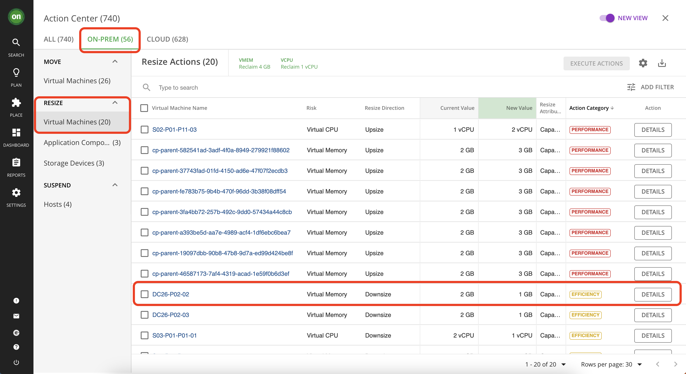
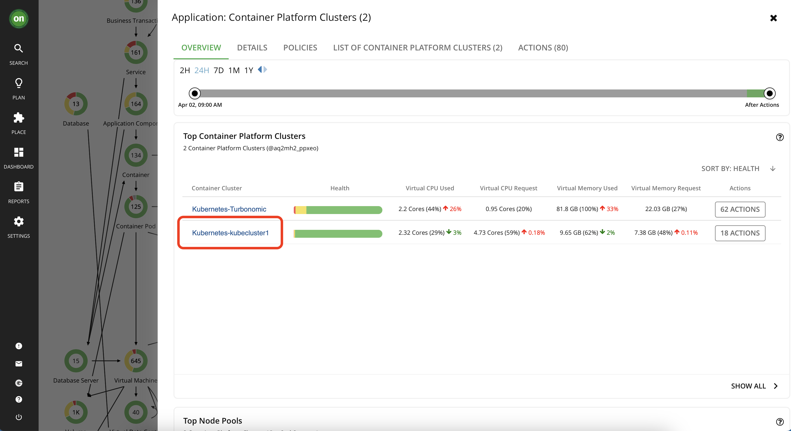

# Actions 
~ 30 minutes

After you deploy your targets, Turbonomic starts to perform market analysis as part of its Application Resource Management process. This holistic analysis identifies problems in your environment and the actions you can take to resolve and avoid these problems. Turbonomic then generates a set of actions for that particular analysis and displays it in the Pending Actions charts for you to investigate.

In this lab you will learn about:
-	Different types of actions
-	Action categories
-	Action Modes

**Please note that your number and types of actions may vary on your environment**

## Types of Actions in Turbonomic

-	**Placement** — These actions determine the best provider for an entity. These include initial placement for a new entity and move actions that change it to use a different provider. For example, moving a VM assigns it to a different host. Moving a VM’s storage means the VM will use a different datastore.
-	**Scaling** — Resize allocation of resources, based on consumption.
    -	Resize up, shown as a required investment.
    -	Resize down, shown as savings.
-	**Discount Optimization** — Increase discount coverage and reduce costs by scaling VMs to instance types that are charged discounted rates.
-	**Configuration** — These are reconfigure and resize actions. Reconfigure actions can add necessary network access or reconfigure storage. Resize actions allocate more or less resource capacity on an entity, which can include adding or reducing VCPUs or VMem on a VM, adding or reducing capacity on a datastore, and adding or reducing volumes in a disk array.
-	**Start/Buy** — Start a new instance to add capacity to the environment, shown as a required investment. For cloud environments, purchase discounts to reduce costs.
-	**Stop/Suspend** — Suspend an instance to increase efficient use of resources, shown as savings.
-	**Delete** — Delete actions affect storage. For example, Turbonomic might recommend that you delete wasted files to free up storage space or delete unused storage in your cloud environment to reduce storage costs.

### Lab – Explore different action types
1. Navigate to the main dashboard by clicking on the "on" button from the navigator. Then select "Show All" from the "Pending Actions" section

2. In this page you will see all pending actions - including on-prem and cloud. If you look at the list on the left you will see actions are categorized by their type. Spend few minutes to explore actions by going to the on-prem or cloud tabs.

3. While exploring actions, you will notice that each action type has multiple entities that it affects. For example, the type "Scale" - which is basically a resize action for cloud entities - affects VMs, databases, VM storage and volumes. Let's take a closer look at some of these actions.

    Navigate to "Volumes" under "Scale" action type.

    

    Select the "Azure" tab. Then click on "Details" for an action that is market "Performance" and reduces your cost. You may need to scroll to the right to locate the button.

    

    This page displays all the detail about this action including why it was generated, what is the impact if taken, costs or cost savings associated with taking this action, and important information about if it will cause downtime if taken and whether or not it is reversable. Let's take a closer look at the information specified in this action details.

    1- This section informs you of the action, the entity it affects, the location in which the entity exists and the reason. In this picture we have a scaling volume action for entity named "ptericdisks3_datadisk_2" in the deployment named "EA - Development" and the reason is IOPS Congestion.
    
    2- The action essentials section gives a quick view into what you need to know about taking this action. 
        - The action can be accepted and executed immediately means there is currently no restrictions that will prevent you from taking it right now. We will explore what this means further when we disscuss action modes.
        - Whether or not there is downtime associated with taking this action. In our example, this change requires a period of downtime so when considering taking it one must plan ahead and inform the users of this volume of a planned downtime.
        - Whether or not this action is reversable. 
    
    3- In this section you will learn why this action is generated. Typically Turbonomic observes the entity over a period of time and captures the 95th percentile for it. Considering the example shown in the picture below, Turbonomic tells us that the IOPS utilization is about 100% for 95% of the time during a 30-day observation period. This means there is an IOPS congestion on this volume so a scaling action is generated for this entity to move it to a more suitable volume.
    
    4- The IOPS 95th percentile graph.
    
    5- IOPS daily average graph.
    
    6- The dotted line represents the projected 95th percentile after taking this action.
    
    7- Detailed comparison between the current state of the resources and the projected result after taking the action. 
    
    8- Detailed cost savings comparison for if you take this action. Notice how scaling to a different volume will result in higher IOPS, lower utilization and it even saves money. So why wouldn't you take it?

    
    

## Action Categories

Notice how in the previous section we picked an action with a "Performance" action category? Let's explore different action categories. 
Turbonomic groups entries in the Actions List by different categories. These categories do not strictly define the severity of an issue, but they indicate the nature of the issue.

- **Performance Assurance** - Ultimately, the reason to manage workloads in your environment is to assure performance and meet QoS goals. When Turbonomic detects conditions that directly put QoS at risk, it recommends associated actions in the Performance category. You can consider these critical conditions, and you should execute the recommended actions as soon as possible.

- **Efficiency Improvement** - Efficient utilization of resources is an important part of running in the desired state. Running efficiently maximizes your investment and reduces cost. When Turbonomic discovers underutilized resources, it recommends actions to consolidate your operations. For example, it can recommend that you move certain VMs onto a different host. This can free a physical machine to be shut down.

- **Prevention** - Turbonomic constantly monitors conditions and works to keep your environment running in a desired state. As it finds issues that risk moving the environment out of this state, it recommends associated actions in the Prevention category. You should attend to these issues and perform the associated actions. If you do not, the environment may drift away from the desired state, and the QoS for some services may be put at risk.

- **Compliance** - A virtual environment can include policies that limit availability of resources. It’s possible that the environment configuration violates these defined policies. In such cases, Turbonomic identifies the violation and recommends actions that bring the entity back into compliance.

- **Savings** - Cloud environments have costs associated with them. If the environment is not being utilized well, it means there is an opportunity to optimize the cost while ensuring the performance will not be affected.

### Lab - Explore action categories
Now let's explore some other action categories.
1. From the actions list navigate to "Move" and then "Virtual Machines". Explore details of actions categorized as "Prevention" and "Efficiency"

2. Navigate to "Scale" then "Virtual Machines" and explore details of actions categorized as "Savings".

## Action Modes
Action modes specify the degree of automation for the generated actions. For example, in some environments you might not want to automate resize down of VMs because that is a disruptive action. You would use action modes in a policy to set that business rule. We will explore this further in "Policies" lab.

Turbonomic supports the following action modes:

-	**Recommend** — Recommend the action so a user can execute it via the given hypervisor or by other means.
-	**Manual** — Recommend the action and provide the option to execute that action through the Turbonomic user interface.
-	**Automatic** — Execute the action automatically. This automation is defined in "Policies". We will explore this further in the Policies lab

### Lab – Explore action modes
While exploring previous labs in this section, you might have noticed that in the list of actions, they have different icons to the left of them. Or, when you've opened their action details, some had green "Execute Action" button enabled at the bottom if them. These elements are affected by the "Action Mode" specified for the action. Let's take a closer look.

1. Navigate to "Scale" then "Virtual Machines" and find actions that have a square with a dark outline next to them. A dark outline indicates that the action acceptence mode is "Manual" and you can accept and execute the action manually in Turbonomic. Open the action details and explore the data.

2. In the same list, find an action with a do not enter icon next to it. Such actions may be able to taken manually/automatically but are currently blocked because there are other pre required actions that needs to be executed before this one. Once the prerequirements are cleared this action will then be allowed execution. Open the action details and explore the data.

3. Navigate to "Resize" then "Storage Devices". Actions with greyed out square next to them are blocked by policies. The action mode for these actions are set to "Recommend" in policies and can not be taken in Turbonomic (manually or automatically). Open the action details and explore the data.
Usually, actions regarding changes to resources of a physical device are on Recommend since Turbonomic can not physically go out there and make changes to the physical storage. However your business requirements may dictate other form of actions to be set on "Recommend" only and this can be defined in Policies in Turbonomic.

## Taking Actions
In previous lab, you’ve learned different types of actions in Turbonomic and explored some generated actions within your environment. This lab will walk you through executing an existing action manually in Turbonomic.

### Lab – Manually perform an action 

- **Optimize on-prem resources**

In this section you will take actions that will optimize your on-prem resources while assuring performance. Taking such actions will result in resources being released by entities or VMs that are not utilizing what they have over the observation period (by default 30 days) so that they can be allocated to workloads that needs these resources.

1. Navigate to "On-Prem" tab from your actions page. Then under "resize" select "Virtual Machines".

2. Scroll down the list and select an action to downsize virtual memory that has "Efficiency" as its action category. Click on its details.

3. Check the details, you will notice that this VM's virtual memory utilization was under 1% for 95% of the time over 30 days. This means this VM has overallocated memory which it does not consume. So you can safely reduce the memory capacity while still providing optimal performance. Notice the projected results of taking the action, it will bump up the utilization from 1% to 2% which is perfectly acceptable. 

    Once you approve of all details and ensure this action is safe, click on "Execute Action" button at the bottom of the details page. Once you execute this action, Turbonomic will use API calls to adjust the virtual memory of this VM for you. So you won't need to log into your vCenter environment. If the action is executed successfully, you will see a green checkmark next to that action.

---

- **Public Cloud Actions**

For this section, you will execute actions that will optimize the cost of your cloud environment. Remember that Cloud instances have a dollar value associated with them and because of that Turbonomic is able to accurately calculate the necessary investments or potential savings from cloud optimizations. 

1. From your actions center navigate to the "Cloud" tab. Under "Scale" select Volumes.

2. We want to see which action will save us the most money and has the lowest risk. So sort the list based on "Cost Impact". Then click on "details" to explore the action with highest amount of savings. 

3. In the action details, notice how the IOPs utilization for this volume has been below 10% for 95% of the time. also notice that this action does not require a downtime and can be reverted as well. This indicates that this is a low risk high reward action to take. By taking this action you can save money while assuring performance and it has a very low risk associated with it. So why won't you take it? 
After examining the details, execute the action using the green button at the bottom. If successful, you will see a green checkmark next to the action.

---
- **Kubernetes**

When you added the Kubernetes target using kubeturbo commands, you allowed the kubernetes cluster to be managed by Turbonomic. This means that now, we can take Kubernetes optimization actions within Turbonomic. 

1. Navigate to the main dashboard by clicking on the "ON" button from the navigator.

2. From the supply chain find the "Container Platform Cluster" entity - it should show the number 2 if you have successfully added your Kubernetes cluster as a target. This will select the details of both of your Kubernetes clusters.

3. From the list, select your Kubernetes cluster, it should be named like "Kuberneter-kubecluster1". Click on the cluster name. 

4. Now you are on your cluster's detailed page. Notice how the supply chain is updated to only reflect entities within this cluster. Also all the actions are filtered to show only the ones applicable to this particular cluster. On this page, click on "Show All" in the "Pending Actions" section.

5. From the actions list, find the item with "payment" as its "Workload Controller Name" then click on details.

6. In the details you can see that it is regarding VMem congestion for this entity and Turbonomic wants to resize it to resolve the congestion and assure performance. After reviewing the details scroll down and click on "Execute Action" button. Once successfully executed, you can see a green check mark next to the "payment" item and upon refreshing the page you will see that it disappear from the list of pending actions.

congratulations! You have completed the Actions lab.
