# Add Targets 
~ 60 minutes

A target is a service that performs management in your virtual environment. Turbonomic uses targets to monitor workload and to execute actions in your environment. Turbonomic communicates with the target via the management protocol that it exposes — The REST API, SMI-S, XML, or some other management transport. Turbonomic uses this communication to discover the managed entities, monitor resource utilization, and execute actions.

**Tip:** Turbonomic must be on a network that has access to the specific services you want to set up as targets. (but we have this part covered for this session)

In this lab, you will add two targets to your Turbonomic environment

1. An application performance monitoring target - Instana
2. Kubernetes target

## Adding Instana Target

Turbonomic supports discovery of applications that are managed by APM tools - in this case the Instana platform. Turbonomic includes the discovered information about these applications in its calculations for environment health.

We have already prepared an Instana server for your environment. This server is monitoring two applications: RobotShop and Quote of the Day. In this section, you will go through steps to add this Instana instance to your Turbonomic environment.

### Generate Instana API Token

1. To connect Instana to Turbonomic you will need API token from your Instana server so that Turbonomic can authenticate the connection. To generate this key navigate to you bastion VM and click on the Instana tab.


2. This will take you to the Instana login page. log in using your Instana credentials. Instana credentials are provided in Turbo-PoT-Credentials tab.

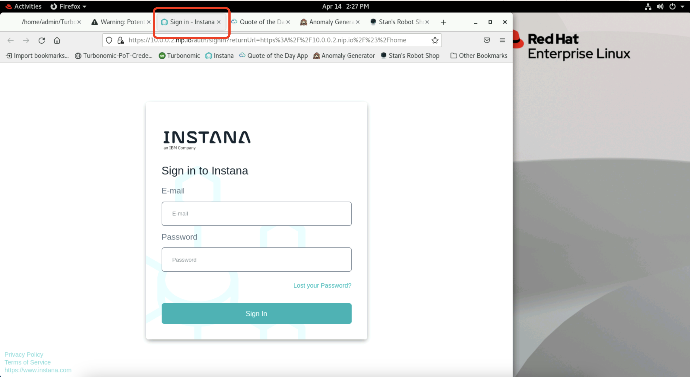

3. Once you logged in, click on the gear icon on the left menu to open settings.

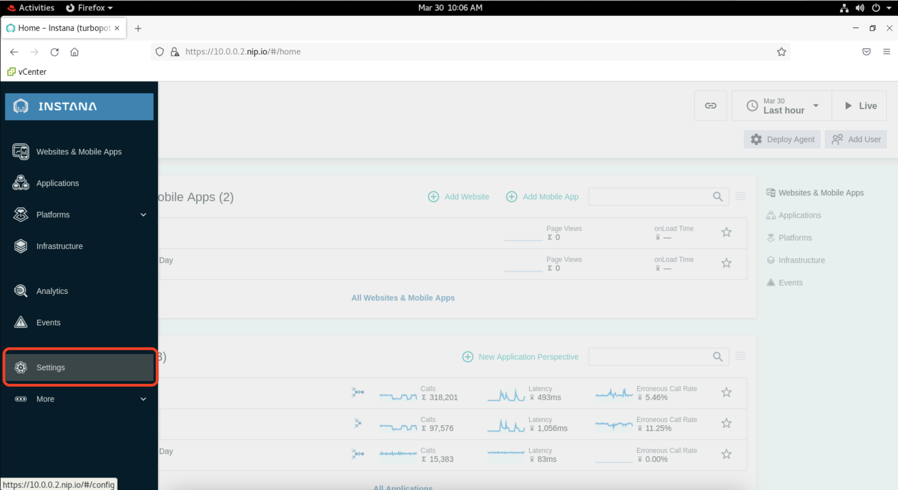

4. In the settings page, under "Team Settings" click on "API Tokens". Then click on "Add New Token".

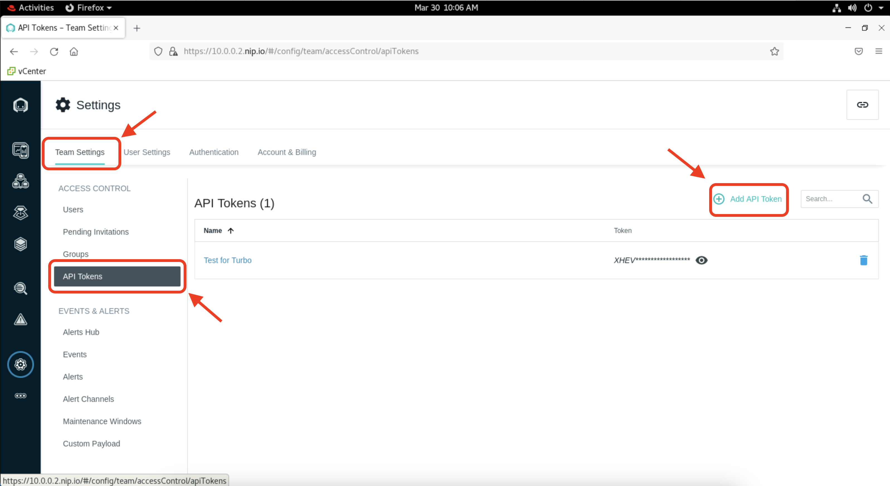

5. Give your token a unique name like "api_YourInitials". Then scroll down and click on "Save". You can leave all other settings as default.
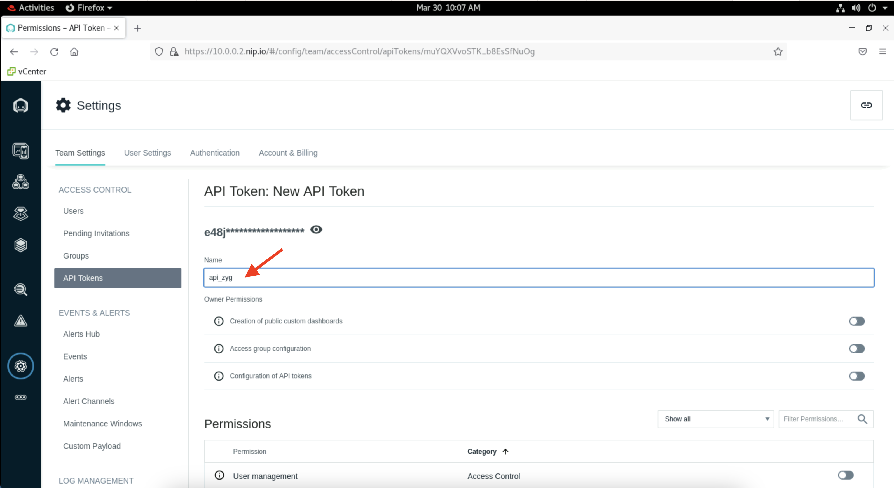
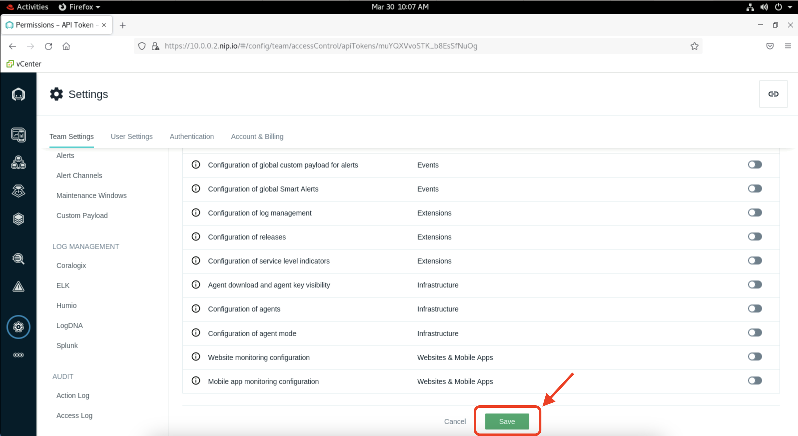

6. Now click on the eye icon to reveal your API token and take a note of it. You will need this key in next section. 
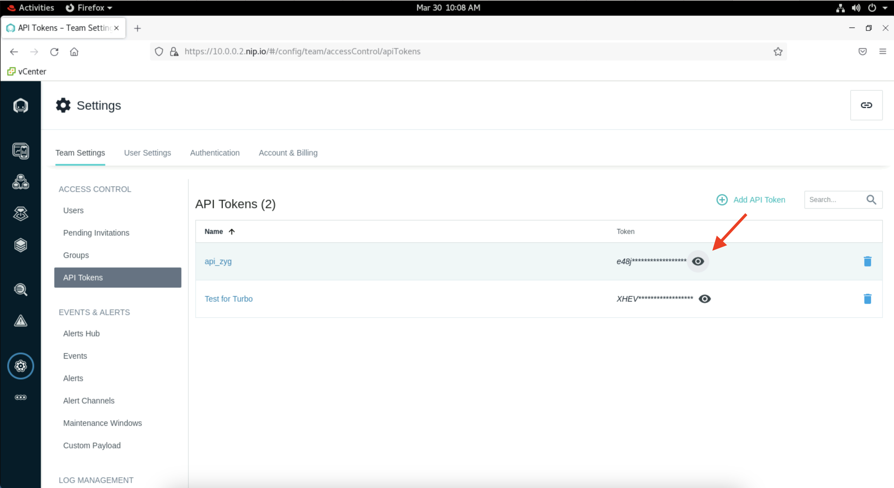


### Add Instana as a target

1. Navigate to your Turbonomic console on the bastion VM, then click on "Settings" from the navigator.

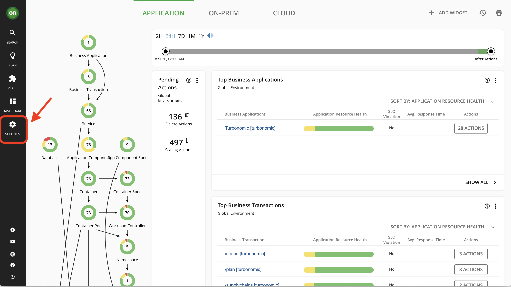

2. Select "Target Configuration" option. This will open up the page containing all configured targets.

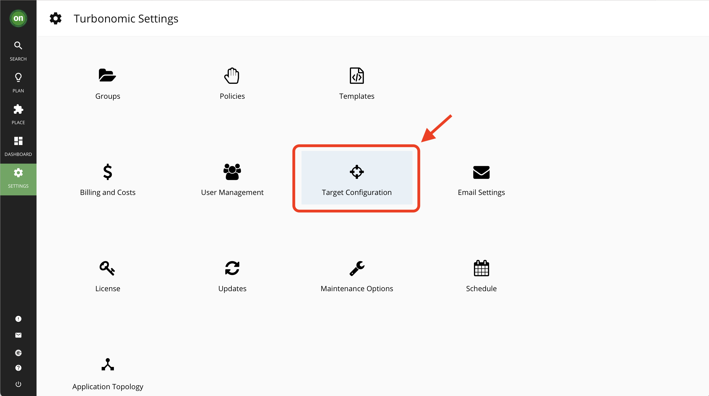

3.  Click on "New Target". This will open up a page with a list of available target types for this environment. 

**Tip:** This is not an extensive list of available target types. To view the full list and supported versions visit the [documentation site](https://www.ibm.com/docs/en/tarm/8.8.0?topic=overview-turbonomic-targets).

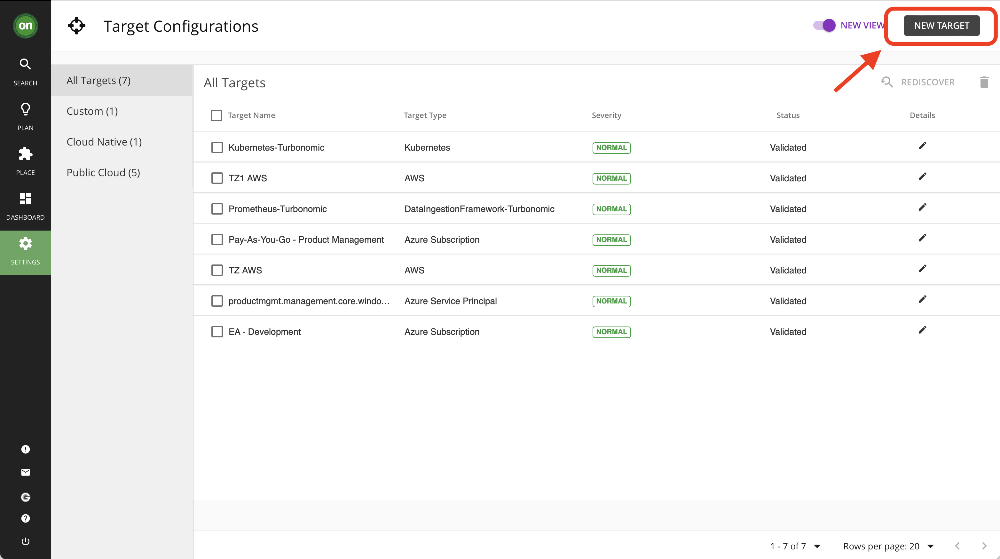

4. From the list select "Applications and Databases". Then select "Instana".

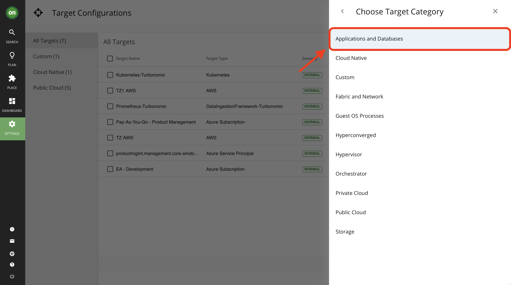

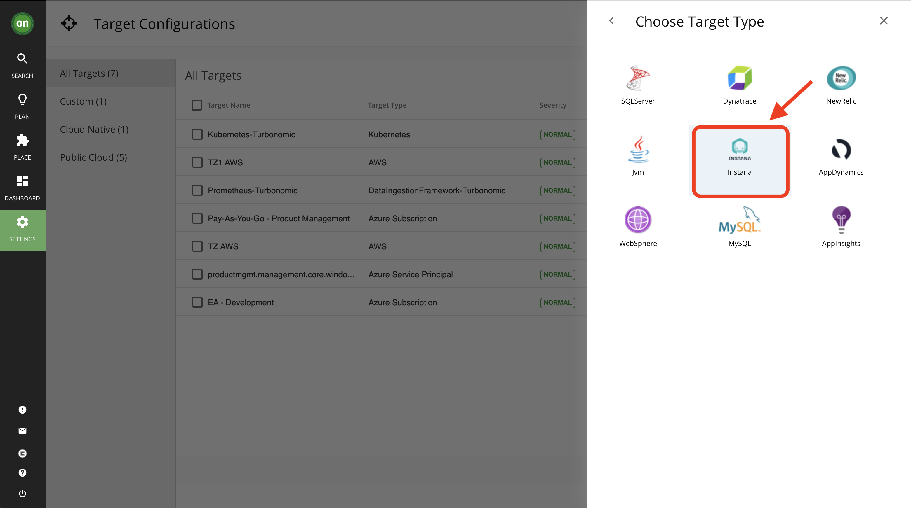 

5. To add Instana all you need is the host name or IP address of your instana server, and an API token generated from your Instana backend. Once you filled out these information click on "Add" at the bottom of the page. Since we don't have a proxy we can leave those parts empty.

**Note:** If you see the host name and/or IP address is prepopulated as administrator and a password in this step, clear both and type in your information. 

**Tip:** Keep in mind, the hostname or IP address must be visible to Turbonomic. If you have your Instana and Turbonomic instances installed in different networks or the communication between them is blocked by a firewall, the target configuration will fail. 

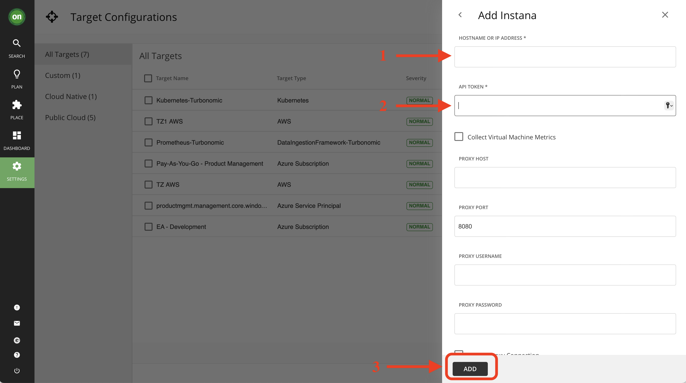

6. Your newly added Instana target will appear in your list of targets. Check the "status" and "severity", it must show as "Validated" and "Normal". Congratulations, you have successfully connected your Instana environment to Turbonomic.

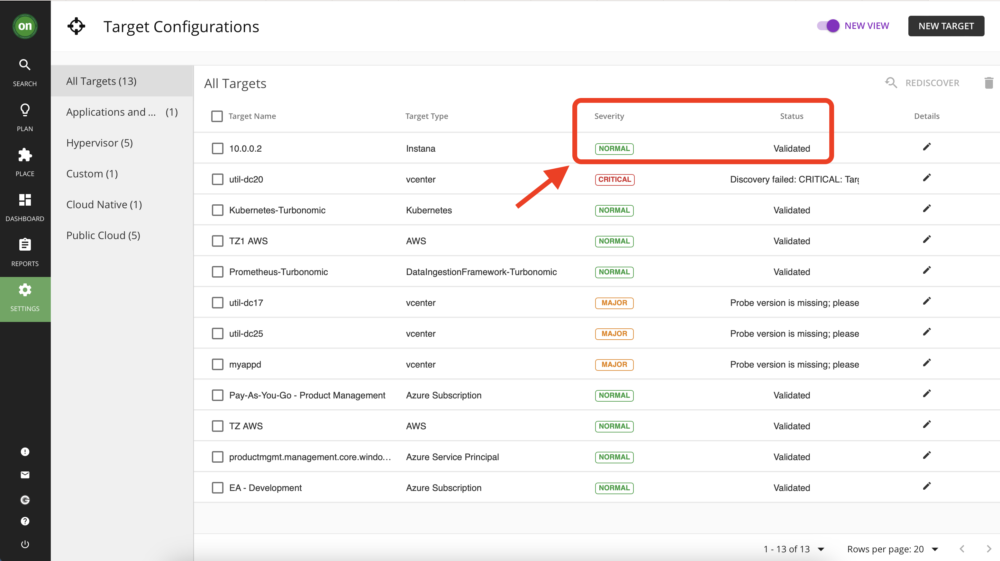

Now that you have added a new target, allow 15 minutes for Turbonomic to run discovery and add the data from Instana. To check this, look at your top business applications and look for two applications that will be added in from Instana: Quote of the Day, and RobotShop. 

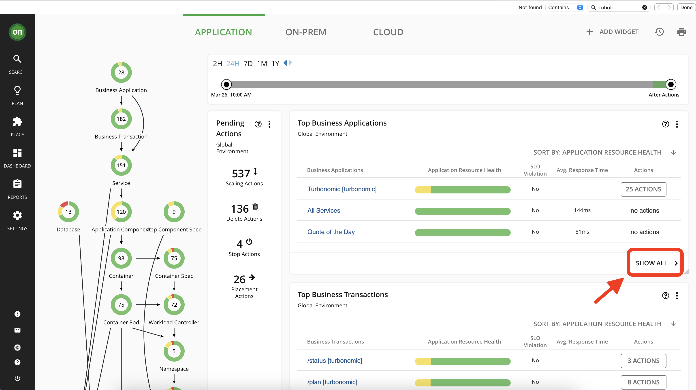

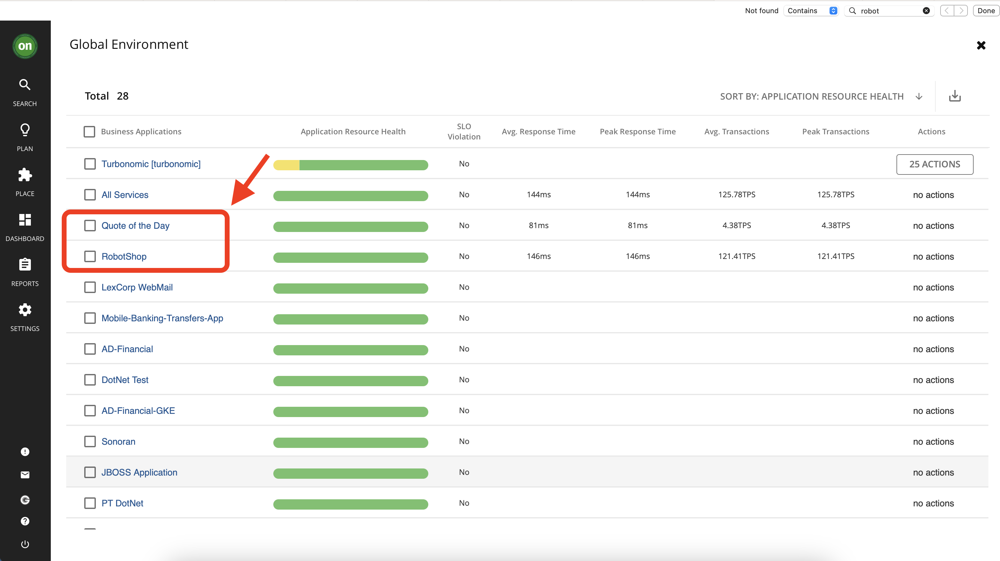

## Adding Kubernetes Target

The Turbonomic platform gathers information from Kubernetes/OpenShift environment through **Kubeturbo** that is deployed into the Kubernetes/OpenShift cluster that you want to manage. Kubeturbo will run a single pod deployment with the following resources:

- Namespace or Project (default: turbo)
- Service Account
- Rolebinding defined
- ConfigMap which contains connection to the Turbonomic server
- Deployment for Kubeturbo pod.

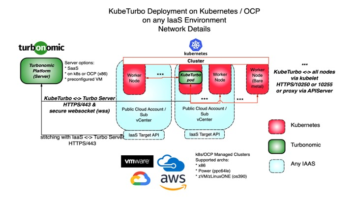

### Requirements

Kubeturbo can be installed on Kubernetes version 1.11 or higher and OpenShift release 3.11 and higher on any x86_64, Power and LinuxONE architecture. The other requirements are

- Turbonomic Server URL
- Turbonomic Server credentials for Kubeturbo to communicate with. Typically it can be Site Administrator or Administrator role
- Access to registry `icr.io/cpopen/turbonomic/kubeturbo:<version>` (Version 8.7.5 or higher) or [Docker hub or docker.io] for versions 8.7.4 or lower
- Ports 443 and 10250 
  
### Types of Deployment of Kubeturbo

Kubeturbo can be deployed in three ways. They are:

- Deploy resources via yaml (resource files)
- Operator (OperatorHub for OpeNShift)
- Helm chart

More information is available on the [Kubeturbo Wiki](https://github.com/turbonomic/kubeturbo/wiki). In this tutorial, you will be installing Kubeturbo via helm chart.

### Kubeturbo deployment via Helm charts

As per the requirements, for the KubeTurbo to communicate with the Turbonomic server, you need
* Turbonomic URL: https://10.0.0.1
* ServiceAccount: kubeserviceaccount (you will create this as described below)

### Create Service Account

The various steps to create a service account are:

- From your Turbonomic UI navigate to Settings -> User Management 

  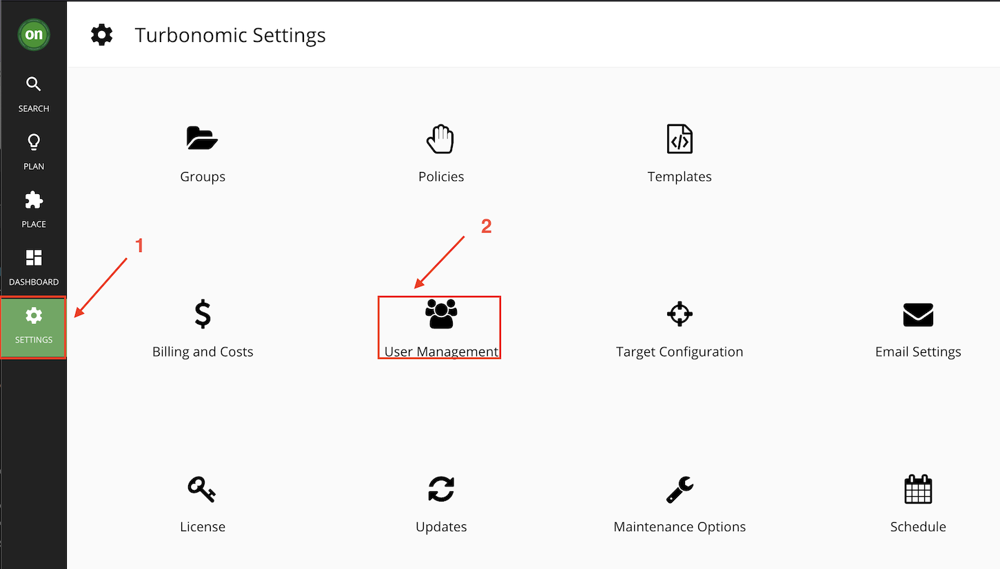

- Select **NEW LOCAL USER**  
  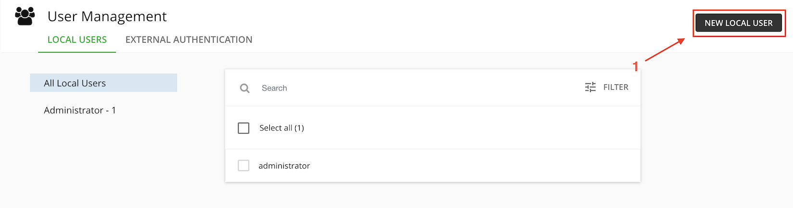

- For the user details please fill as
  - **USERNAME**: kubeserviceaccount
  - **PASSWORD**: Refer to "Turbo-PoT-Credentials" on you bastion VM
  - **ROLE**: Site Administrator (default)
  - and then click **SAVE**  
  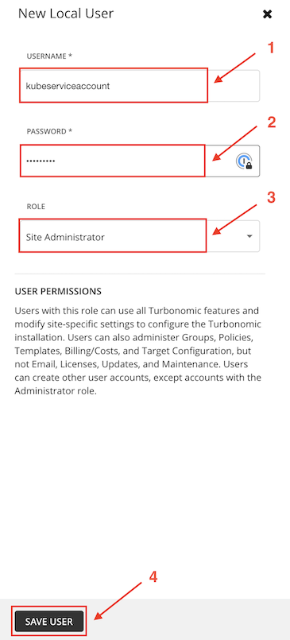

- Validate the user is created  
  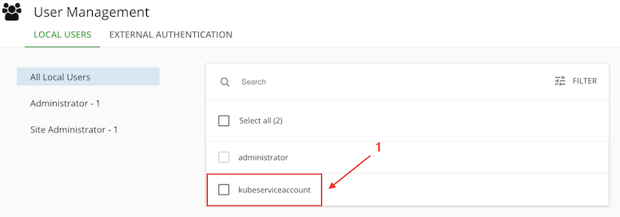

### Install Kubeturbo on the kubernetes cluster

The Kubeturbo is installed on the provided Kubernetes cluster. In this section you will SSH into your kubernetes cluster from your bastion VM. **So all commands will be executed from your bastion VM's Terminal window.**

- Find the Turbonomic Server Version from the console: The version here is **8.8.2** as shown in the picture.  
  
  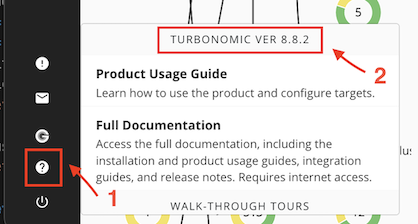

- SSH to server kmaster (IPAddress: 10.0.0.3) using **user-id: cocuser**, **password: Refer to "Turbo-PoT-Credentials" on you bastion VM** and **ssh port: 2022**
  
  ```
  ssh -p 2022 cocuser@10.0.0.3
  ```

  To list all the helm releases in the cluster execute the command below.
  ```
  helm ls -A 
  ```

  For example: to view the release for Instana agent only run this command
  ```
  helm ls -n instana-agent
  ```

  The result will be something like this:
  ```

   NAME          NAMESPACE    	REVISION	UPDATED                                	STATUS  	CHART               	APP VERSION
   instana-agent instana-agent	1       	2023-03-20 23:33:01.070041691 -0400 EDT	deployed	instana-agent-1.2.56	1.244.0
  ```
  
- [Kubeturbo git](https://github.com/turbonomic/kubeturbo.git) is cloned locally. Then follow the steps as:

  ```
  cd kubeturbo/deploy
  kubectl create ns turbo
  ```

  The result should be like this:
  ```
  namespace/turbo created
  cocuser@kmaster:~/kubeturbo/deploy$ 
  ```

- Now run this command to install kubeturbo. **Make sure to change the password for restAPIConfig.opsManagerPassword and set it to the one provided in the Credentials file. Be sure to remove any quotation marks ''**
  
  ```
  helm install  kubeturbo  ./kubeturbo --namespace turbo \
       --set serverMeta.turboServer=https://10.0.0.1 \
       --set serverMeta.version=8.8.2 --set image.tag=8.8.2 \
       --set restAPIConfig.opsManagerUserName=kubeserviceaccount \
       --set restAPIConfig.opsManagerPassword='Refer to Turbo-PoT-Credentials' \
       --set targetConfig.targetName=kubecluster1
  ```

  Will give output as:

  ```
  NAME: kubeturbo
  LAST DEPLOYED: Thu Mar 30 20:34:33 2023
  NAMESPACE: turbo
  STATUS: deployed
  REVISION: 1
  TEST SUITE: None
  ```

**Tip**: The following commands may be handy in case you run into issues and need to troubleshoot.

```
# To remove helm release
helm delete <release name> -n <namespace>

For ex: helm delete kubeturbo -n turbo (To delete kubeturbo)

# To upgrade an existing release
helm upgrade <release name> -n <namespace> <other options>

For example: (** Don't forget to change the password in the command **)
helm upgrade  kubeturbo  ./kubeturbo --namespace turbo \
    --set serverMeta.turboServer=https://10.0.0.1 \
    --set serverMeta.version=8.8.2 --set image.tag=8.8.2 \
    --set restAPIConfig.opsManagerUserName=kubeserviceaccount \
    --set restAPIConfig.opsManagerPassword=myPassw0rd \
    --set targetConfig.targetName=kubecluster1

# To set the context for a namespace
kubectl config set-context --current --namespace=<namespace>

For ex: (to set the context to turbo namespace)
kubectl config set-context --current --namespace=turbo
```


- You can check the logs to see if kubeturbo is communicating with the Turbonomic Server.
  
  ```
  kubectl -n turbo get pods 
  ```

  The result will be like following:
  ```
  output
  ------
  NAME                         READY   STATUS    RESTARTS   AGE
  kubeturbo-5fb9df466d-l7lk4   1/1     Running   0          5m47s
  ```
  To check the logs for this pod take your pod's name from the output of the previous command and run the command below using your pod name.
  ```
  kubectl -n turbo logs -f kubeturbo-5fb9df466d-l7lk4
  ```

  The result will be a loop that keeps printing the logs for that pod, similar to the snippet below:

  ```
  snippet of output
  -----------------
  I0331 14:35:10.398686       1 kubeturbo_builder.go:519] ********** Start running Kubeturbo Service **********
  I0331 14:35:10.398736       1 mediation_container.go:67] Initializing mediation container .....
  I0331 14:35:10.398740       1 mediation_container.go:74] Registering 1 probes
  I0331 14:35:10.398769       1 client_websocket_transport.go:381] Trying websocket connection to: wss://10.0.0.1/vmturbo/remoteMediation
  I0331 14:35:10.407740       1 client_websocket_transport.go:384] Successfully connected to api service at: wss://10.0.0.1/vmturbo/remoteMediation
  I0331 14:35:10.407779       1 client_websocket_transport.go:305] Connected to server 10.0.0.1:443::192.168.1.219:40362
  I0331 14:35:10.407785       1 client_websocket_transport.go:306] WebSocket transport layer is ready.
  I0331 14:35:10.407799       1 remote_mediation_client.go:92] Start sdk client protocol ........
  I0331 14:35:10.407814       1 sdk_client_protocol.go:35] Starting protocol negotiation ....
  I0331 14:35:10.411017       1 sdk_client_protocol.go:118] Protocol negotiation result: ACCEPTED. Protocol version "8.8.2" is allowed to interact with server.
  ```
**Tip:** to break out of the logs loop you can do a ctrl+c.

- Now validate that the kubeturbo that is installed is showing up in the Turbonomic console. 
  - Go to Settings -> Target Configuration.
    
    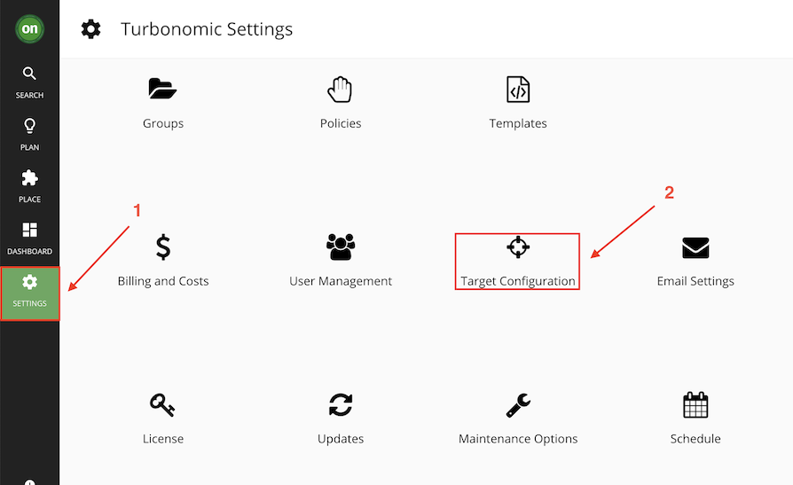

  - Click on **Cloud Native**
  - You will see the added kubernetes target with the name **Kubernetes-kubecluster1** (kubecluster1 is the name you specified during helm chart install).
  
    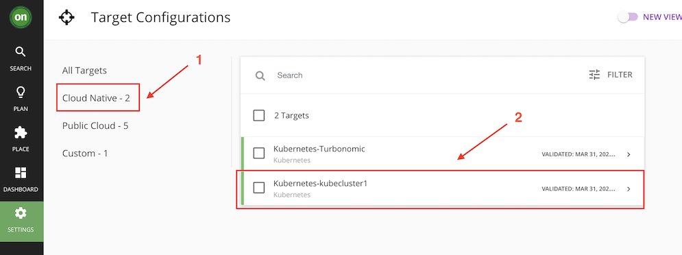

- Now you can search for this cluster.
  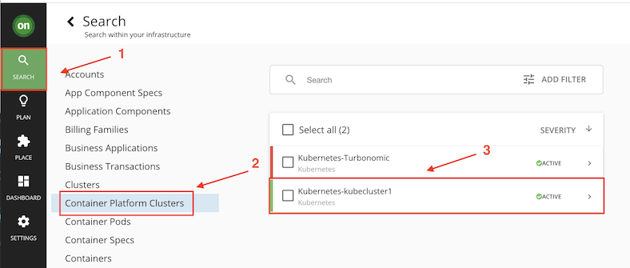

This concludes adding targets tutorial.