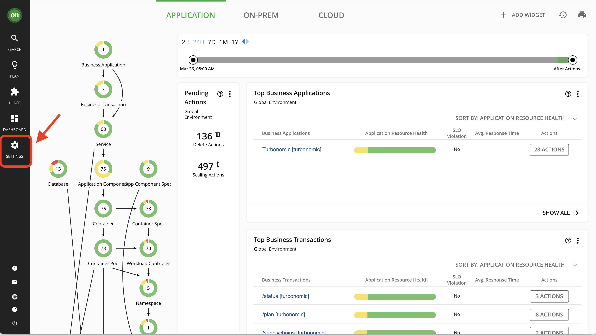

# Administration 
~ 15 minutes

## Managing User Accounts

As an administrator, you specify accounts that grant users specific access to Turbonomic. User accounts determine the following for a given user login:

### User Authentication

To configure an account, you set the type of authentication the account will use:

- Local User – Configure the username and password and save those credentials on the Turbonomic server.
- External User – Single user accounts that authenticate through Single Sign-on (SSO) or through Microsoft Active Directory (AD).
- External Group – A group of user accounts that authenticate through SSO or AD.

### User Authorization

Properties that determine the range of access and features for a given user:

- Role – Access to specific Turbonomic features
- Scope – How much of the environment this user can manage

## Lab - Setting up 2 User Accounts

In this lab, we will set up 2 additional local user accounts. We will assign them a different Role and scope so you can see the difference between them.

Click on "Settings" from the navigator as shown below in Image 1

***Image 1***

Click User Management as shown below in Image 2

***Image 2***

You will see the User Management Page and see 2 options: LOCAL USERS or EXTERNAL AUTHENTICATION. In this lab, we will be creating "Local Users". Currently two user accounts are configured: the administrator user which you used to login into Turbonomic, and the "kubeserviceaccount" which you created to be used for Kubernetes cluster management. 

Click the "Local Users" tab and then click "administrator" user as shown below in Image 3

***Image 3***

Review the User permissions for the administrator account as shown below in Image 4 and once done click "X" on the top. ***DO NOT MAKE ANY CHANGES***

***Image 4***

Next, click on "New Local User" on the right-top of the page to create a new user

***Image 5***

Next, We will create a user named "demo1". For password use the same password as your Administrator user, and give it the role of an "Automator". You can see the permissions that will be assigned to this user. Once done, click Save User Follow the order (1 to 4) as shown below in Image 6

***Image 6***

Next, We will create a user named "demo2". For password use the same password as your Administrator user, and give it the role of an "Operational Observer". You can see the permissions that will be assigned to this user. Once done, click Save User Follow the order (1 to 4) as shown below in Image 7

***Image 7***

 Once you are done, you will see the 2 users you have created as shown below in Image 8

 ***Image 8***

Next, logout of Turbonomic UI and log back in as demo1 and demo2 respectively. You will notice the Navigation menu is different for all 3 of them as the User Roles were different as shown below in Image 9. 

 ***Image 9***

Next explore the Turbonomic UI as each of the users to see the differences.

**Hint:** For a complete list of all User Roles, please review the Turbonomic Documentation by [clicking here](https://www.ibm.com/docs/en/tarm/8.8.3?topic=tasks-managing-user-accounts)

### Once you have finished exploring as different users (demo1 and demo2), make sure to log back in with the "administrator" user to be able to complete rest of the labs.

You have now finished the administration lab and can move on to the next lab. 
