# Custom Dashboard 
~ 20 minutes

In this lab, we will show you how to create a Custom Dashboard. 

A custom dashboard is a view that you create to focus on specific aspects of your environment. You can create dashboards that are private to your user account, or dashboards that are visible to any user who logs into your Turbonomic deployment.

## Creating a Custom Dashboard

To create a custom dashboard, Click on Dashboards as shown below in Image 1

***Image 1***

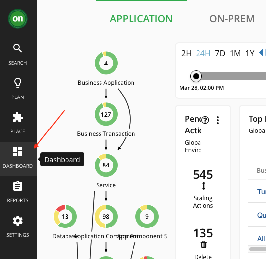

This page lists all dashboards that are available to you. To view a dashboard, click its name in the list if you desire as shown below in Image 2 or move forward and create a custom dashboard. 

Click NEW DASHBOARD to add a new dashboard to your Turbonomic session.

***Image 2***

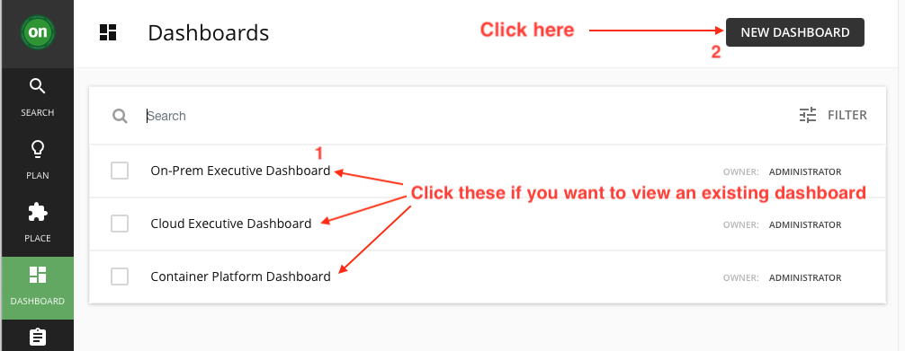

The dashboard appears with a default name and without chart widgets. The time range in the Time Slider is set to 24 hours by default as shown below in Image 3

***Image 3***

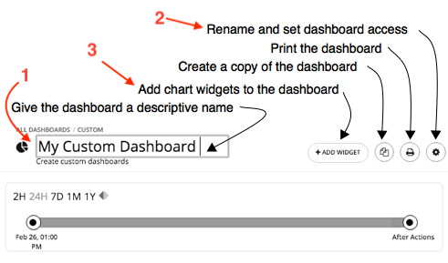

Click 1 from above screenshot and give a name that describes the dashboard. If you will share the dashboard with all Turbonomic users, the name will help them decide whether to view it.

Next Click 2 (Gear to change the setting) from above screenshot to set the dashboard access.

Dashboard access can be:

    Only Me – The dashboard is only available to your Turbonomic user account.

    All Users – Every Turbonomic user can see this dashboard.

See ***Image 4***

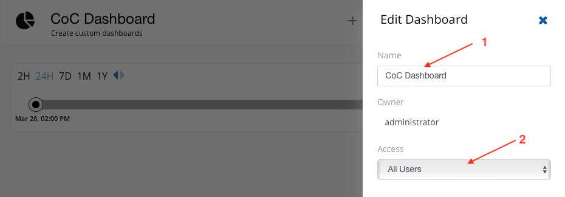

Next, Add chart widgets to the dashboard by clicking "ADD WIDGET" as shown below in Image 5

***Image 5***

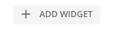

We will customize this dashboard to show certain metrics for "Quote Of The Day" Application.

### Adding Health Widget

1.  You will see the default screen with multiple Widget Galleries as shown below in Image 6

***Image 6***

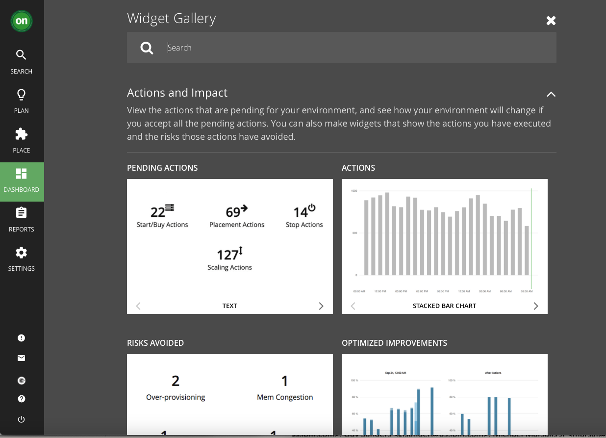

2. Type "Health" in the search bar as shown below in Image 7 and select that widget by clicking anywhere in the white space.

***Image 7***

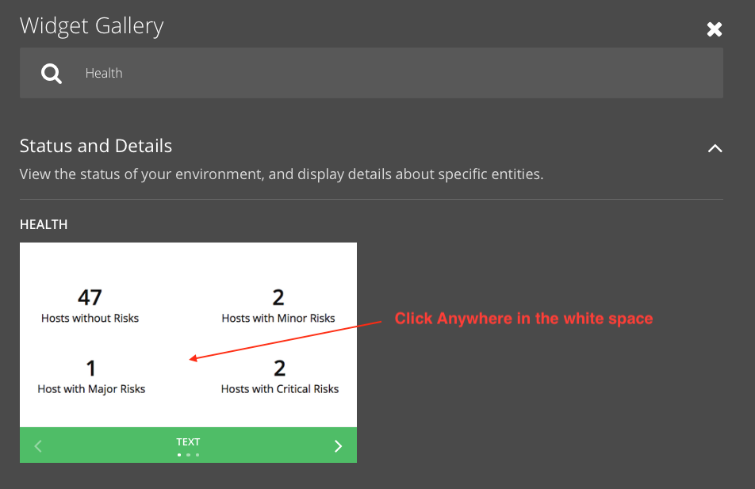

3. Under Scope, Global Environment "Click to change scope" as shown below in Image 8

***Image 8***

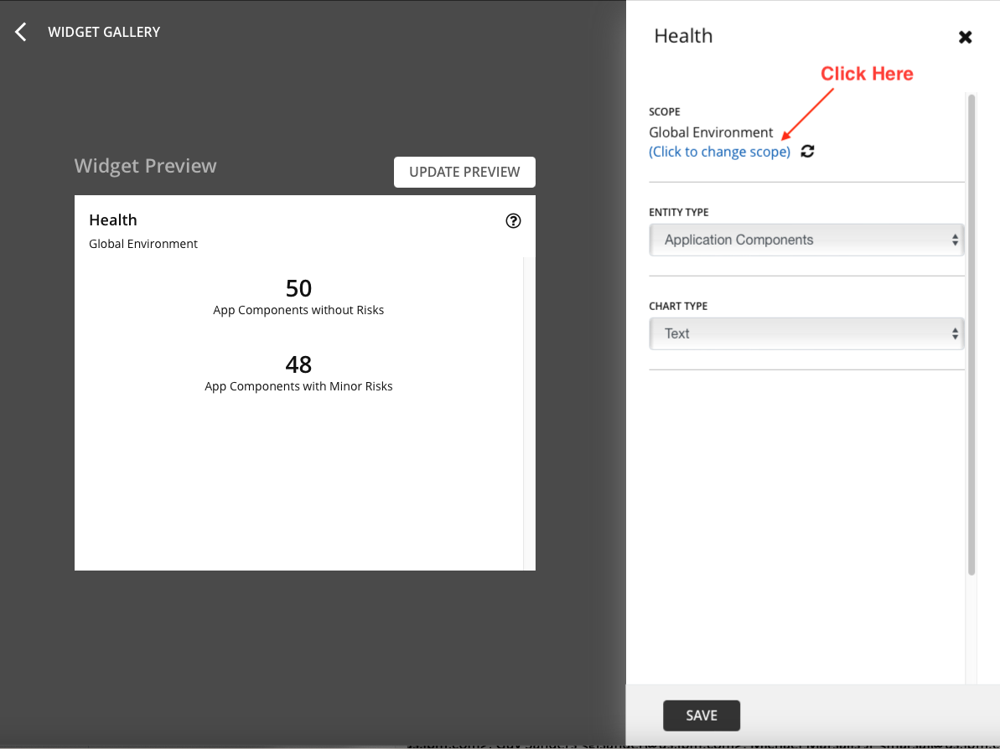

4. Next, Select Scope, ensure you are on Entities and select Business Application as shown below in Image 9. Follow the order (1 to 3) in Image 9 

***Image 9***

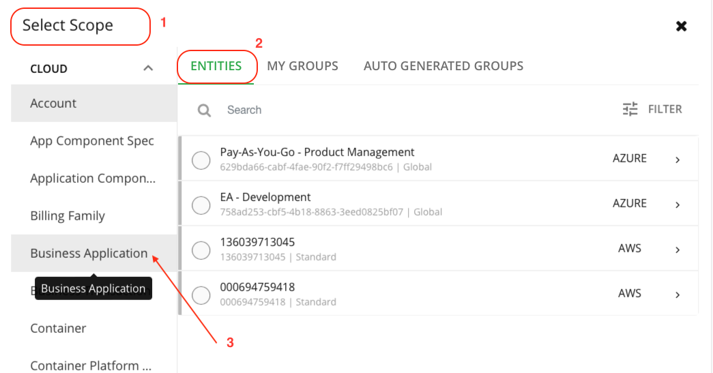

5. Next, Select "Quote of the Day" from Businss Application as shown below in Image 10

***Image 10***

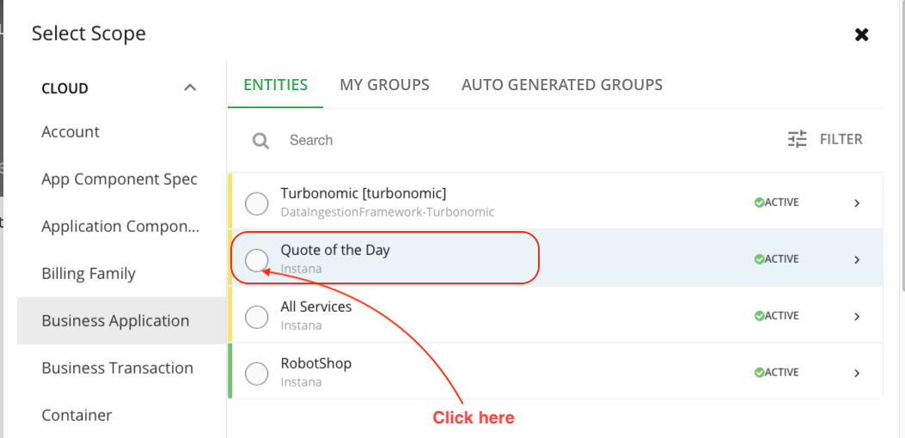

6. Next, select "Application Components" from Entity Type as shown below in Image 11

***Image 11***

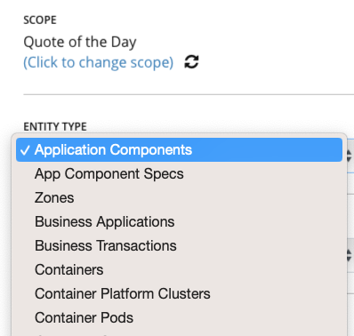

7. Next, select "Ring Chart" from Chart Type as shown below in Image 12

***Image 12***

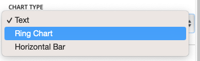

8. Next, click "Update Preview" button to see the result and then click "Save" at the bottom as shown below in Image 13 

***Image 13***

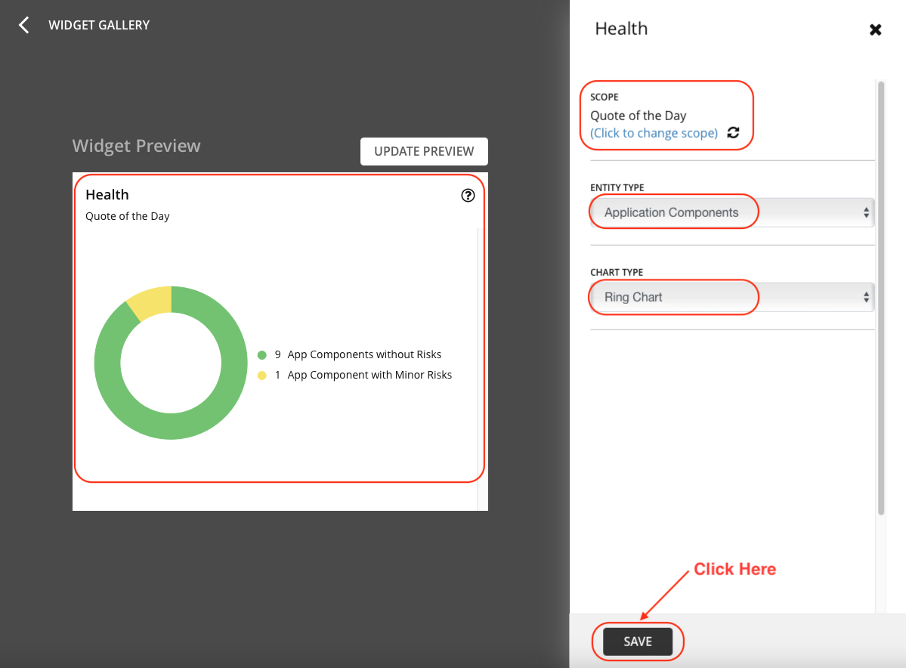

9. Finally, you will see your widget published on your Custom Dashboard as shown below in Image 14.

***Image 14***

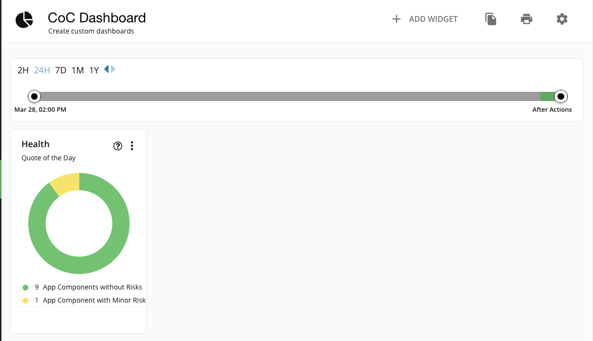

That is it you just published your first widget on your custom dashboard.

Next, let's add one more widget to the Custom Dashboard.

### Adding Top Business Transactions Widget

1.  You will see the default screen with multiple Widget Galleries as shown below in Image 15

***Image 15***

2. Type "Top" in the search bar as shown below in Image 16 and select that widget by clicking anywhere in the white space.

***Image 16***

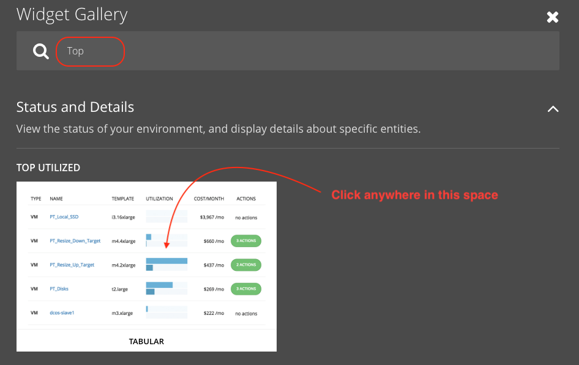

3. Under Scope, Global Environment "Click to change scope" as shown below in Image 17

***Image 17***

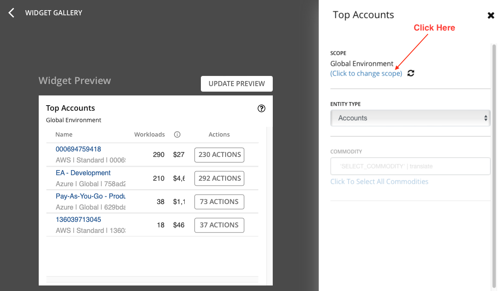

4. Next, Select Scope, ensure you are on Entities and select Businss Application as shown below in Image 9. Follow the order (1 to 3) in Image 18 

***Image 18***

5. Next, Select "Quote of the Day" from Businss Application as shown below in Image 19

***Image 19***

6. Next, select "Business Transactions" from Entity Type as shown below in Image 20

***Image 20***

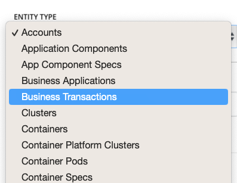

7. Next, click "Update Preview" button as shown below in Image 21

***Image 21***

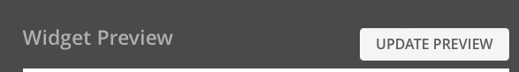

8. Next, Review the updated preview and then click "Save" at the bottom as shown below in Image 22 

***Image 22***

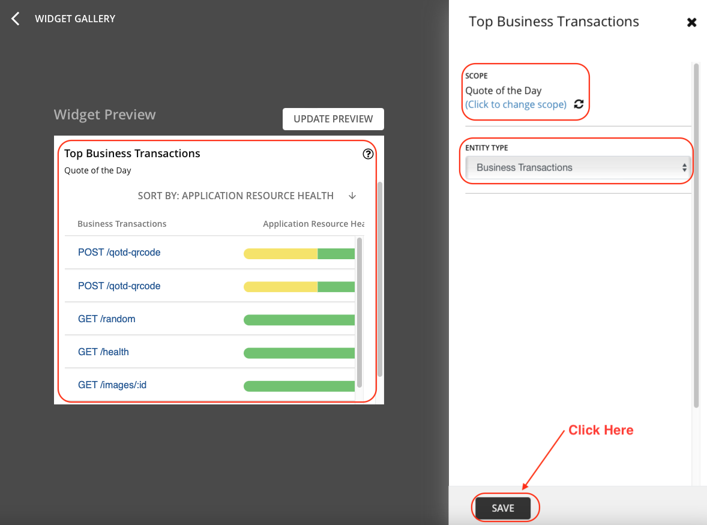

9. Finally, you will see your widget published on your Custom Dashboard (move them around to show the view as shown below in Image 23.

***Image 23***

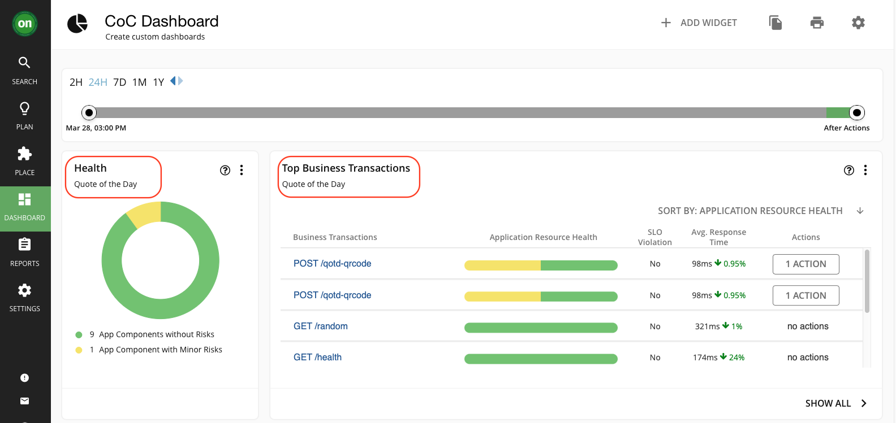

That is it you just published your first custom dashboard with 2 different type of widgets.

Add as many chart widgets to the dashboard as you want. To learn more about the chart types / widgets available, please review  our documentation by [clicking here](https://www.ibm.com/docs/en/tarm/8.8.3?topic=views-chart-types).

You have now successfully completed the Custom Dashboard lab. 
