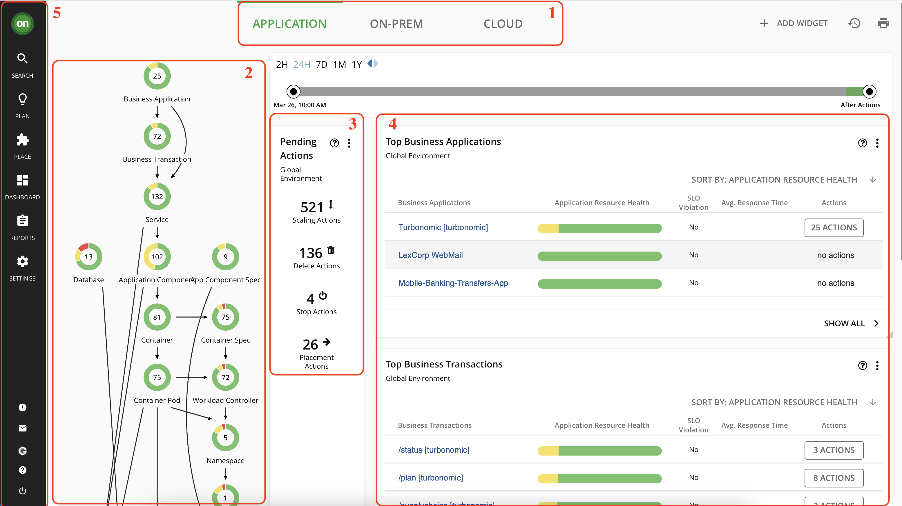
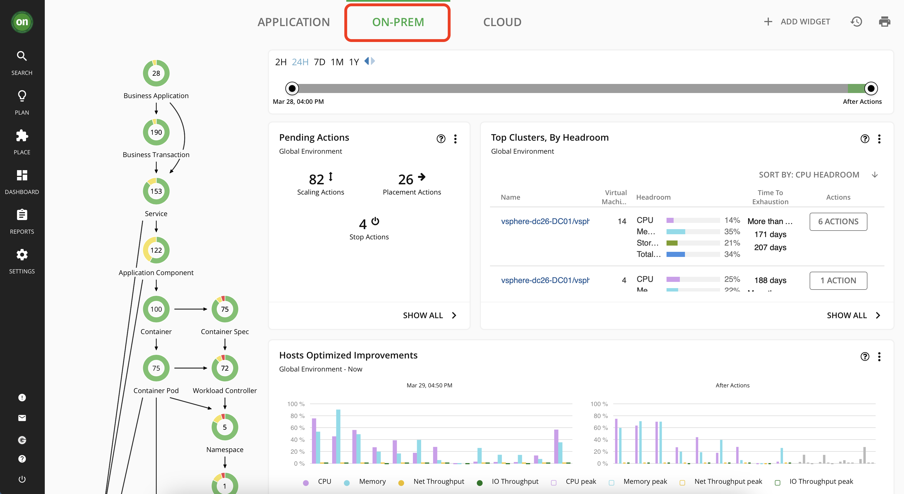
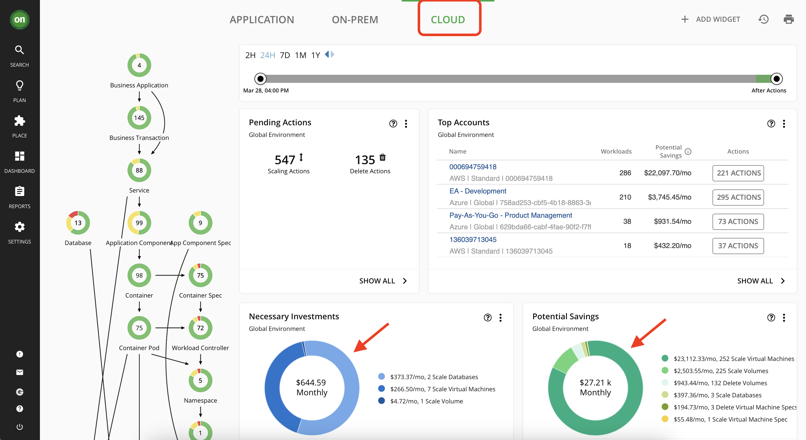
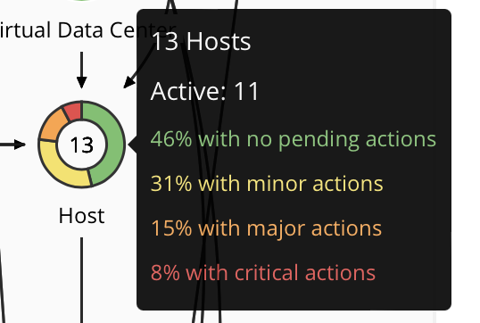
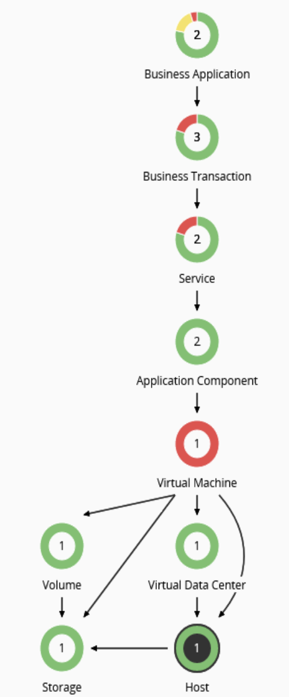
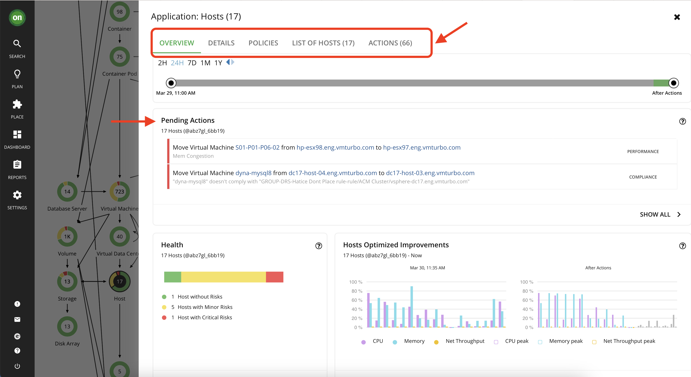
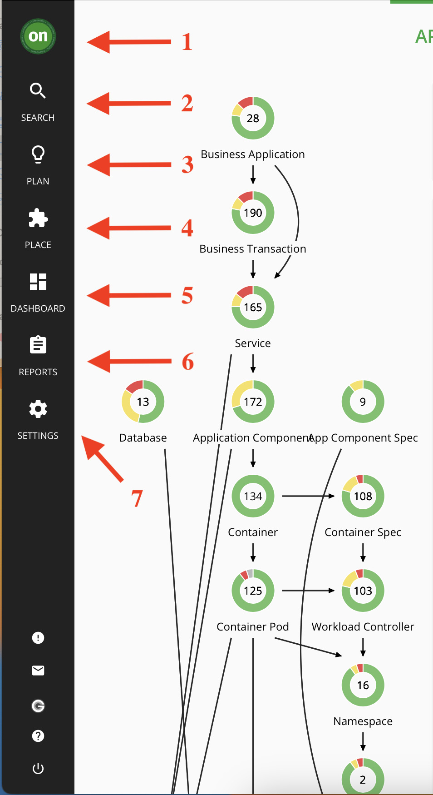
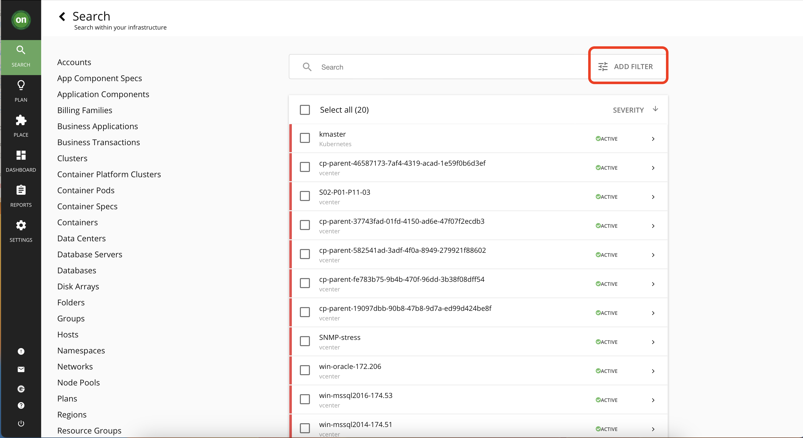
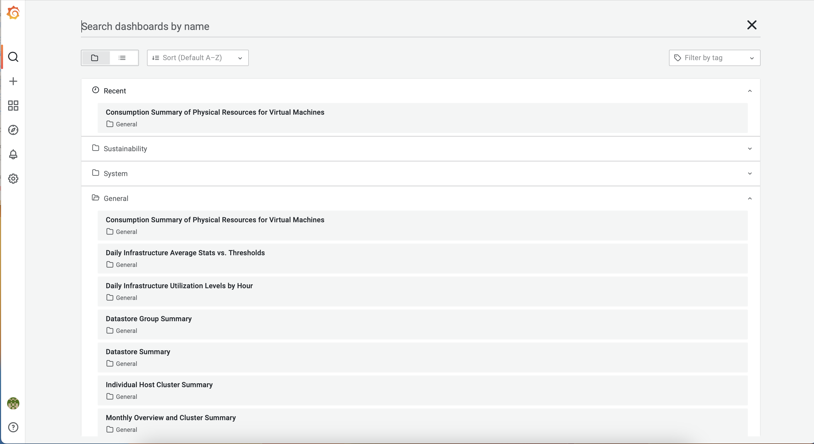
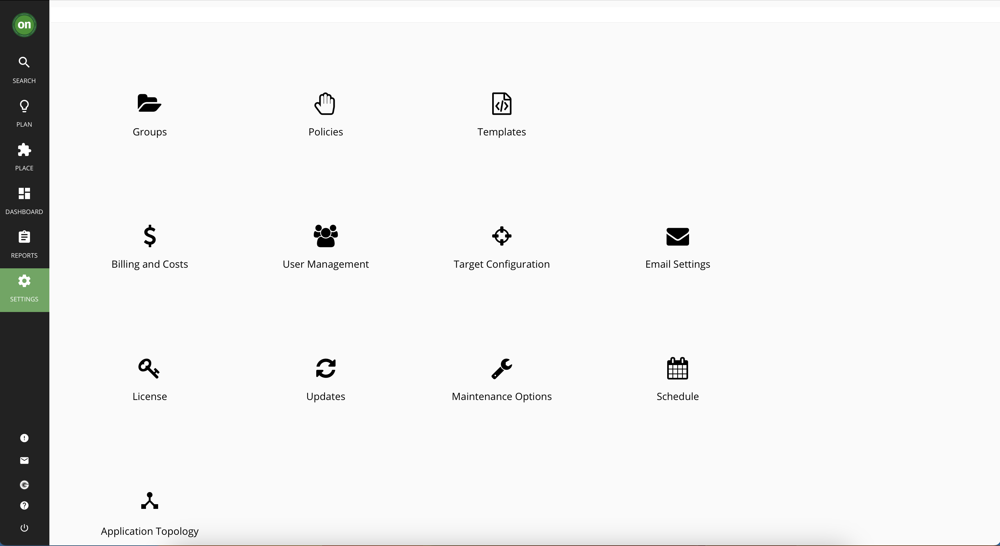

# Explore Turbonomic 
~ 15 minutes

Welcome to Turbonomic! In this lab, you will explore the Turbonomic user interface and familiarize yourself with its different parts. 

**Note:** You logged in with an admin user so you will be able to see the entire environment monitored by Turbonomic. Once you go through the "Administration" lab, you will learn that different access levels can be assigned to users and their dashboard will differ from what you see here.

## Main Dashboard

Upon login, you will be presented with the main Turbonomic dashboard.  
1. The three tabs at the top give you access to global (full-environment) views.
2. The Supply Chain on the left shows you the entities Turbonomic has discovered and their health.
3. The pending actions shows you the actions you should take to optimize your environment and assure performance. We will explore this further in the "Actions" lab.
4. These are Widgets. They are panels that contain information regarding your environment.
5. On the far left is the Navigator – you can use this to access Turbonomic’s other features.

Click on "On-Prem" from the tabs above to view the health of your entire on-prem environment.

Now click on the "Cloud" tab to narrow the focus on all of the cloud environments being monitored. Since cloud instances usually have dollar values associated with them, Turbonomic is able to provide you with a detailed report of what are the necessary investments you need to make to assure performance, and what would be the total cost savings as result of taking all actions. Keep in mind, the total dollar amount is IF you take ALL actions generated by Turbonomic for the cloud instances. As you can see in the example below, the cost savings is significant compared to the necessary investments. And this is while assuring application performance.

Click on "Show All" under both "Necessary Investments" and "Potential Savings" to explore actions regarding each. We will go through actions thoroughly in the "Actions" lab.

## Supply chain

Let's take a closer look at the Supply Chain. From the three tabs above, click on "Applications" to go back to the main dashboard.
Business applications are comprised of multiple application components
running on lots of different infrastructure. Each circle in the supply chain represent an entity. Each entity has a name, number and is surrounded by a circle of colors. Green being desired state, Yellow represents efficiency actions, Red shows that the resources are gongested. See the example below. 

The direction of arrows are also meaningful. They show the direction of purchase of resources. Turbonomic sees the resources available as a marketplace. Every entity can sell resources and/or buy them. For example, a VM buys resources from the host it is residing on, and then sells it to the application components running on it. In this scenario, a VM is both a consumer of resources (from the physical host) and is a supplier of resources (for the application components). See the image below.

click on the Host entity in the supply chain. This will open up a page with information regarding all your hosts, policies applied to them and list of actions for them. Explore each tab. 
The pending actions section shows you the actions that Turbonomic recommends that you tackle to assure performance, save cost, etc. It analyses your environment once you add it as a target and start providing the actions. We will go deeper into actions in the "Actions" lab.

## Navigator

The Navigator will provide you quick access to different parts of Turbonomic. This toolbar will remain constant as you explore different parts of the environment. 

1. the "ON" Button will always bring you back to the main dashboard view. The main dashboard can be different depending on user access levels and customizations - you will learn more about this in "Administration" and "custom Dashboard" labs.
2. Use the "Search" page to find the entities you are looking for. This page will provide categorized view of your entities and also provide you filters to narrow down the entity you are looking for.

3. Planning page in Turbonomic is used to run simulations for what-if scenarios that will help you gain insight into what are the results of certain changes before making them. A plan has no impact on real-time environments. You will learn more about this important feature in "Planning" lab.
4. From the Workload Placement Page, you can set up reservations to save the resources you will need to deploy VMs at a future date. Turbonomic calculates optimal placement for these VMs and then reserves the host and storage resources that they need.
5. Dashboard tab will allow you to create custom dashboards to fit your needs. You will learn more about this in the "Custom Dashboard" lab.
6. Reports tab will allow you to generate different reports of your environment and resources. By clicking on "Reports" a new window will open that contains a list of pre defined reports under the "General" folder. Explore different reports.

7. The Settings page includes important links including, Policies, License, User Management, Targets, etc. You will explore Targets, Policies and User Management extensively in their corresponding labs.

Congratulations! You have Completed this lab.

