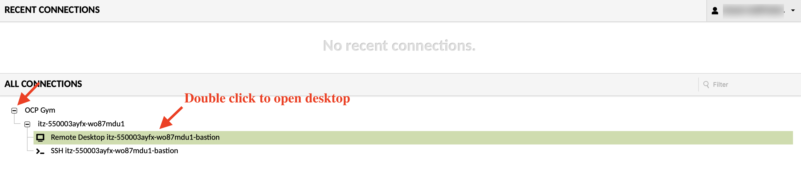

# Your lab environment
To go through your lab sessions you need to first access your environments. Most of the labs will use the Turbonomic UI. Below is the list of the instances you will use during this proof of technology session.

- **Turbonomic** - Which will be accessible through web browser using the link provided.
- **Instana** - This will be accessible through a bastian VM since it is located on a different network
- **Bastian VM** - Can be accessed using the link provided in your environment. The link should automatically log you in the system (no user and password required).
- **Kubernetes cluster** - You will use the Kubernetes master node to run commands necessary to add the cluster to Turbonomic as a target. 

## Access your Turbonomic environment

Click on the link provided to you during environment sign up to access your Turbonomic environment then use the credentials below to log in to the instance.

### Turbonomic Credentials
Username: **administrator**

Password: **Refer to "credentials.pdf" on you bastian VM**

## Access your Instana environment
To access your Instana instance, you must log in to your bastion machine using the link provided during environment sign up. The link should automatically sign you in. Then open a web browser and type in the Instana IP address provided to you and use the credentials below to log in to the instance. You won't spend much time in the Instana instance as it is pre-setup for you. You will access it only once to create an API key.

### Instana Credentials
Endpoint IP address: **10.0.0.2**

Username: **admin@instana.local**

Password: **Refer to "credentials.pdf" on you bastian VM**

## Access Bastian VM
Use the link provided with your reserved environment. Once you click on it, it should open below page in your browser. Click on the "Remote Desktop" item from the list and it will open up your bastian VM desktop.

## Access Kubernetes Master Node
To access this, click on the link provided in your environment that is named kmaster. Use the credential below to log in to this VM:

Username: **cocuser**

Password: **Refer to "credentials.pdf" on you bastian VM**

