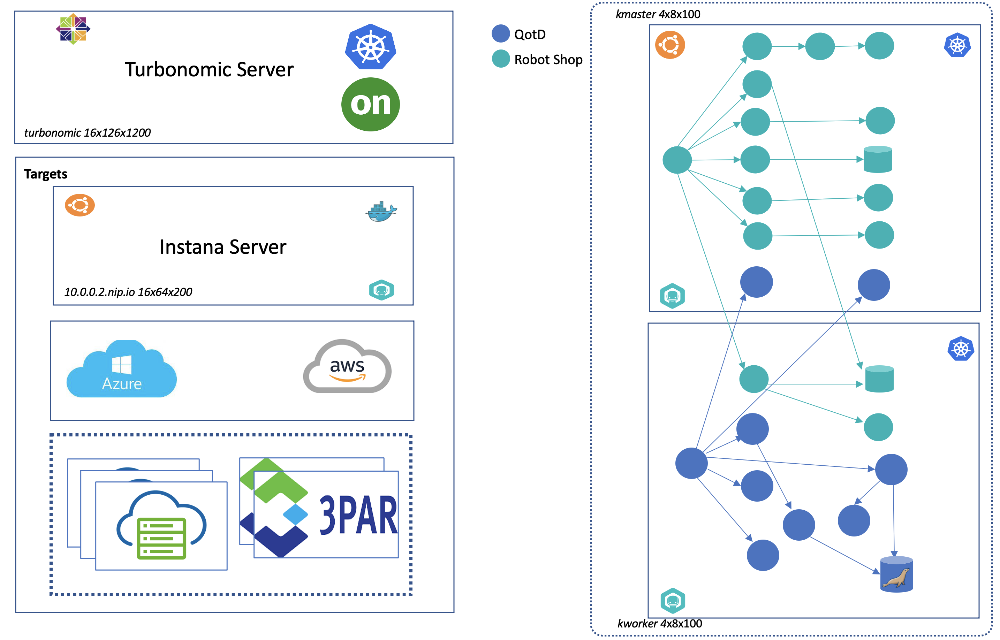

# Overview 
~ 5 minutes

## Introduction
Application Resource Management is a top-down, application-driven approach that continuously analyzes applications' resource needs and generates fully automatable actions to ensure applications always get what they need to perform. It runs 24/7/365 and scales with the largest, most complex environments.

To perform Application Resource Management, Turbonomic represents your environment holistically as a supply chain of resource buyers and sellers, all working together to meet application demand. By empowering buyers (VMs, instances, containers, and services) with a budget to seek the resources that applications need to perform, and sellers to price their available resources (CPU, memory, storage, network) based on utilization in real-time, Turbonomic keeps your environment within the desired state — operating conditions that achieve the following conflicting goals at the same time:

- **Assured application performance** - Prevent bottlenecks, upsize containers/VMs, prioritize workload, and reduce storage latency.

 - **Efficient use of resources** - Consolidate workloads to reduce infrastructure usage to the minimum, downsize containers, prevent sprawl, and use the most economical cloud offerings.

In this proof of technology session, you will go through a series of labs to explore Turbonomic and its components and walk through scenarios of which this APM tool can add benefit.

## Architecture
Below is a high level view of your environment's architecture.

