# Planning 
~ 30 minutes

Planning page in Turbonomic is used to run simulations for what-if scenarios that will help you gain insight into what are the results of certain changes before making them. A plan has no impact on real-time environments. 

When you click Run to start a plan, the following occurs:
- The entities take their current actions in the plan market
- Entity utilization is re-calculated
- The entities continue acting
- Utilization is continually re-calculated
- This process continues until no entities want to act, anymore
    - At this point, the plan has **converged**
    - The entities have reached a **Desired State**!

There are many scenarios which you can take advantage of the planning capability in Turbonomic, but in this lab we will focus on three.
In this lab you will run plans for:
1.	Migrate to cloud
2.	On-prem resource consolidation
3.	Hardware refresh

## 1. Migrate to cloud

A Migrate to Cloud plan simulates migration of on-prem VMs to the cloud, or migration of VMs from one cloud provider to another. This plan focuses on optimizing performance and costs by choosing the most suitable cloud resources for your VMs and the volumes they use. To further optimize your costs, the plan can recommend moving workloads from on-demand to discounted pricing and purchasing more discounts. The plan calculates costs according to the billing and price adjustments that you have negotiated with your cloud provider. Costs include compute, service (such as IP services), and license costs. The plan also calculates discount purchases for VMs that can benefit from discounted pricing.

In this lab, you will run a scenario where you'll move on-prem VMs to AWS.

1. From the navigator, click on the "Plan" button with a light bulb icon. Then in the "Plan Management" page on the top right, click on "New Plan".

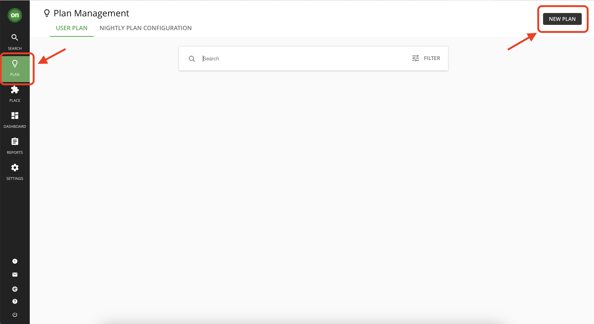

2. From the list, select "Migrate to cloud".
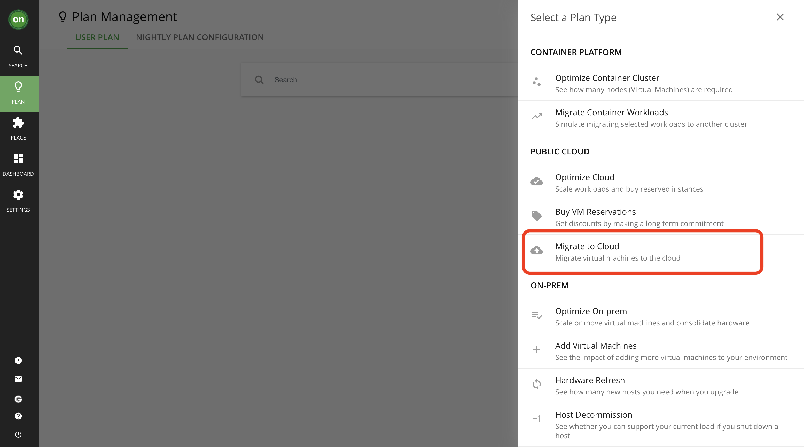

3. In the newly opened page, click on "Clusters" under "On-prem" (since we want to migrate on-prem virtual machines to the cloud). Select the cluster named "vsphere-dc20-DC01/vsphere-dc20-Clus01" Then click on "Next: Where to migrate" button.

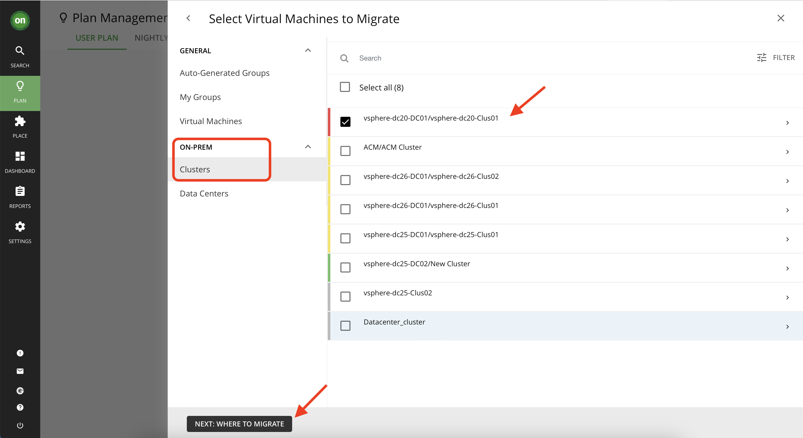

4. Click on "AWS Accounts" then select the account number "136039713045". Then click on "Next: Region".

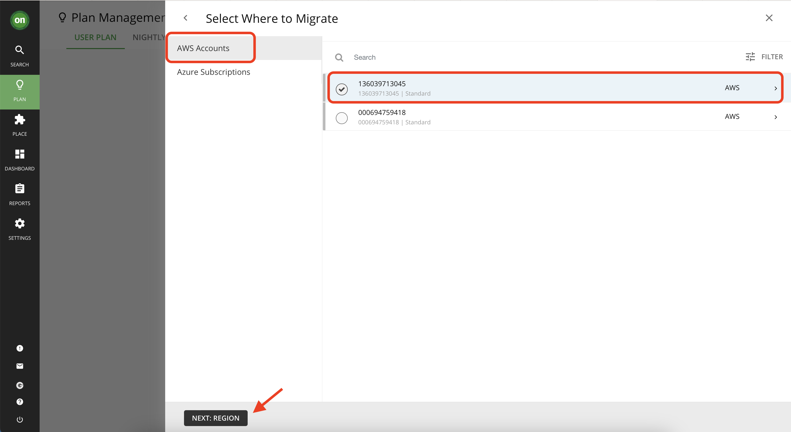

5. In this part you can select a region within your AWS account you'd like to move your on-prem VMs to in the future, and want to see if it is a suitable location. Since you are moving an entire cluster you'd want to choose a region that already is light on number of VMs. Select "aws-US East (N. Virginia)". Then click on "Next: Licensing".

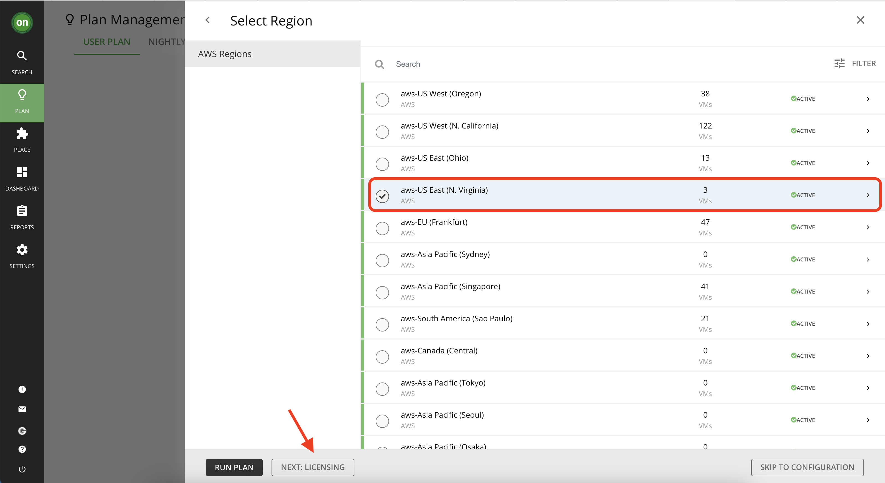

6. In this section you can choose if you'd like the plan to include the cost of the OS as part of the migration plan or not. For this lab we will assume that your on-prem OS licenses are non-transferable so we will include the cost in the migration plan. Once done select "Next: RI Settings".

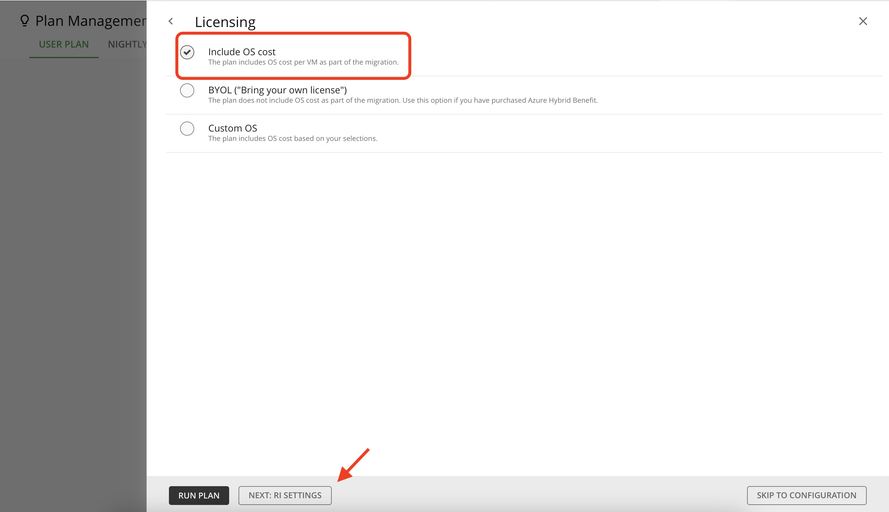

7. In this section you can choose your reserved instance (RI) settings. You can choose different settings from your AWS profile that fits your needs best and if there are any discounts available you can choose them for this plan. For this lab, leave all settings as default and click on "Run Plan".

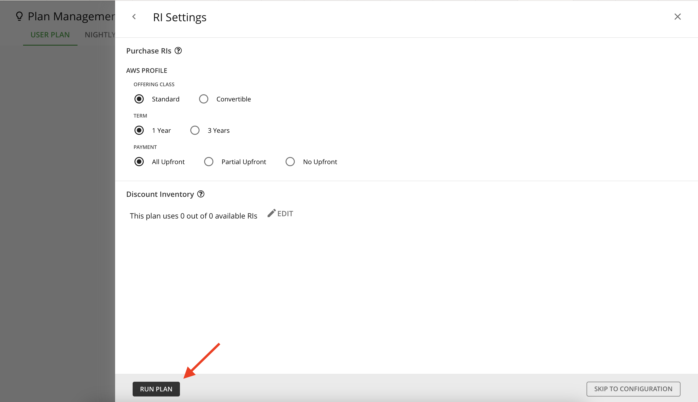

The plan may take few minutes to run. Once the plan has converged, the results will appear on the screen to the right. The plan will offer two routes to migrate your on-prem VMs to cloud. 
    - Lift and Shift : this plan tries to match your on-prem capacities with what exists in the cloud region. So applies minimal changes to the migrated VMs.
    - Optimize: this plan not only simulates migration to the cloud region of your choice, but also optimizes this migration. It looks at the historical utilization of VMs and storage to select the best instance type and storage tier for each VM and disk. 
The plan will also provide you with list of actions necessary to make this migration and their associated cost.

Explore the plan results further. Notice how the optimized migration will make the VMs run more efficiently and saves about 27% on cost compared to if you just do a lift and shift.

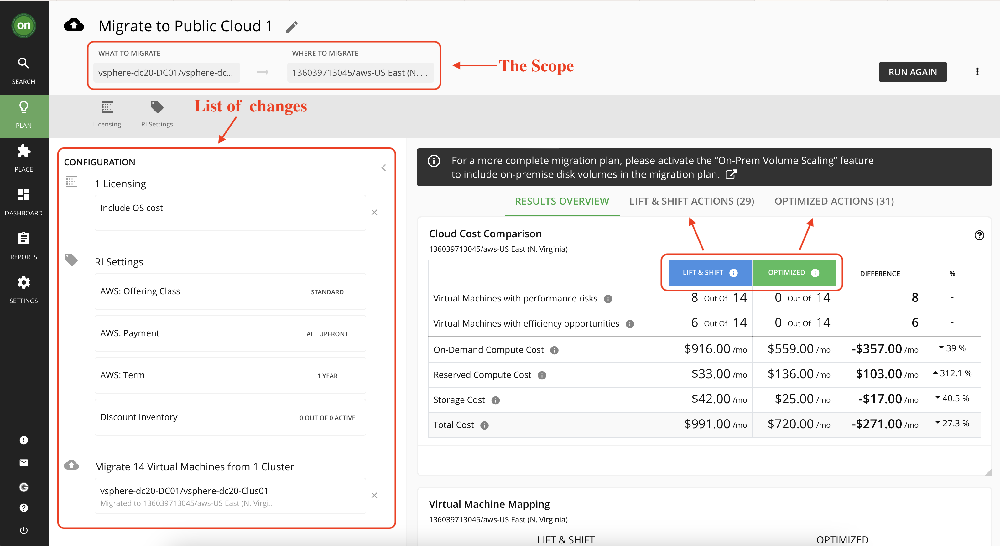

## 2. On-Prem Consolidation (or Optimize On-prem plan)
This plan type is useful when you have many on-prem resources and would like to see how you can optimize them to assure performance and save cost.
In the previous section you ran a plan to migrate a certain cluster to the cloud. But it had some costs associated to it. Now let's see what it would take to optimize the same cluster on-prem.

1. Go back to the plan management page by clicking on the "Plan" button in the navigator. and click "New Plan" from top right of the page.
2. Click on "Optimize On-prem" plan.

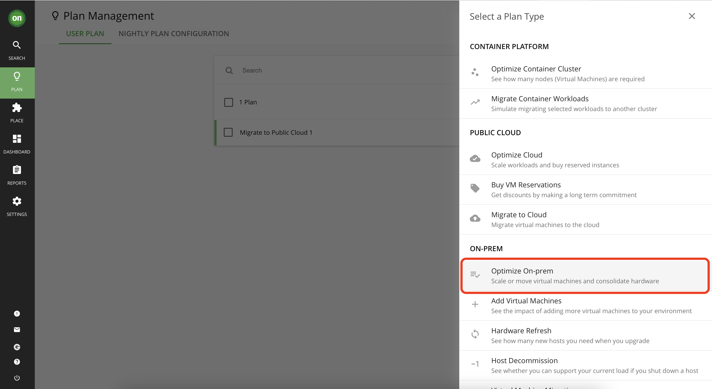

3. From the list select Clusters under On-prem and the select the cluster named "vsphere-dc20-DC01/vsphere-dc20-Clus01". Then click on "Next: Virtual Machine Actions".

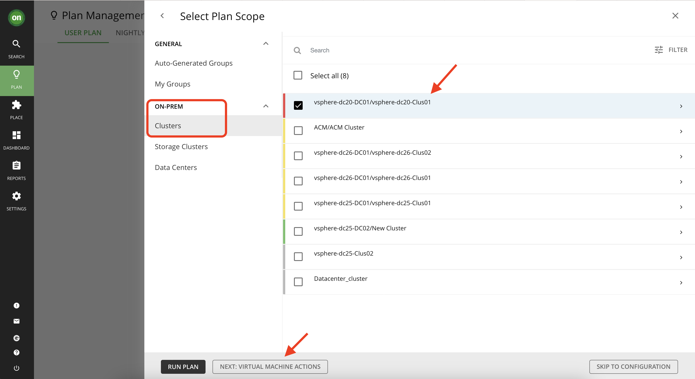

4. This page will list all the actions that can be considered for this cluster. Leave "Scale" selected and click on "Next: Host Actions".
5. Here you can select all the actions to be considered for the hosts. You can choose to have actions for only a group of hosts within this cluster. This is especially useful when you have policies in place to for example, prevent suspension on certain hosts. Here you can exclude them. For this lab, leave the settings as is and click on "Next: Storage Actions".

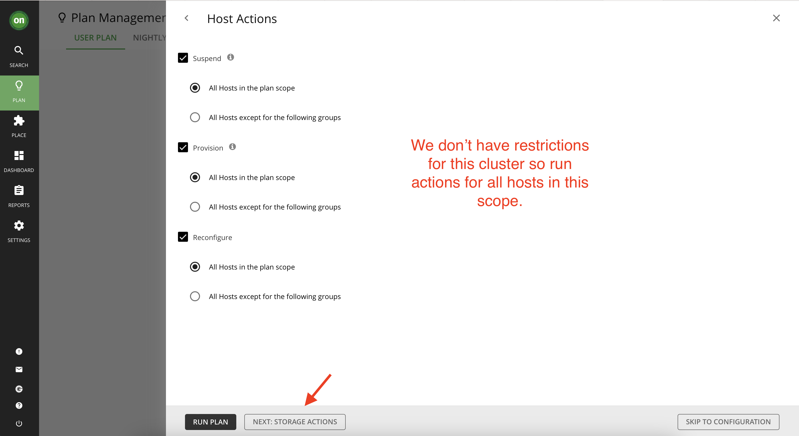

6. Similarly here you have the option to customize actions for the Storage. Leave the settings as is and click on "Next: Constraints Settings".
7. We don't want the plan to ignore current constraints we have for the VMs so leave this part **unchecked**. 
8. Click on "Run Plan". This may take few minutes to complete. Once the plan has converged you will see results as below. Explore the results and the actions section.

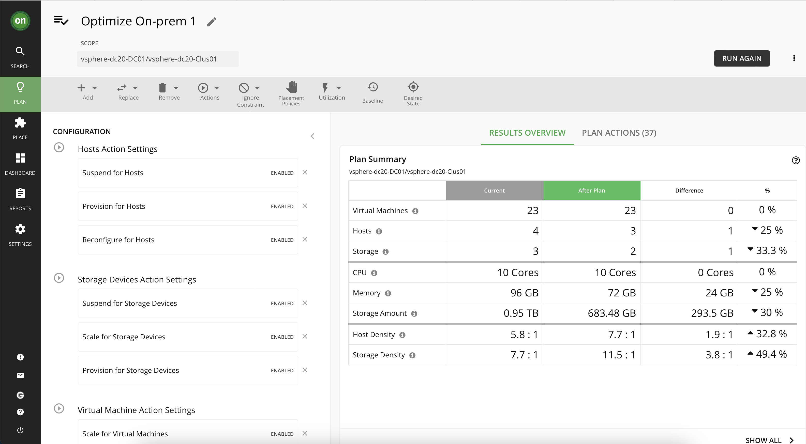

## Hardware Refresh

This plan helps when you are planning on purchasing new on-prem resources to add to, upgrade or replace exisiting hardware. For example,assume you are planning to upgrade the hosts in a cluster: How many do you need to deploy, and still assure performance of your applications? Create templates to represent the upgraded hosts and let the plan figure out how many hosts you really need.

1. From the "Plan Management" page click on "New Plan" from the top right corner of the page.
2. Select "Hardware Refresh" from the list.

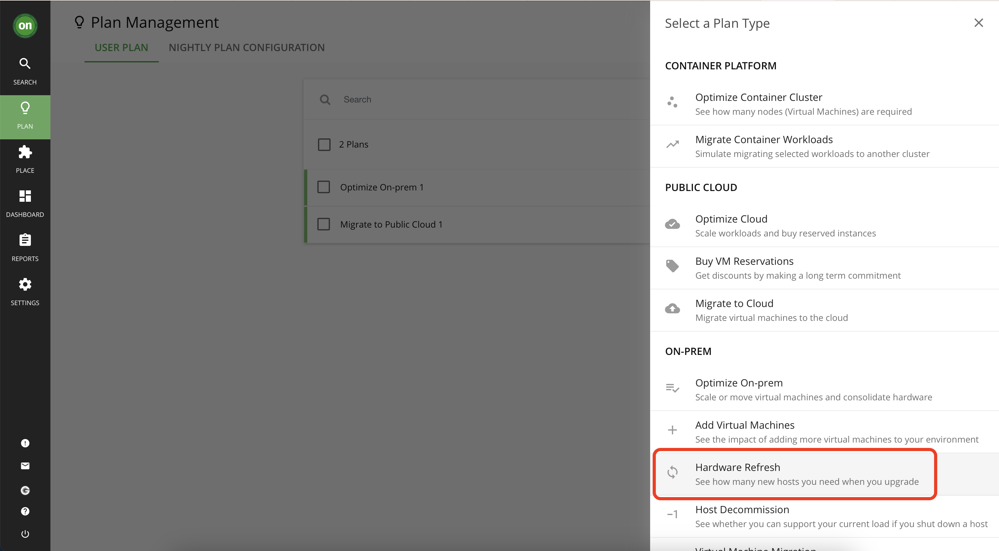

3. As a first step you must select the scope in which this plan applies to. For this lab we'd like to focus on a cluster that is showing as red and is not in desired state. From on-prem section select "Clusters" then select the cluster indicated in the image below. Then select "Next: Replace Hosts"

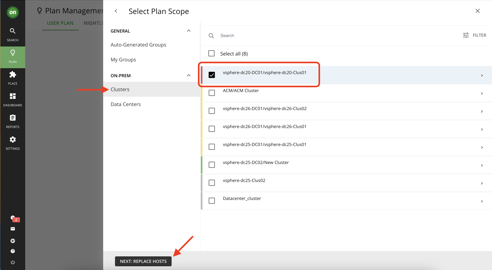

4. Here select all the hosts within this cluster. Then click "Next: Replace Hosts With".

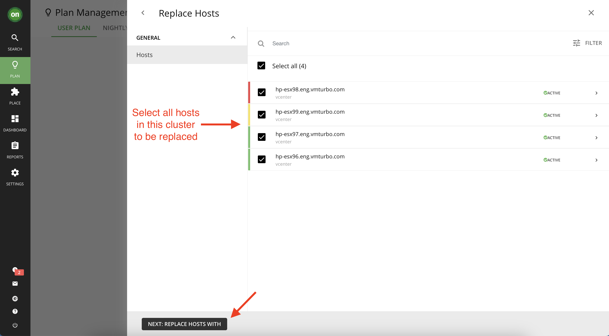

5. In this page, since you don't have any host templates yet, under "Host Templates" click on "New Template". In this page you can specify the template of the host you are planning on purchasing for this cluster. Fill out the information as below:

- **Name** - Give your template a title.
- **CPU** - 36 cores and 3000 MHz
- **Memory** - 1048576 MB (this equals to 1TB of memory)
- **Network** - 10000 MB/s (this equals 10GB/s network throughput)
- **IO** - 100000 MB/s (this equals 100GB/s for disk IO)
- **Price** - $2000 for the price you are forseeing to pay for each host with this specifications.

Once done click on "Create" to create this template. then select your newly created template and click on "Next: Virtual Machine Actions".

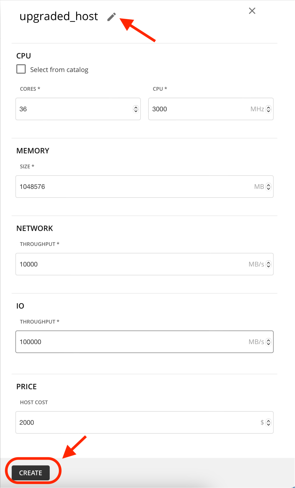

6. In this page keep the scaling actions selected, the click on "Next: Max Host Utilization".
7. Since this is a simulation, you can tell Turbonomic to run this plan considering you want the host maximum CPU and Memory utilization to not exceed the value you define here. For this lab, type 95 for the Plan Scope. and click on "Run Plan".

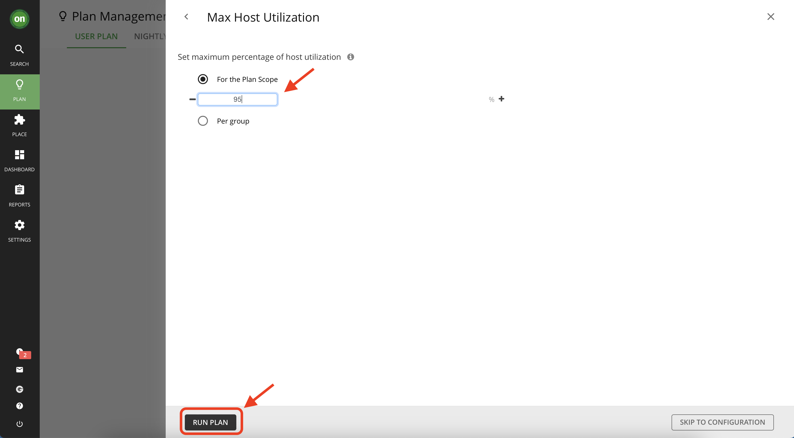

8. Once the plan converges you will see the results showing up. You can see that for adding a host of such powerful resources, you can effectively shut down other hosts and move their VMs and workloads to the new one while having plenty of resources left at your disposal. Since the storage amount and IO throughput is high in your new host, you can safely decommission one storage device as well. Explore the actions listed to learn more about the suggestions provided.
Click on "Show All" under "Plan Actions" to explore actions you will need to take if you move forward with this plan. Explore start and suspend actions for hosts and storage.

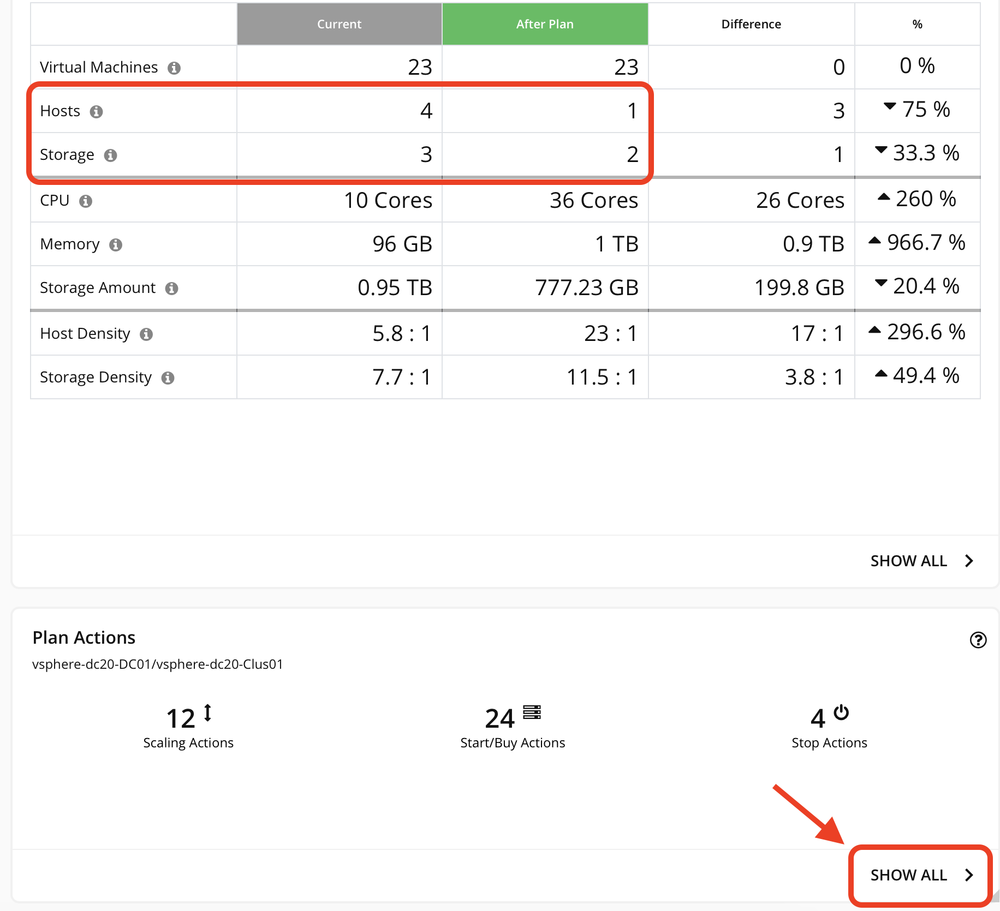

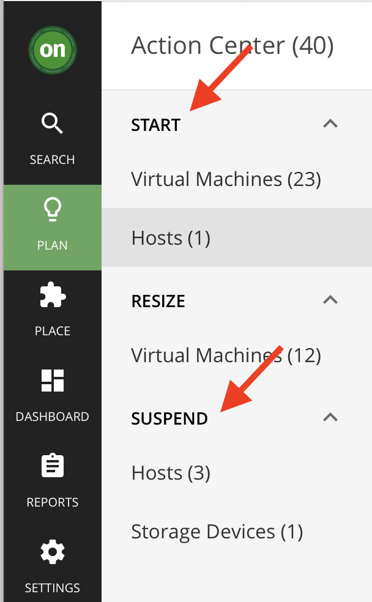

Congratulations! You have completed the Planning lab.

