# Policies 
~ 30 minutes

In the “Taking action” lab, you’ve learned how to take actions manually. But what if we wanted to automate this? Once we validate that it is safe and good to take a certain action and we trust it, we can allow the entities to act on their own decisions. 

In this lab, you will learn about the two types of policies in Turbonomic, explore policies in your environment, and then create an automation policy. 

## What are policies in Turbonomic?

Policies set business rules to control how Turbonomic analyzes resource allocation, how it displays resource status, and how it recommends or executes actions. Turbonomic includes two fundamental types of policies:
### •	Placement Policies
To optimize your environment, Turbonomic recommends actions to place workloads such as applications, containers, or VMs on their providers. Turbonomic can recommend these actions or execute them automatically.
### •	Automation Policies
As Turbonomic gathers metrics, it compares the metric values against specified constraint and capacity settings to determine whether a metric exhibits a problem, and what actions to recommend or execute to avoid a problem. Turbonomic uses Automation Policies to guide its analysis and resulting actions.

## Lab - Explore existing policies

### As a reminder, please ensure that you are logged in with an Administrator user. If you havent't logged out of your demo users, you will not have the necessary permissions to run through the labs.

1. Navigate to "Settings", then "Policies". In this page, you will see a list of all existing policies.

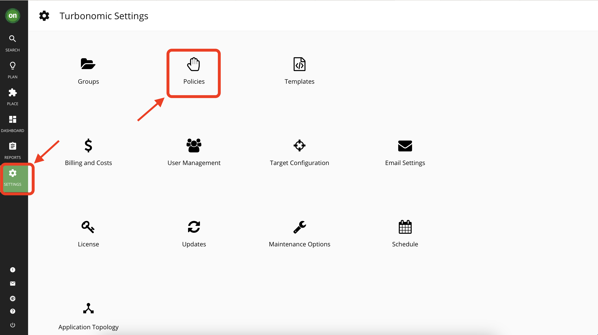

2. From the list to the left, select "Defaults". This will show a list of all system default policies. 

**Tip:** These default policies remain effective unless user creates a policy affecting same resources but with different criteria. User defined policy overrides the default policy.

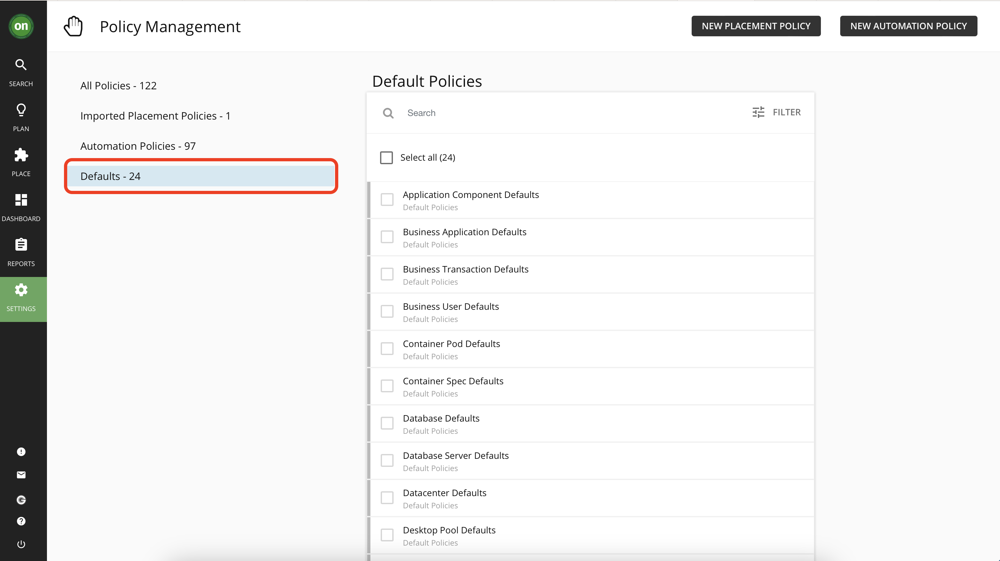

3. Recall in "Actions" lab in the "Explore action modes" section where you saw some actions are blocked by policy and are set on recommend mode? Let's take a closer look at the policy responsible for that. The action you saw in that lab was a resize down action for storage. 

Scroll down in default policy list and click on "Storage Defaults". Now notice that this policy sets the "Resize" action acceptance are set to recommend. This will result in all resize actions generated for storage to be set to recommend only and be unable to execute within Turbonomic. 

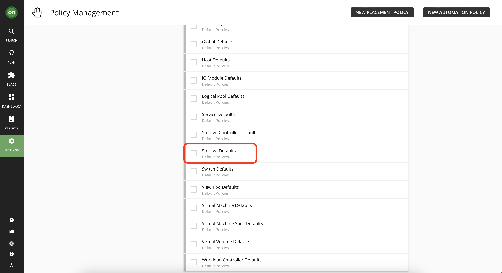

4. Respectively, for the action that you explored for a cloud VM where you could manually accept and execute it within Turbonomic, there is a default policy set that defines that:

Navigate to "Virtual Machine Defaults" policy from the default policies list. You can see that all cloud scaling actions are set to "Manual" which allows them to be accepted and executed (assuming there are no prerequisits for them).

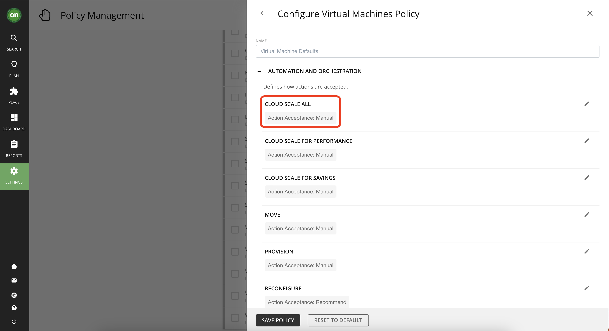

## Lab - Create an Automation Policy
In this lab, you will create an automation policy to define how you'd like Turbonomic to treat actions as they appear. Keep in mind, user defined policies will override system default policies that affect the same entity.

### Move Virtual Machines

1. Navigate to "Policies" from "Settings". Then click on "New Automation Policy" on the top right side of the window.

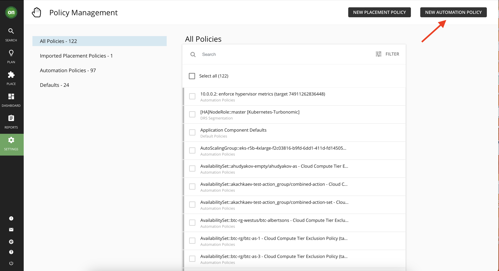

2. Scroll down the list and click on "Virtual Machine". Once you do the Policy Editor window will appear.

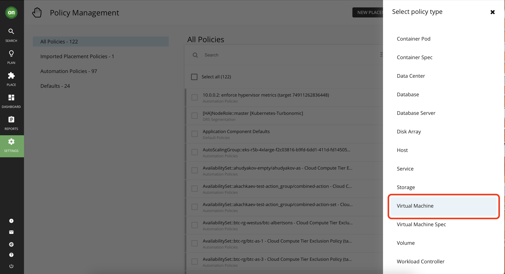

3. In the Policy editor, give your policy a unique name like **vm_move_YourInitials**. Then under "Scope" click on "Select group of virtual machines". This will specify which group of VMs will be affected by this policy.

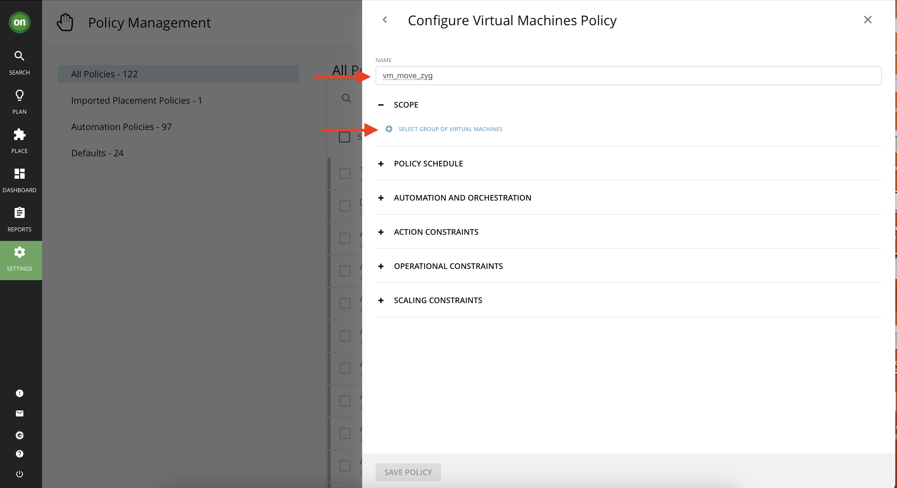

4. In the search bar type "vsphere" and from the list select the group named "vsphere-DC20-DC01_VM" and click on "Select".

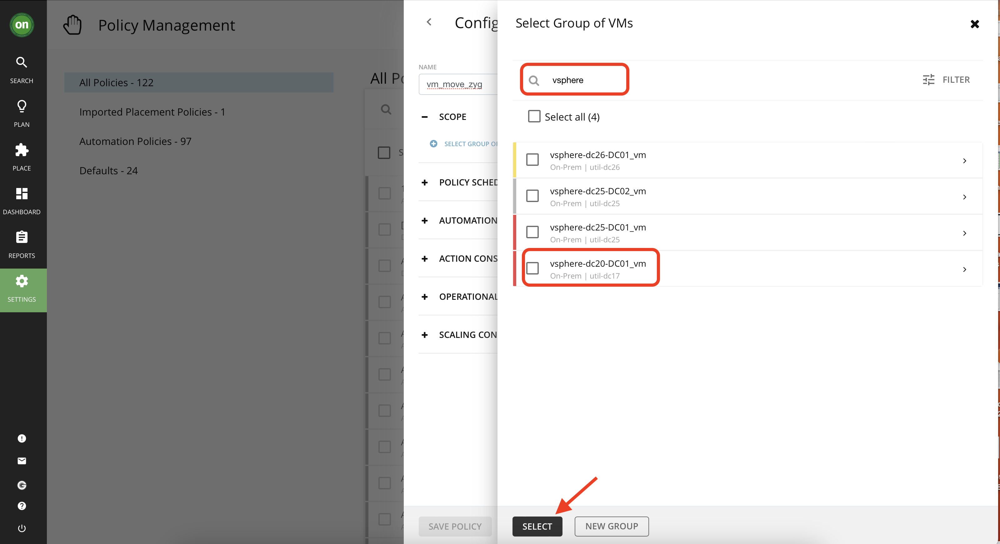

5. In the policy editor, then click on "Automation and Orchestration" then click on "Add Action". This section will allow you to select which actions are accepted and how. Fill out the information as shown below. The automation piece is applied when you select "Automatic" for "Action Acceptance". You can leave the orchestration settings as default then click "Submit"

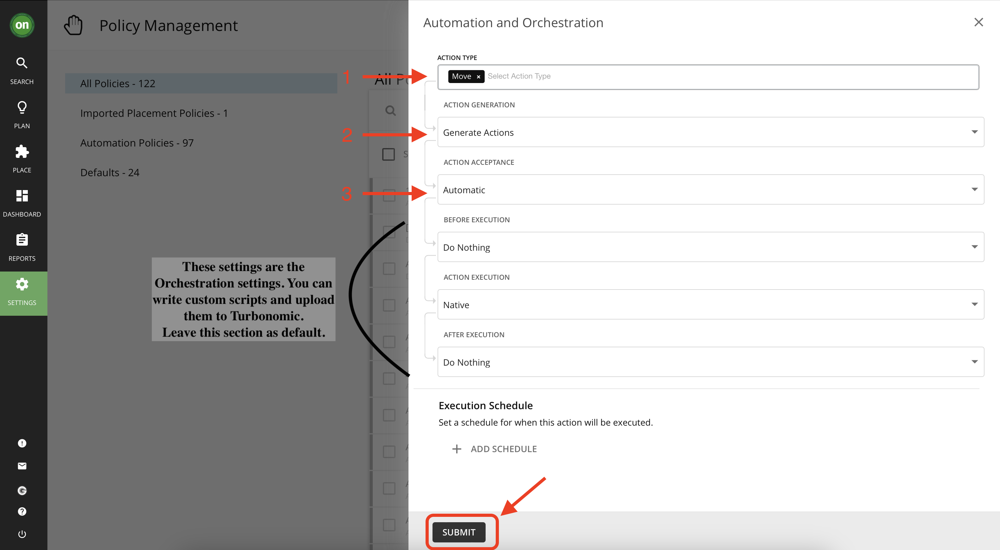

6. In your policy editor, double check for entered information and the click on "Save Policy". You may recieve a message saying it may take 10 minutes for the policy to become effective, click "Yes" to proceed.

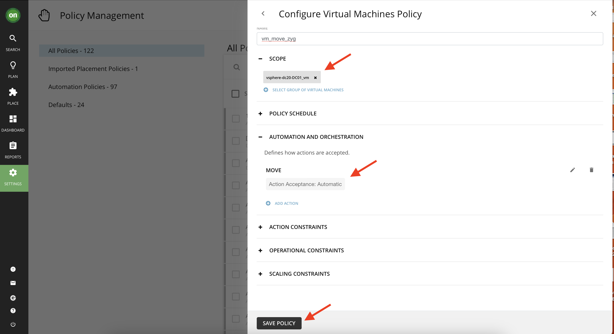

7. To check if your policy is created try searching for your policy's name in the list. you can make changes and edit it as necessary from here as well.

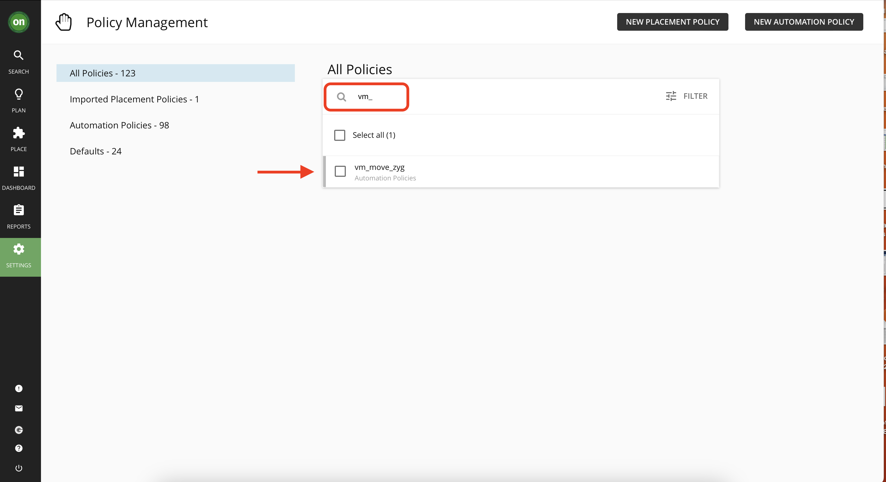

Congratulations! You succesfully created a policy to automate move actions for VMs in selected scope.

---

### Scale Cloud Volume

In this section you will create an automation policy to automate scaling of cloud volume actions. Let's automate volumes whose scaling actions are non-disruptive, reversible and offer cost savings (because they offer the lowest risk and highest reward).
Do you recall in the "Actions" lab we executed a similar action manually? Now you will automate the same one.

1. Navigate to "Policies" from "Settings". Then click on "New Automation Policy" on the top right side of the window. Select "Volumes" from the list.

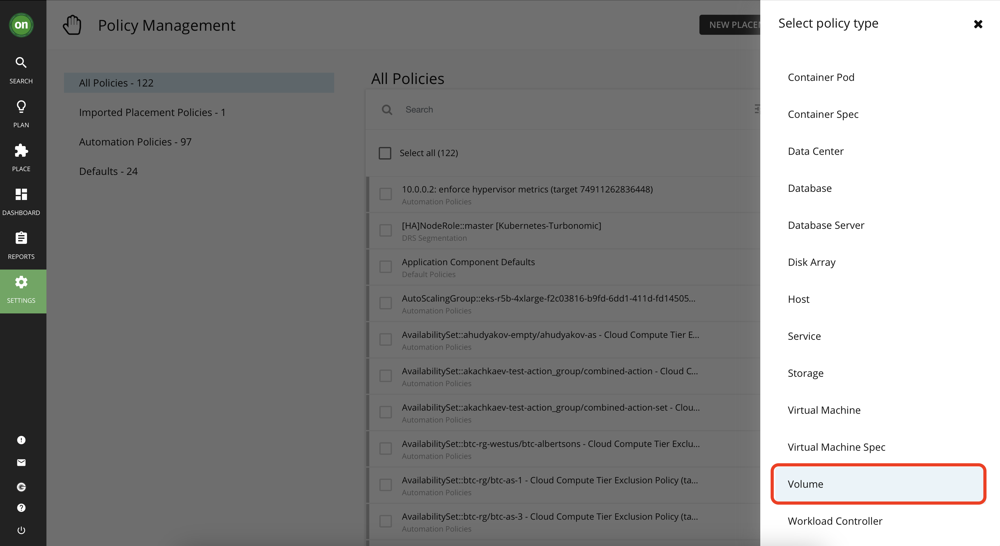

2. Because our focus is scaling cloud volumes, select cloud from the list on the left, then select "akachkaev-test-action_group" form the list and click on the submit button.

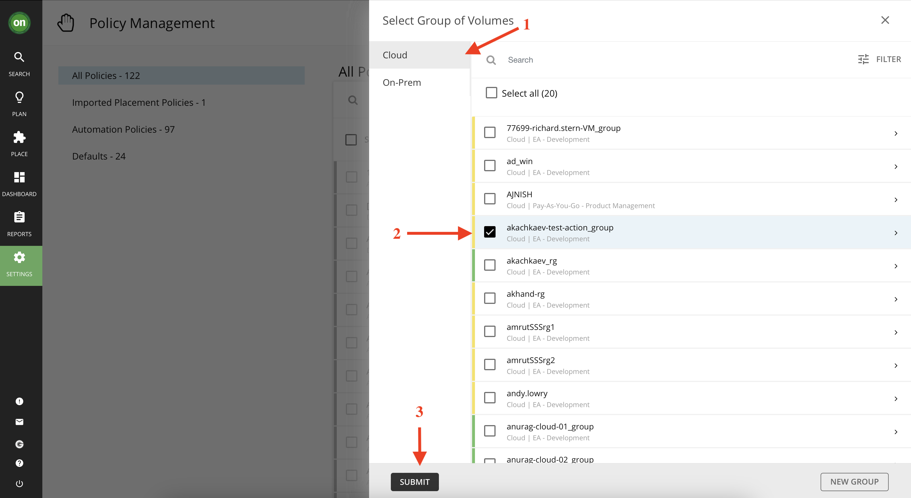

3. This will open up the "Configure Volume Policy" page. 

    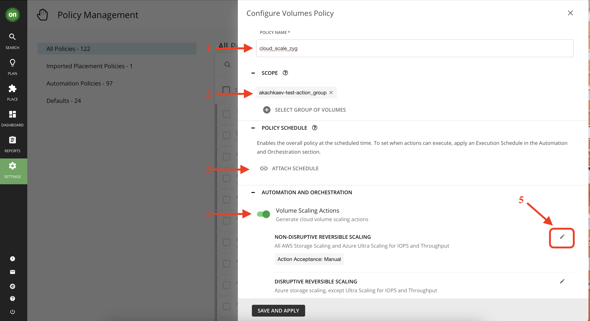

    1- Give your policy a unique name like "cloud_scale_YourInitials". 
    
    2- Notice how the scope is set to the group of volumes you selected. 
    
    3- We want this policy to be effective always and immediately so we will leave the "Policy Schedule" empty.
   
    4- Toggle the "Volume Scaling Actions" on to enable these actions.
   
    5- Since we want to automate the lowest risk actions, use the pencil icon next to "Non-Disrubtive Revesible Scaling" to edit the "Action Acceptance" and set it to "Automatic". Leave the Orchestration settings as default. click on "Submit" to go back to the policy editor.

    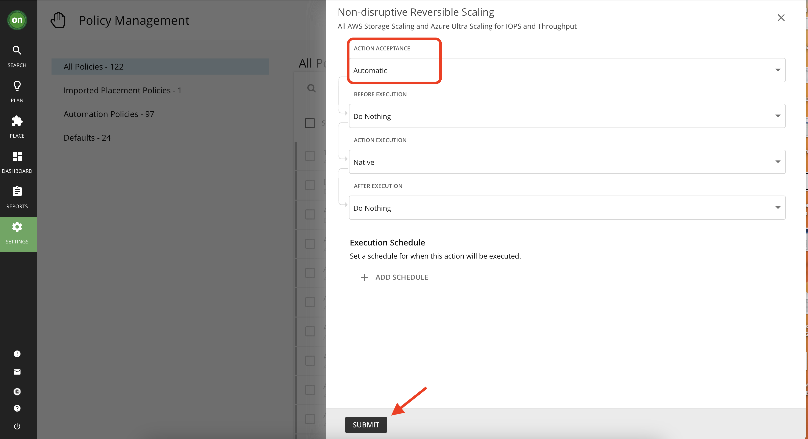

    6- Scroll down and ensure "Disruptive Reversible Scaling" is set to "manual" since you'd like to plan for the downtime resulting from this action before taking it.
    
    7- Set "Disruptive Irreversible Scaling" to "Recommend". 
   
    8- Since our goal is to maximize savings, choose that option.
    
    9- Allow generation of "Volume Deletion Actions" by toggling it to green and set its action acceptance to "Manual". 

    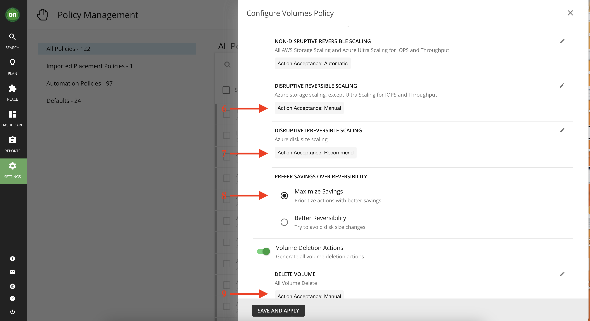

    10- Scroll further down until you see a graph of and its settings below it. Do you recall when exploring the action details there was a chart showing the 95th pecentile of the utilization over 30 day observation period? That is a default in Turbonomic but if you wanted to change that this section is where you do it for the specified group of resources. The chart in this page will show the effect of changing each setting.
        - **Aggressiveness** - Defines what is the percentile you want the utilization of the resource to be before taking and action. Leave it at P95 for this lab.
        - **Min Observation Period** - This Lets Turbonomic know what the shortest amount of time is it needs to monitor a resource before generating actions to optimize it. Leave this setting as "None".
        - **Max Observation Period** - This settings tells Turbonomic how long we want it to monitor the resource before generating an action. Leave this setting as "30 days".
    
    11- You can leave the rest of the settings in the policy editor as is and then click on "Save and Apply". If a window pops up, click "Apply".

    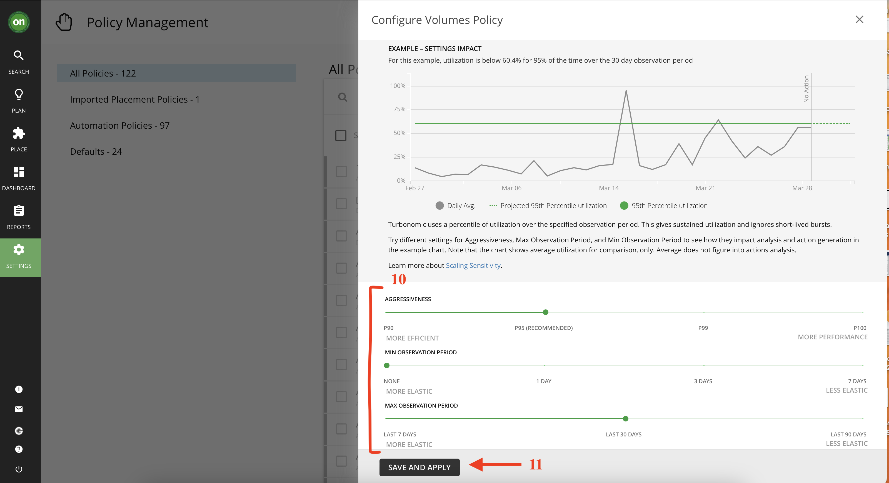

    Congratulations! You succesfully created a policy to automate cloud volume scaling actions.
    

## Lab - Scheduled Policies

You can set a schedule for an automation policy, which sets a window of time when the policy takes effect. 
In addition, a scheduled policy can include scheduled actions. When the policy is in effect, Turbonomic recommends or automatically executes those actions as they are generated. Some of those actions could be disruptive so you may want to defer their execution to a non-critical time window. In this case, you will need to set an action execution schedule within the scheduled policy.

1. Create a new policy using the "New Automation Policy" button.
2. Scroll down the list and click on "Virtual Machine". 
3. In the Policy editor, give your policy a unique name like **schedule_YourInitials**. Then under "Scope" click on "Select group of virtual machines". This will specify which group of VMs will be affected by this policy.
4. In the search bar type "vsphere" and from the list select the group named "vsphere-DC25-DC01_VM" and click on "Select".
5. Expand "Policy Schedule" and click on "Attach Schedule". Then click on "New Schedule"

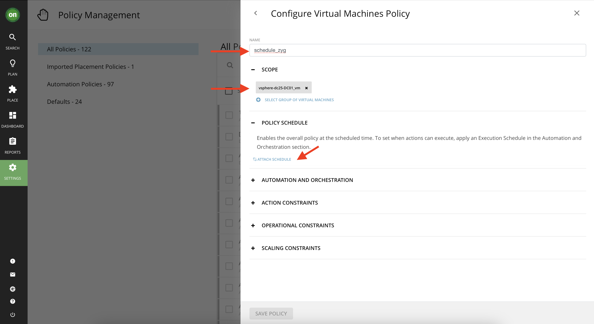
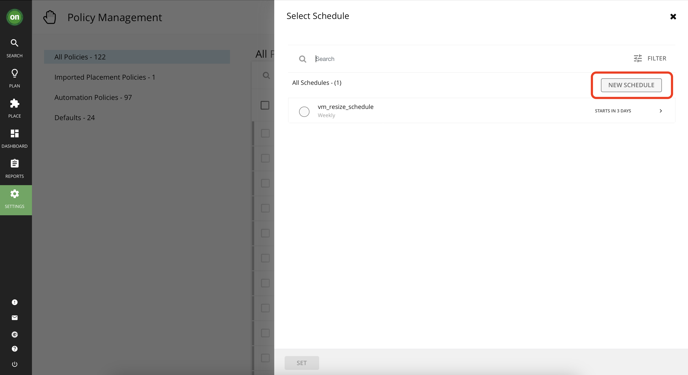

6. This section will define when your policy is on effect. 
    1. Give your policy schedule a name like **policy_schedule_YourInitials**. 
    2. Select "Weekly" under Recurrence.
    3. Set to repeat every week only on Saturdays and Sundays.
    4. Select today's date as start date and "None" as end date. 
    5. Set 12:00 as start time and 12 for duration hours. **Please Note** if you are completing this lab after noon local time, you may want to adjust this time from 12:00 to few hours after your current time. The reason is that the system will not allow you to create a policy in the past.
    6. Select your timezone.
    7. Check the Summary and click on Submit.

    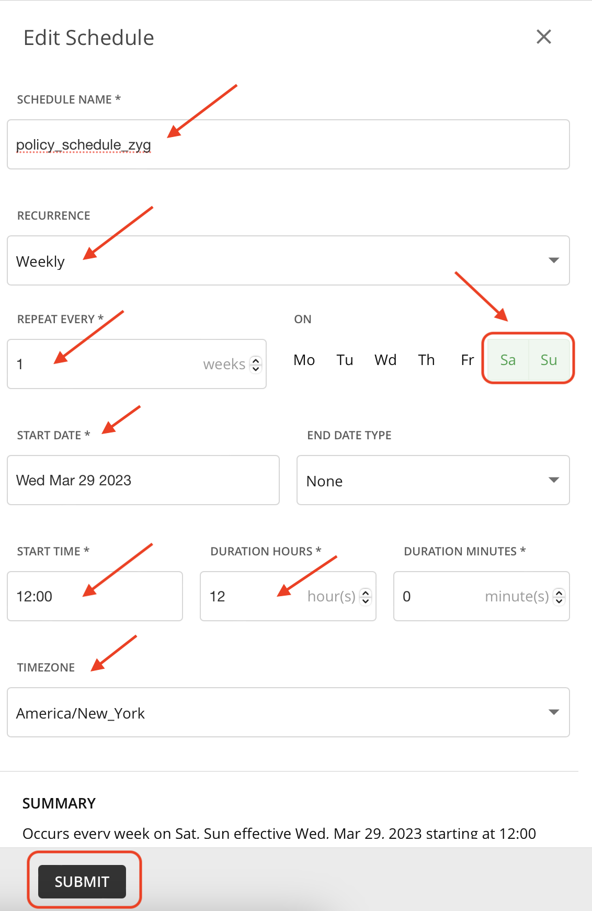

7. Select your newly created schedule and click "Set" 
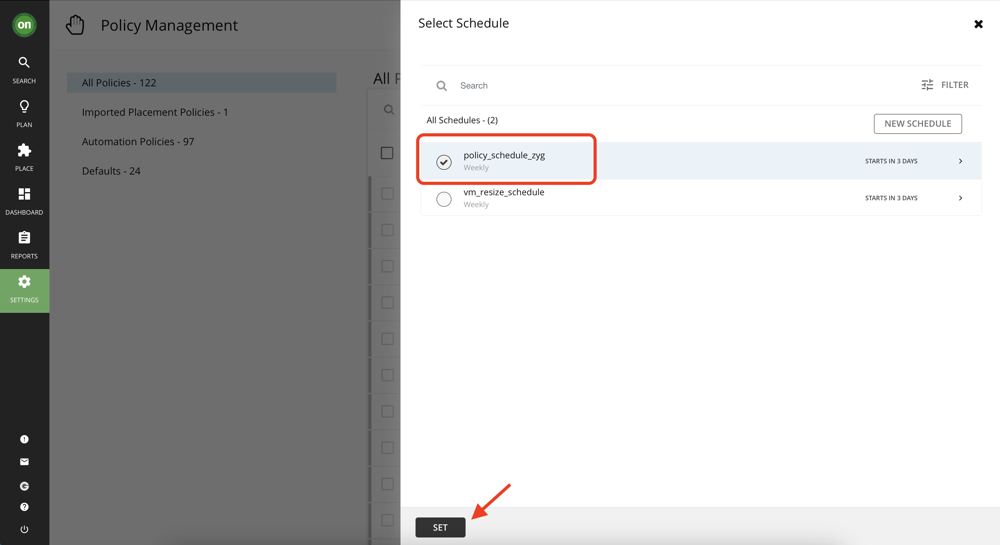
8. Expand "Automation and Orchestration" and click on "Add Action".
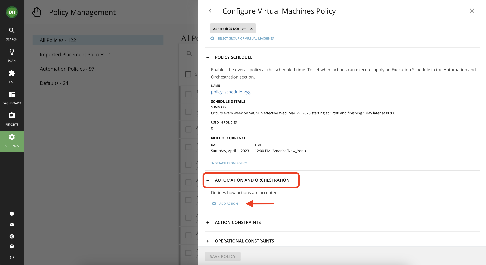
9. For action type select "VCPU-Resize-Down", for action acceptance select "Automatic" and then click on "Add Schedule" under Execution Schedule. This section will define the **action schedule**. Create a new schedule to assign to the **action**. Click on "Add Schedule" under "Execution Schedule" and then click on "New Schedule" to create a different schedule for your action.

- **Tip** - In this scenario, we want the policy to be effective on Saturdays and Sundays from 12:00PM - midnight. But we want to automatically accept and execute VCPU resize actions ONLY on Sundays from 12:00PM - 6:00PM where we know the load is at its lowest.

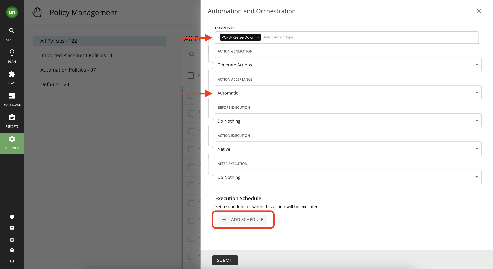

10. Type in a name for your schedule like **action_schedule_YourInitials** and fill in the information as specified in the image below. Once done click on "Submit". Make sure to select Sunday only and set the start date as the upcoming Sunday. (Remember, you can't create a policy in the past. It should start from a date in the future)

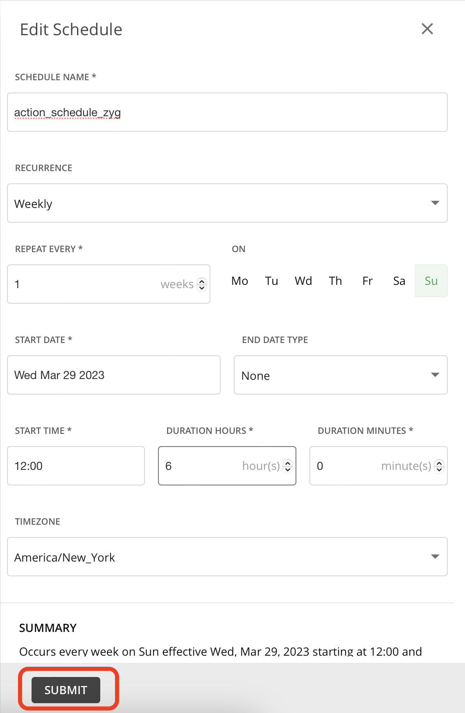

11. Select your newly created action schedule and click on "Save". This will return you to "Automation and Orchestration" page. Click "Submit" for this page
12. Now you should be back in "Virtual Machines Policy" page. check all the information and ensure their accuracy. Once done, click on "Save Policy".

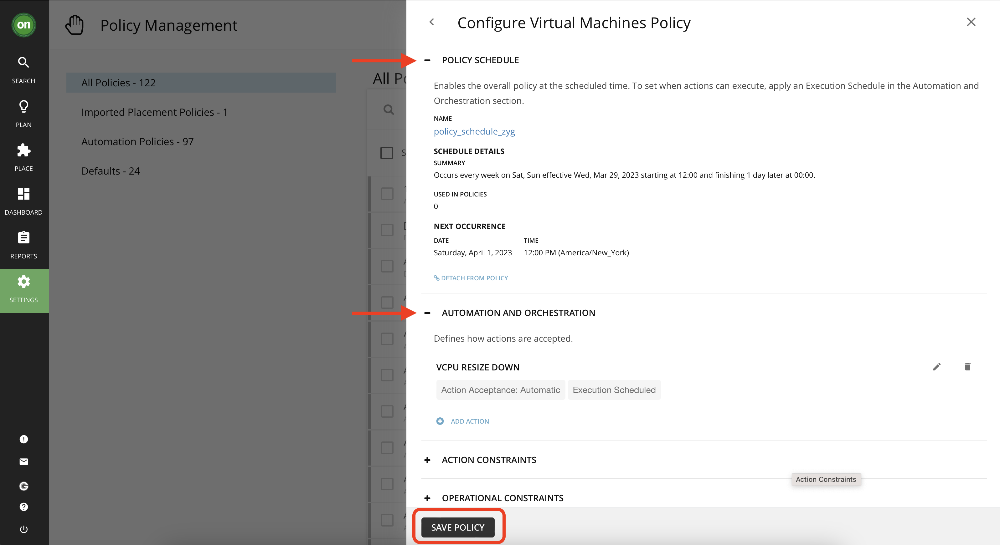

Congratulations! You succesfully created a scheduled policy with scheduled automated actions.

